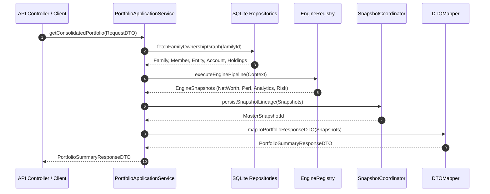

# 🔄 APPLICATION_SERVICE_SEQUENCE_DIAGRAMS.md — Sequence Diagrams

**System Name**: Family Wealth OS  
**Phase**: Sprint 6A (Application Service Layer - Architecture & Design Phase)  
**Date**: July 26, 2026  
**Status**: APPROVED ARCHITECTURE  

---

## 1. Sequence 1: End-to-End Family Portfolio Processing Flow

