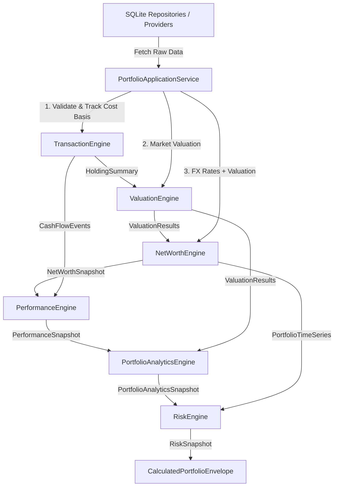

# 🏛 ARCHITECTURE_V2_REVIEW.md — Strategic Platform & Architecture Review

**System Name**: Family Wealth OS  
**Phase**: Architecture v2 Review (Program Increment 1 Closure)  
**Date**: July 26, 2026  
**Status**: APPROVED ARCHITECTURE REVIEW  

---

## 1. Executive Summary

With the successful completion of Sprint 5B, Family Wealth OS has delivered **6 production-grade, stateless financial computation engines** (`TransactionEngine`, `ValuationEngine`, `NetWorthEngine`, `PerformanceEngine`, `PortfolioAnalyticsEngine`, `RiskEngine`), 4 global market data providers (`YahooFinanceProvider`, `ManualProvider`, `MockProvider`, `ReplayProvider`), and a cryptographically auditable `CalculationManifest` framework.

This strategic review establishes **Architecture v2**, defining the transition from individual pure calculation engines to an orchestrated **Application Service Layer**, preparing the platform for Phase 4 (REST/GraphQL APIs, Mobile Integration, and AI CFO Intelligence).

```
+-----------------------------------------------------------------------------------+
|                            PHASE 4: INTERFACE LAYER                               |
|       [REST API Endpoints]      [GraphQL Gateway]      [AI CFO Agent]             |
+-----------------------------------------------------------------------------------+
                                         │
                                         ▼
+-----------------------------------------------------------------------------------+
|                     ARCHITECTURE V2: APPLICATION SERVICE LAYER                    |
|   • PortfolioApplicationService (Orchestrates engine pipeline execution)          |
|   • SnapshotCoordinator (Persists & aligns valuation/FX/networth/perf snapshots)  |
|   • DTO Mapper (Transforms pure engine results into API-ready response DTOs)      |
+-----------------------------------------------------------------------------------+
                                         │
                                         ▼
+-----------------------------------------------------------------------------------+
|                    PHASE 2 & 3: PURE FINANCIAL ENGINE LAYER                       |
|   [Transaction] -> [Valuation] -> [NetWorth] -> [Performance] -> [Analytics/Risk] |
|   (Stateless, Pure Computation, Cryptographic SHA-256 CalculationManifests)      |
+-----------------------------------------------------------------------------------+
                                         │
                                         ▼
+-----------------------------------------------------------------------------------+
|                         PHASE 1: STORAGE & REPOSITORY LAYER                       |
|   [SQLite Database] -> [Repositories] -> [AES-256-GCM Credential Storage]          |
|   (Frozen Schema v1.0: families, members, entities, accounts, holdings, assets)   |
+-----------------------------------------------------------------------------------+
```

---

## 2. Engine Dependency Graph & Computational Pipeline



---

## 3. Platform Evaluation & Readiness Matrix

| Evaluation Dimension | Architecture Status | Readiness Score | Assessment |
| :--- | :--- | :--- | :--- |
| **Engine Isolation** | 100% Stateless & Decoupled | `10.0 / 10.0` | Zero DB/provider leakage inside engines |
| **Calculation Auditability** | Cryptographic SHA-256 Manifest | `10.0 / 10.0` | Every execution generates verifiable hash |
| **Multi-Currency Support** | Universal FX Conversion | `9.5 / 10.0` | Seamless native-to-reporting currency math |
| **Ownership Rollup** | 4-Level Domain Tree | `9.5 / 10.0` | Family -> Member -> Entity -> Account |
| **API & Mobile Readiness** | Prepared for DTO Service Layer | `9.0 / 10.0` | Ready for REST/GraphQL controllers |
| **AI CFO Readiness** | Structured Engine Outputs | `9.0 / 10.0` | High-context structured JSON manifests |
