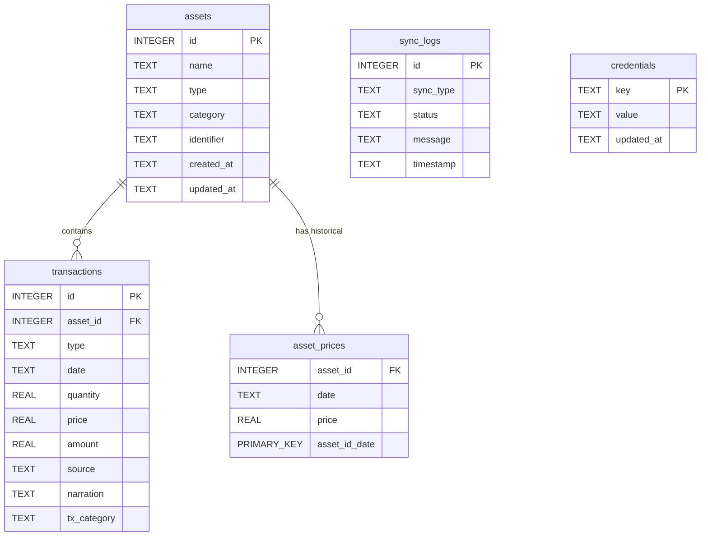

# 📄 CURRENT_STATE.md — Existing System Architecture & Assessment

**System Name**: MyWorth (Baseline for Family Wealth OS)  
**Date**: July 25, 2026  
**Author**: Lead Software Engineer & Software Architect  
**Status**: Approved Baseline

---

## 1. Executive Summary

This document captures the current state of the application prior to commencing the Family Wealth OS transformation. The current system—code-named **MyWorth**—is a functional, single-user, local-first net worth and statement aggregator.

The application has strong statement parsing capabilities (CAMS/KFintech CAS PDFs, EPF passbooks, Bank CSVs, broker statements) and a polished dark-themed UI. However, its architecture exhibits structural limitations: single-tenant data structures, tightly coupled controller-database logic, unencrypted local data storage, and monolithic React components.

This document serves as the architectural baseline for the migration strategy defined in Sprint 0.5.

---

## 2. Current Architecture

The application is structured as a **Two-Tier Monolithic Client-Server (Layered Monolith)** running locally on the user's desktop.

```mermaid
graph TD
    Client["React 19 Frontend SPA (Vite)
    http://localhost:5173"]
    
    API["Express REST Backend
    http://localhost:5000"]
    
    DB[("SQLite Database
    data/myworth.db")]
    
    External1["AMFI NAV Server
    amfiindia.com"]
    
    External2["Yahoo Finance API
    query1.finance.yahoo.com"]

    Client -->|HTTP / REST API| API
    API -->|better-sqlite3 (Sync SQL)| DB
    API -->|HTTPS Fetch| External1
    API -->|HTTPS Fetch| External2
```

### Architectural Breakdown
- **Frontend**: Single Page Application (SPA) built with React 19, TypeScript, and Vite. State is managed entirely via local `useState` hooks inside monolithic view components. Router navigation is tab-based within `App.tsx`.
- **Backend**: Express.js server written in TypeScript running under `ts-node-dev`. Handles HTTP requests, runs parsing services, executes synchronous SQL statements against SQLite, and fetches live market prices.
- **Database**: SQLite 3 database (`data/myworth.db`) accessed synchronously using the `better-sqlite3` driver.

---

## 3. Current Modules

| Module Name | File Location | Responsibility |
| :--- | :--- | :--- |
| **Dashboard** | `backend/src/routes/dashboardRoutes.ts`<br>`frontend/src/components/Dashboard.tsx` | Calculates net worth KPIs, 30-day growth timeline, and category allocation. |
| **Portfolio & Holdings** | `backend/src/routes/portfolioRoutes.ts`<br>`frontend/src/components/Portfolio.tsx` | Asset CRUD, family member filtering, cost basis vs market valuation, and XIRR calculation. |
| **Protection & Insurance** | `backend/src/routes/insuranceRoutes.ts`<br>`frontend/src/components/protection/ProtectionDashboard.tsx` | Policy registration modal, family floater matrix, status badges, and nominee audit. |
| **Reports & PDF Generator** | `backend/src/routes/reportingRoutes.ts`<br>`frontend/src/components/reports/ReportsGenerator.tsx`<br>`frontend/src/utils/pdfGenerator.ts` | Executive report templates (Net Worth, Tax, Insurance, Estate) and Adobe Acrobat binary PDF generation. |
| **Theme Engine** | `frontend/src/components/layout/ThemeProvider.tsx`<br>`frontend/src/components/layout/TopNavbar.tsx` | Seamless Light & Dark Theme switching with localStorage persistence and CSS design tokens. |
| **Ledger / Transactions** | `backend/src/routes/transactions.ts`<br>`frontend/src/components/Transactions.tsx` | Transaction grid, PDF/Manual source tagging, category selection, and transaction logging. |
| **Cash Flow (BankInsights)** | `backend/src/routes/cashflow.ts`<br>`frontend/src/components/CashFlowDashboard.tsx` | Bank statement ingestion, income vs. expense analytics, regex categorization. |
| **Import Center** | `backend/src/routes/import.ts`<br>`frontend/src/components/ImportCenter.tsx` | Multi-format statement ingestion (CAS PDF, EPF, NPS CSV, Zerodha, AngelOne, INDmoney). |
| **Market Sync** | `backend/src/services/marketSync.ts` | Daily AMFI mutual fund NAV text scraping and Yahoo Finance stock/gold price fetcher. |

---

## 4. Current Strengths

1. **Local-First & Privacy Core**: Data is stored locally in SQLite (`data/myworth.db`). No cloud databases, third-party authentication servers, or external telemetry dependencies.
2. **Indian Financial Statement Parsing**: Built-in parsers for password-protected CAMS/KFintech CAS PDFs, EPFO passbooks, bank CSV/Excel statements, and broker exports.
3. **Rich Visual Aesthetics**: Modern dark glassmorphic interface built with Tailwind CSS, custom HSL tokens, Recharts, and Lucide icons.
4. **Fast Development Iteration**: Vite dev server and `ts-node-dev` backend hot-reloading allow rapid UI and API iterations.

---

## 5. Current Weaknesses

1. **Single-User Hardcoding**: The database schema has no `user_id`, `family_member_id`, or `entity_id` columns. All assets and transactions belong to one implicit user.
2. **Tightly Coupled Backend Routes**: Express controllers (`backend/src/routes/*.ts`) directly contain SQL queries, cost basis calculations, and business formatting instead of delegating to domain services/repositories.
3. **Monolithic Frontend Components**: View components (`ImportCenter.tsx`, `Portfolio.tsx`, `Dashboard.tsx`) are monolithic files ranging from 500 to 1,500 lines combining fetching, state, forms, dry-run validations, and UI markup.
4. **Lack of State Management & API Client**: Components call `fetch('http://localhost:5000/api/...')` directly without a centralized API client, error interceptor, or query caching library (React Query / Zustand).
5. **Simple Average Cost Basis**: Investment returns use weighted average cost. There is no FIFO/LIFO tax lot tracking for capital gains calculations.

---

## 6. Current Risks

### Security Risks
- **Wildcard CORS (`origin: '*'`)**: Allows any website running in the user's browser to make background HTTP requests to `http://localhost:5000` and read all financial data.
- **Unencrypted Local Storage**: SQLite database (`myworth.db`) stores decrypted balances without encryption at rest.
- **Plain-Text File Dumps**: In `import.ts`, decrypted PDF plain text is written synchronously to disk at `data/raw_cams_text.txt`.
- **Unencrypted Credentials**: API keys and OAuth tokens are stored in plain text in the `credentials` table.

### Performance Risks
- **Synchronous N+1 Queries**: `GET /api/assets` loops through assets executing 3-4 synchronous SQL queries per asset inside a `.map()` callback.
- **Unindexed Database Scans**: No secondary indexes exist on `transactions(asset_id, date)` or `asset_prices(date)`.

---

## 7. Current Technical Debt

- **Hardcoded URLs**: `'http://localhost:5000'` is hardcoded in 6 separate frontend files.
- **Duplicated Business Logic**: Holding calculation and EPF fallback algorithms are duplicated across `assets.ts` and `dashboard.ts`.
- **Missing Data Access Objects (DAOs)**: SQL queries are written inline across route handlers.
- **Brittle Schema Migrations**: `db.ts` renames tables to `_old` on startup based on string matching `sqlite_master.sql`.

---

## 8. Current Folder Structure

```
MyWorth/
├── package.json               # Root orchestrator & dependency scripts
├── README.md                  # High-level documentation
├── data/                      # Local SQLite directory (myworth.db, raw_cams_text.txt)
├── backend/                   # Node.js + Express + TypeScript Backend
│   ├── src/
│   │   ├── index.ts           # Express server bootstrap & route mounting
│   │   ├── db.ts              # SQLite connection & schema initialization
│   │   ├── schema.ts          # Zod schemas for assets and transactions
│   │   ├── routes/            # REST controllers (assets, dashboard, import, transactions, cashflow)
│   │   └── services/          # Statement parsers & live market sync
└── frontend/                  # React 19 + Vite + TypeScript Frontend
    ├── src/
    │   ├── main.tsx / App.tsx # Entry point & tab router
    │   └── components/        # Monolithic view components
```

---

## 9. Current Data Model



---

## 10. Current Development Process

- **Single Developer Mode**: Ad-hoc development without automated unit/integration tests or formal CI/CD quality gates.
- **Build Verification**: Manual execution of `npm run build` (`tsc` and `vite build`).
- **Dependency Management**: Monorepo managed via root `package.json` utilizing `concurrently`.
