# 🗄 DATABASE_MIGRATION_PLAN.md — Database Migration Plan

**System Name**: Family Wealth OS  
**Author**: Lead Software Engineer & Software Architect  
**Date**: July 25, 2026  
**Status**: Target Specification (Sprint 0.5)

---

## 1. Executive Migration Summary

The database migration strategy follows the **Evolution before Replacement** principle (`Reuse > Refactor > Replace`). The existing SQLite engine (`better-sqlite3`) and market price tables will be preserved, while existing asset/transaction tables will be non-destructively modified to support multi-entity family structures. New tables will be created for Family, Members, Entities, Tax Lots, Goals, Theses, and Decisions.

---

## 2. Table-by-Table Migration Strategy

| Current Table | Migration Action | Target State / Modifications | Difficulty | Rationale |
| :--- | :--- | :--- | :--- | :--- |
| **`assets`** | **MODIFY** | Add `portfolio_id` (FK), `entity_id` (FK), `is_active` (BOOLEAN). Set default fallback entity for existing rows. | **Medium** | Existing asset records must be migrated to belong to a default Primary Entity without breaking current valuations. |
| **`transactions`** | **MODIFY** | Add `entity_id` (FK), `tax_lot_id` (FK NULLABLE), `notes` (TEXT). | **Medium** | Existing transactions are retained. Backfill script will associate past transactions with initial tax lots. |
| **`asset_prices`** | **REUSE** | Keep composite PK `(asset_id, date)`. No schema changes required. | **Low** | Table structure is already clean and performs as required. |
| **`sync_logs`** | **REUSE** | Keep schema as-is. | **Low** | Audit log structure requires no changes. |
| **`credentials`** | **REPLACE** | Replace plain-text `value` column with encrypted byte payload (AES-256-GCM). | **Medium** | Critical security upgrade to prevent local plain-text API token theft. |

---

## 3. New Tables Required

| Table Name | Purpose | Key Foreign Keys | Migration Difficulty |
| :--- | :--- | :--- | :--- |
| **`families`** | Root container for the family unit. | None | **Low** (New creation) |
| **`family_members`** | Individual members of the family (Self, Spouse, Children). | `family_id` -> `families(id)` | **Low** (New creation) |
| **`entities`** | Tax/Legal entities (Personal, Spouse Personal, HUF, Minor). | `family_member_id` -> `family_members(id)` | **Low** (New creation) |
| **`accounts`** | Financial accounts (Bank, Broker, EPF, PPF, NPS). | `entity_id` -> `entities(id)` | **Low** (New creation) |
| **`portfolios`** | Strategic asset groupings (Core Equity, Emergency). | `account_id` -> `accounts(id)` | **Low** (New creation) |
| **`tax_lots`** | FIFO purchase lot tracking for STCG/LTCG capital gains. | `asset_id`, `buy_transaction_id` | **Medium** (Populates via backfill) |
| **`goals`** | Financial targets and progress tracking. | `portfolio_id` -> `portfolios(id)` | **Low** (New creation) |
| **`investment_theses`**| Documented buy/sell investment rationale. | `asset_id` -> `assets(id)` | **Low** (New creation) |
| **`decision_journal`**| Wealth decisions log and quarterly reviews. | `family_id` -> `families(id)` | **Low** (New creation) |
| **`documents`** | Local document vault file metadata registry. | `account_id` -> `accounts(id)` | **Low** (New creation) |

---

## 4. Step-by-Step Migration Workflow (Zero Data Loss)

```mermaid
sequenceDiagram
    autonumber
    participant App as Migration Runner
    participant DB as SQLite DB
    participant Backup as Backup File

    App->>DB: PRAGMA foreign_keys = OFF
    App->>Backup: Create physical copy (myworth_backup_v1.db)
    
    rect rgb(20, 30, 50)
        Note over App,DB: Step 1: Create New Structure Tables
        App->>DB: CREATE TABLE IF NOT EXISTS families, family_members, entities, accounts, portfolios
    end

    rect rgb(20, 50, 30)
        Note over App,DB: Step 2: Seed Default Family Hierarchy
        App->>DB: INSERT INTO families (Default Family)
        App->>DB: INSERT INTO family_members (Primary Member)
        App->>DB: INSERT INTO entities (Personal Entity)
        App->>DB: INSERT INTO accounts (Default Main Account)
        App->>DB: INSERT INTO portfolios (Default Main Portfolio)
    end

    rect rgb(50, 40, 20)
        Note over App,DB: Step 3: Non-Destructive Schema Alterations
        App->>DB: ALTER TABLE assets ADD COLUMN portfolio_id FK
        App->>DB: UPDATE assets SET portfolio_id = (Default Portfolio ID)
        App->>DB: ALTER TABLE transactions ADD COLUMN entity_id FK
        App->>DB: UPDATE transactions SET entity_id = (Default Entity ID)
    end

    rect rgb(40, 20, 50)
        Note over App,DB: Step 4: Backfill FIFO Tax Lots
        App->>DB: Generate tax_lots from existing BUY transactions
    end

    App->>DB: PRAGMA foreign_keys = ON
    App->>App: Verify integrity & record count
```

---

## 5. Rollback & Safety Guarantees

1. **Pre-Migration Snapshot**: Before any schema modification is executed, the backend engine makes an atomic, compressed file copy of `myworth.db` named `myworth_backup_v1.db` in `data/backups/`.
2. **Atomic DDL Transactions**: All schema migrations run inside a single `db.transaction()` block. If any migration query fails, SQLite performs a complete rollback automatically.
3. **Foreign Key Integrity Verification**: After migration completes, `PRAGMA foreign_key_check` is executed to guarantee zero orphan records before accepting user requests.
