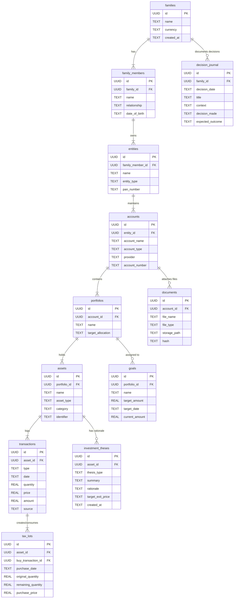

# 🧬 DOMAIN_MODEL.md — Family Wealth OS Domain Model

**System Name**: Family Wealth OS  
**Author**: Lead Software Engineer & Software Architect  
**Date**: July 25, 2026  
**Status**: Target Specification (Sprint 0.5)

---

## 1. Domain Model Hierarchy Overview

The target domain model for Family Wealth OS structures all financial assets, transactions, goals, and decision histories under a hierarchical family tree.

```
Family
 └── Family Members (Self, Spouse, Child 1, Parent)
      └── Entities (Personal, Spouse Personal, HUF, Minor, Business)
           └── Accounts (Broker, Bank, EPF, PPF, NPS, SSA, FD, Credit Card)
                └── Portfolios (Core Equity, Emergency Fund, Retirement, Child Ed)
                     └── Assets (Mutual Funds, Stocks, Gold, Real Estate)
                          ├── Transactions (Buy, Sell, Dividend, Reinvest)
                          │    └── Tax Lots (FIFO / LIFO Purchase Lots)
                          ├── Goals (Retirement, Education, Property)
                          ├── Investment Theses (Buy/Sell Rationale)
                          ├── Decision Journal Logs (Quarterly Reviews)
                          └── Documents (Stored Statement PDFs & Reports)
```

---

## 2. Complete Entity Relationship Diagram (Mermaid ERD)



---

## 3. Entity Dictionary & Attributes

### 3.1 `families`
- **Description**: The top-level root aggregate representing the family unit.
- **Attributes**: `id` (UUID PK), `name` (string), `currency` (default "INR"), `created_at`.

### 3.2 `family_members`
- **Description**: Individual family members associated with the family.
- **Attributes**: `id` (UUID PK), `family_id` (FK), `name`, `relationship` (Self, Spouse, Child, Parent), `date_of_birth`.

### 3.3 `entities`
- **Description**: Legal and tax entities owned by family members for tax optimization and asset separation.
- **Attributes**: `id` (UUID PK), `family_member_id` (FK), `name`, `entity_type` (`PERSONAL`, `SPOUSE_PERSONAL`, `HUF`, `MINOR`, `BUSINESS`), `pan_number` (encrypted).

### 3.4 `accounts`
- **Description**: Financial accounts held with institutions.
- **Attributes**: `id` (UUID PK), `entity_id` (FK), `account_name`, `account_type` (`BROKER`, `BANK`, `EPF`, `PPF`, `NPS`, `SSA`, `FD`, `BONDS`, `CREDIT_CARD`), `provider` (Zerodha, HDFC Bank, EPFO, etc.), `account_number` (masked/encrypted).

### 3.5 `portfolios`
- **Description**: Strategic groupings of assets dedicated to specific goals or strategies.
- **Attributes**: `id` (UUID PK), `account_id` (FK), `name` (Core Equity, Emergency Fund, Satellite), `target_allocation`.

### 3.6 `assets`
- **Description**: Individual holdings or financial instruments within a portfolio.
- **Attributes**: `id` (UUID PK), `portfolio_id` (FK), `name`, `asset_type` (`MUTUAL_FUND`, `STOCK`, `EPF`, `NPS`, `GOLD`, `BOND`, `PROPERTY`, `BANK_ACCOUNT`), `category` (`Equity`, `Debt`, `Cash`, `Hybrid`, `Alternative`), `identifier` (ISIN, Ticker, AMFI Code).

### 3.7 `transactions`
- **Description**: Financial ledger transactions against assets.
- **Attributes**: `id` (UUID PK), `asset_id` (FK), `type` (`BUY`, `SELL`, `REINVEST`, `DIVIDEND`, `INTEREST`, `CREDIT`, `DEBIT`), `date`, `quantity`, `price`, `amount`, `source` (`MANUAL`, `PDF_IMPORT`, `BANK_INSIGHTS`, `KITE`).

### 3.8 `tax_lots`
- **Description**: Granular purchase lots for FIFO/LIFO capital gains tracking.
- **Attributes**: `id` (UUID PK), `asset_id` (FK), `buy_transaction_id` (FK), `purchase_date`, `original_quantity`, `remaining_quantity`, `purchase_price`.

### 3.9 `goals`
- **Description**: Long-term financial objectives.
- **Attributes**: `id` (UUID PK), `portfolio_id` (FK), `name` (Retirement 2045, Higher Education), `target_amount`, `target_date`, `current_amount`.

### 3.10 `investment_theses`
- **Description**: Documented rationale and conviction for purchases or sales.
- **Attributes**: `id` (UUID PK), `asset_id` (FK), `thesis_type` (`BUY`, `SELL`, `HOLD`), `summary`, `rationale`, `target_exit_price`, `created_at`.

### 3.11 `decision_journal`
- **Description**: Historical decision log for wealth strategy and quarterly reviews.
- **Attributes**: `id` (UUID PK), `family_id` (FK), `decision_date`, `title`, `context`, `decision_made`, `expected_outcome`.

### 3.12 `documents`
- **Description**: Metadata index for local encrypted files (CAS PDFs, Bank Statements, Tax filings).
- **Attributes**: `id` (UUID PK), `account_id` (FK), `file_name`, `file_type`, `storage_path`, `hash`.
