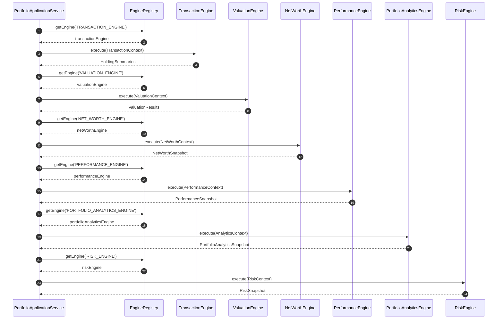

# 🔄 ENGINE_ORCHESTRATION_ARCHITECTURE.md — Engine Pipeline & Orchestration

**System Name**: Family Wealth OS  
**Phase**: Architecture v2 Review  
**Date**: July 26, 2026  
**Status**: APPROVED ARCHITECTURE  

---

## 1. Multi-Engine Pipeline Execution Pipeline

---

## 2. Pipeline Error Propagation & Fallback Policy

1. **Transaction Engine Failure**: Fails entire pipeline execution (`CRITICAL`).
2. **Valuation Engine Warning**: Continues execution; flags stale price warning in `CalculationManifest`.
3. **Risk Solver Failure**: Falls back to Bisection Search solver; sets `quality: ESTIMATED`.
