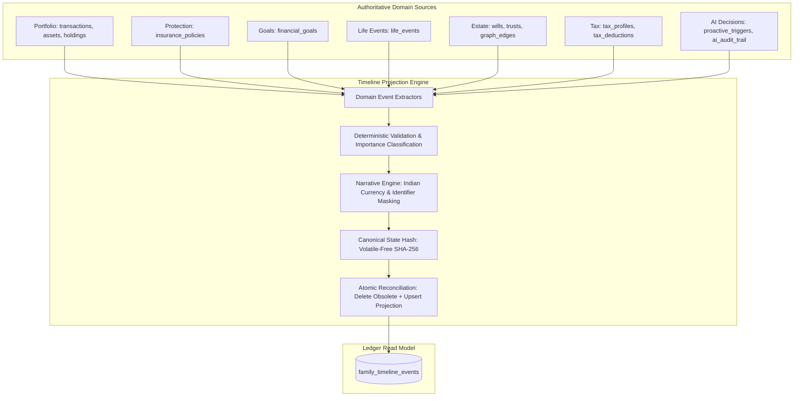

# Family Timeline Ledger & Deterministic Narrative History

## 1. Architectural Overview

The **Family Timeline Ledger** is a unified, chronological, cross-domain projection layer in FamilyWealthOS. It transforms siloed historical facts, policy lifecycle events, goal milestones, legal estate actions, tax regime changes, and fiduciary AI decisions across 7 logical domains into a standardized audit-ready timeline ledger with deterministic narrative summaries.



---

## 2. Central Fiduciary Invariant

$$\text{Authoritative Domain Data} \longrightarrow \text{Timeline Projection} \longrightarrow \text{Narrative Interpretation}$$
$$\text{Never: } \text{Timeline} \longrightarrow \text{Authoritative Financial State}$$

- **Zero-Write Invariant**: Timeline synchronization executes **0 writes (0 inserts, 0 updates, 0 deletes)** on any of the 11 underlying domain source tables.
- **Fail-Closed Atomic Rollback**: Synchronization runs inside an atomic SQLite transaction (`batchReconcileTimeline`). If any domain extractor encounters a fatal exception, the entire transaction rolls back, leaving previous timeline projections completely uncorrupted.
- **Valuation Invariant**: Insurance `SUM_ASSURED` is strictly recorded as `amount_type = 'SUM_ASSURED'` (coverage protection) and is never aggregated or interpreted as financial wealth or net worth.
- **Scheduled vs Historical Separation**: Future obligations (such as `SCHEDULED_PREMIUM_DUE`) are tagged with `event_status: 'SCHEDULED'` and filtered from default historical timeline queries (`event_date <= CURRENT_DATE`) unless explicitly requested with `includeScheduled=true`.

---

## 3. 7-Domain Ingestion & Identity Schema

| Domain | Source Tables | Event Types | Event Identity Format | Provenance Tier |
| :--- | :--- | :--- | :--- | :--- |
| **PORTFOLIO** | `transactions`, `assets_master`, `holdings` | `BUY`, `SELL`, `DIVIDEND`, `INTEREST` | `evt_PORTFOLIO_transactions_${id}_${type}` | `AUTHORITATIVE_SOURCE` |
| **PROTECTION** | `insurance_policies` | `POLICY_ACTIVATED`, `SCHEDULED_PREMIUM_DUE` | `evt_PROTECTION_insurance_policies_${id}_${eventType}` | `AUTHORITATIVE_SOURCE` |
| **GOAL** | `financial_goals` | `GOAL_CREATED`, `GOAL_HALFWAY_FUNDED`, `GOAL_ACHIEVED` | `evt_GOAL_financial_goals_${id}_${milestoneKey}` | `AUTHORITATIVE_SOURCE` |
| **LIFE_EVENT** | `life_events` | `LIFE_EVENT_DECLARED`, `LIFE_EVENT_PROCESSED` | `evt_LIFE_EVENT_life_events_${id}_${statusSuffix}` | `AUTHORITATIVE_SOURCE` |
| **ESTATE** | `wills`, `trusts`, `graph_edges` | `WILL_REGISTERED`, `TRUST_FORMED`, `NOMINEE_ASSIGNED` | `evt_ESTATE_${sourceType}_${sourceId}_${eventType}` | `AUTHORITATIVE_SOURCE` / `DERIVED` |
| **TAX** | `tax_profiles`, `tax_deductions` | `REGIME_SELECTED`, `STATUTORY_DEDUCTION_CLAIMED` | `evt_TAX_${sourceType}_${id}_${suffix}` | `AUTHORITATIVE_SOURCE` |
| **AI_DECISION** | `proactive_triggers`, `ai_audit_trail` | `TRIGGER_ACKNOWLEDGED`, `TRIGGER_RESOLVED`, `RECOMMENDATION_EXECUTED` | `evt_AI_DECISION_${sourceType}_${sourceId}_${suffix}` | `AI_AUDIT` |

---

## 4. Deterministic Narrative History Engine

The `TimelineNarrativeEngine` constructs human-readable, context-aware narrative descriptions according to the following strict standards:

1. **Indian Currency Formatting**: Renders amounts using standard Lakhs/Crores notation (`₹15 L`, `₹1.5 Cr`) with zero-trimmed decimals.
2. **Central Identifier Masking**: Sensitive account and policy numbers are centrally masked (`••••1234`), guaranteeing raw numbers never leak into narrative text.
3. **Structured Narrative Metadata**: Serialized as Zod-validated JSON (`TimelineNarrativeMetadataSchema`) containing immutable domain attribution (`memberDisplayName`, `insurerDisplayName`, `policyType`, `targetYear`, `sectionCode`, `dateProvenance`, `sourceStateHash`).

---

## 5. API Endpoints

### 5.1 Query Timeline
- **Route**: `GET /api/v1/family-office/timeline`
- **Query Parameters**:
  - `domain`: Filter by domain (`PORTFOLIO`, `PROTECTION`, `GOAL`, `LIFE_EVENT`, `ESTATE`, `TAX`, `AI_DECISION`)
  - `eventType`: Specific event type
  - `familyMemberId`: Specific family member
  - `importance`: Minimum importance tier (`CRITICAL`, `HIGH`, `MEDIUM`, `INFO`)
  - `startDate`, `endDate`: ISO date boundaries (`YYYY-MM-DD`)
  - `minAmount`, `minAmountCurrency`: Currency-safe minimum amount threshold (e.g. `minAmount=100000`, `minAmountCurrency=INR`)
  - `includeScheduled`: Boolean flag (default `false`) to include future scheduled obligations
  - `limit` (default 50), `offset` (default 0)

### 5.2 Synchronize Timeline
- **Route**: `POST /api/v1/family-office/timeline/sync`
- **Headers**: `X-Idempotency-Key` (required for safe replay)
- **Response**:
  ```json
  {
    "status": "SUCCESS",
    "message": "Timeline successfully synchronized",
    "data": {
      "familyId": 921,
      "syncedCount": 32,
      "durationMs": 14
    }
  }
  ```

---

## 6. Verification & Performance Invariants

- **Master Test Suite**: 348 tests passing (100% pass rate).
- **Deterministic Rebuild Invariant**: Complete purge and re-sync produces 100% byte-for-byte identical event IDs, event dates, amounts, importance tiers, narrative strings, and state hashes.
- **Performance Benchmark**: Full 7-domain synchronization and query completes in **14ms** (well below the $\le 100\text{ms}$ fiduciary budget).
