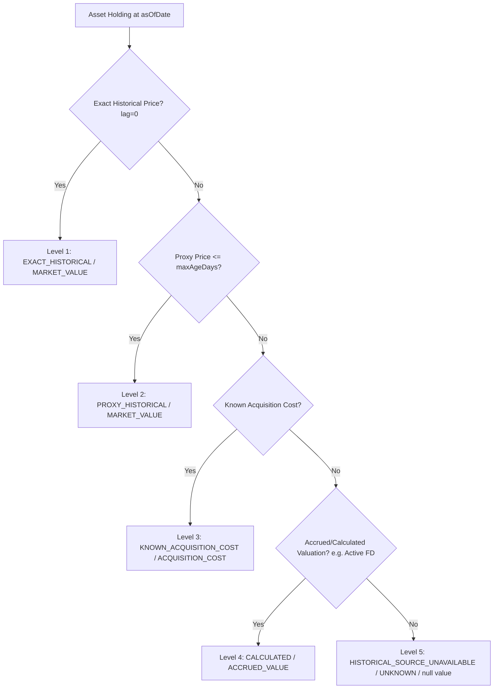

# Financial Time Machine & What-If Simulation Sandbox

## Overview

Sprint 8C.3 delivers the **Financial Time Machine & Point-in-Time Reconstruction Engine** alongside the **In-Memory What-If Simulation Sandbox** for MyWorth Family Office.

The Financial Time Machine enables family offices, advisors, and estate planners to accurately reconstruct historical balance sheets, asset portfolios, liability positions, insurance coverage, and estate/tax pillar statuses as of any historical timestamp (`asOfDate <= CURRENT_DATE`), while enforcing strict non-fabrication guardrails.

The What-If Simulation Sandbox provides an isolated, in-memory environment to test hypothetical financial adjustments (SIP step-ups, lump-sum deployments, retirement age shifts, goal reallocations, and tax regime switches) against an immutable reconstructed historical or current baseline state without altering persistent database records.

---

## 1. Core Architectural Guardrails

### 1.1 Reconstruction Mode & Knowledge-Time Transparency
- **Mode**: `HISTORICAL_ECONOMIC_STATE` using business-effective transaction dates (`date <= asOfDate`).
- **Knowledge-Time Status**: Explicitly labelled `knowledgeTimeStatus: 'NOT_FULLY_RECONSTRUCTABLE'` to truthfully reflect that retroactively edited historical entries reflect today's corrections rather than point-in-time system state snapshots.
- **Future Date Guardrail**: Any reconstruction or simulation with `asOfDate > CURRENT_DATE` is rejected with `ValidationError` (`400 Bad Request`, `code: 'FUTURE_AS_OF_DATE_UNSUPPORTED'`).

### 1.2 Mandatory Non-Fabrication Guardrails
1. **Mandatory Correction #1 (Missing Data Invariant)**:
   - Missing historical values (unpriced assets, unrecorded cash balances, unverified assets) must strictly evaluate to `null` with explicit `status: 'INSUFFICIENT_DATA'` and provenance (`HISTORICAL_SOURCE_UNAVAILABLE`).
   - Numeric `0` is strictly reserved for evaluated zero (e.g. fully sold holdings, `KNOWN_ZERO`).
2. **Mandatory Correction #2 (Fixed Deposit Maturity Invariant)**:
   - Fixed deposits past their maturity date (`asOfDate > maturityDate`) without authoritative evidence of renewal or redemption are excluded from net worth with `totalMarketValue: null`, `status: 'INSUFFICIENT_DATA'`, and `lifecycleStatus: 'MATURED_PENDING_REINVESTMENT'`.
3. **Protection Shield Isolation**:
   - `sumAssured` across term and health policies is reported strictly under `protectionShield` and **never added to gross assets or net worth**.

---

## 2. 5-Level Valuation Hierarchy

When reconstructing historical asset holdings, valuations follow a strict 5-level deterministic precedence:



### Proxy Freshness Policy (`TIME_MACHINE_RULE_REGISTRY`)
| Asset Category | Max Proxy Age (`MAX_PROXY_AGE_DAYS`) | Fallback if Expired |
| :--- | :--- | :--- |
| `Equity` / `US Stock` | 30 days | `KNOWN_ACQUISITION_COST` |
| `Debt` / `Gold` | 60 days | `KNOWN_ACQUISITION_COST` |
| `Property` (Real Estate) | 365 days | `KNOWN_ACQUISITION_COST` |
| `Cash Snapshots` | 90 days | `INSUFFICIENT_DATA` (null) |

---

## 3. What-If Simulation Sandbox

The What-If engine runs entirely in-memory over a deep-cloned reconstructed baseline state:
- **0 Database Writes**: 0 `INSERT`, 0 `UPDATE`, 0 `DELETE` across all 21 system tables, proven via SHA-256 database fingerprinting.
- **Deterministic Baseline Binding**: Every simulation result includes `baselineStateHash` (SHA-256 canonical hash of the baseline) and `baselineAsOf`.
- **Assumption Provenance**: All assumptions explicitly track source provenance (`USER_PROVIDED`, `FAMILY_PROFILE`, `SYSTEM_ASSUMPTION`).
- **Incomplete Baseline Guardrail**: Simulations against incomplete historical baselines flag `baselineLimitations` metadata or return `INSUFFICIENT_DATA`.
- **No Fabricated Income**: Tax regime simulations require verified income profiles or explicit `salaryIncome` parameters; unverified income returns `INSUFFICIENT_DATA` with `taxSavingsBenefit: null`.

### Supported Scenario Catalogue
1. **`RECURRING_SIP_STEP_UP`**: Models compound growth under annual SIP step-up percentages.
2. **`ONE_TIME_LUMP_SUM_INVESTMENT`**: Simulates deployment of surplus capital across configurable time horizons.
3. **`RETIREMENT_AGE_ADJUSTMENT`**: Re-evaluates retirement corpus sufficiency and readiness score under altered retirement age targets.
4. **`GOAL_CONTRIBUTION_REALLOCATION`**: Models shifting monthly savings allocations between competing financial goals.
5. **`TAX_REGIME_OPTIMIZATION_SCENARIO`**: Evaluates tax liabilities under hypothetical 80C/80CCD deductions and selects optimal regime (Old vs New).

---

## 4. API Endpoints & Security Scope

### 4.1 Production-Safe Family Scope Authorization
- Endpoints strictly authorize the active family scope from authenticated session context (`CorrelationContext.getFamilyId()`).
- Direct client parameter overrides or spoofed `x-family-id` headers without authenticated context fail closed (`400 ValidationError`). Mismatched client-supplied IDs throw `403 FORBIDDEN`.

### 4.2 Reconstruct Historical Economic State
- **Route**: `GET /api/v1/family-office/time-machine`
- **Query Params**:
  - `asOfDate` (required, `YYYY-MM-DD`, `<= CURRENT_DATE`)
- **Response**: `TimeMachineReconstructionSchema`

### 4.3 Execute What-If Scenario Simulation
- **Route**: `POST /api/v1/family-office/time-machine/what-if`
- **Middleware**: `idempotencyMiddleware` (HTTP platform response caching; engine itself performs 0 domain mutations).
- **Body**:
  ```json
  {
    "scenarioType": "RECURRING_SIP_STEP_UP",
    "baselineAsOf": "2024-03-31",
    "monthlySipAmount": 50000,
    "sipStepUpPercent": 10,
    "years": 20
  }
  ```
- **Response**: `WhatIfSimulationResultSchema`
