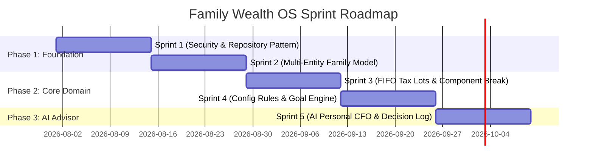

# 🎯 MVP_SCOPE.md — Sprint Evolution & Delivery Roadmap

**System Name**: Family Wealth OS  
**Author**: Lead Software Engineer & Software Architect  
**Date**: July 25, 2026  
**Status**: Target Specification (Sprint 0.5)

---

## 1. Roadmap Overview

This document defines the 5-Sprint evolutionary roadmap transitioning the baseline application (**MyWorth**) into the target **Family Wealth OS**. Each sprint is scoped with concrete objectives, deliverables, technical dependencies, and a strict Definition of Done (DoD).

---

## 2. Sprint Specifications

### 2.1 Sprint 1: Security Hardening & Repository Pattern
- **Primary Objective**: Secure the local API server, eliminate data leakage risks, and establish the Repository Pattern for database decoupling.
- **Deliverables**:
  1. Restricted CORS policy (`http://localhost:5173`) and loopback binding (`127.0.0.1`).
  2. Permanent removal of plain-text file dump (`raw_cams_text.txt`).
  3. AES-256-GCM column encryption module for stored credentials.
  4. Repository Layer interfaces (`IAssetRepository`, `ITransactionRepository`) isolating raw SQL execution.
- **Dependencies**: None (Starts from Sprint 0 baseline).
- **Definition of Done (DoD)**:
  - Express server rejects non-localhost CORS requests.
  - Zero plain-text files written during CAS PDF ingestion.
  - Credentials in SQLite are stored encrypted.
  - Express route controllers call Repository interfaces instead of inline SQL.

---

### 2.2 Sprint 2: Multi-Entity Family Data Model & Account Structure
- **Primary Objective**: Evolve single-user database into a multi-tenant family hierarchy (`Family -> Members -> Entities -> Accounts -> Portfolios`).
- **Deliverables**:
  1. Non-destructive database migration adding `families`, `family_members`, `entities`, `accounts`, and `portfolios` tables.
  2. Data backfill script assigning pre-existing assets and transactions to a default Primary Entity.
  3. Centralized API client module (`VITE_API_URL`) replacing hardcoded localhost URLs.
  4. Top header Family & Entity filter selector component.
- **Dependencies**: Sprint 1 completion.
- **Definition of Done (DoD)**:
  - Database schema passes foreign key integrity checks.
  - Existing assets/transactions remain fully accessible under default Primary Entity.
  - User can create new entities (Personal, Wife, HUF) and view scoped net worth totals.

---

### 2.3 Sprint 3: FIFO Tax Lot Engine & UI Component Deconstruction
- **Primary Objective**: Implement FIFO purchase lot tracking for STCG/LTCG capital gains and refactor monolithic UI components into modular React 19 sub-components.
- **Deliverables**:
  1. FIFO Tax Lot calculation service (`backend/src/services/taxLotService.ts`).
  2. Ingestion pipeline update assigning new BUY transactions to purchase lots.
  3. Deconstructed `ImportCenter.tsx` into 6 step wizard components.
  4. Deconstructed `Portfolio.tsx` with slide-out Tax Lot Drawer component.
  5. Integration of TanStack Query (React Query) for server-state caching.
- **Dependencies**: Sprint 2 completion.
- **Definition of Done (DoD)**:
  - Selling an asset accurately consumes purchase lots in FIFO order and computes STCG/LTCG.
  - `ImportCenter.tsx` and `Portfolio.tsx` single-file line counts are below 200 lines each.
  - Switching tabs in frontend UI uses React Query cache without triggering full API refetches.

---

### 2.4 Sprint 4: Knowledge-Driven Configuration Engine & Goal/Retirement Planning
- **Primary Objective**: Externalize business rules into `config/*.json` files and deliver the Goal Planning & Retirement Corpus simulator screen.
- **Deliverables**:
  1. External configuration rules engine reading `config/asset_allocation.json`, `config/tax_rules.json`, and `config/risk_rules.json`.
  2. Goal Planning domain model and API endpoints (`/api/v1/goals`).
  3. Monte Carlo Retirement Corpus simulator service.
  4. New **Goal Planner & Retirement (`/goals`)** UI screen.
- **Dependencies**: Sprint 3 completion.
- **Definition of Done (DoD)**:
  - Asset allocation target percentages can be updated by editing `config/asset_allocation.json` without modifying code.
  - Retirement simulator outputs projected corpus success probability based on current savings and inflation parameters.

---

### 2.5 Sprint 5: AI Personal CFO Advisor, Investment Thesis & Decision Journal
- **Primary Objective**: Deliver the AI Personal CFO recommendation engine, Investment Thesis logger, and Decision Journal.
- **Deliverables**:
  1. AI Personal CFO Prompt Engine reading structured portfolio summaries combined with `knowledge/Investment_Constitution.md`.
  2. Investment Thesis modal allowing users to log purchase/sale rationale.
  3. Quarterly Decision Journal log storage and markdown persistence.
  4. New **AI Personal CFO & Journal (`/advisor`)** UI screen.
- **Dependencies**: Sprint 4 completion.
- **Definition of Done (DoD)**:
  - User can view proactive AI-generated wealth recommendations grounded in their `Investment_Constitution.md`.
  - Investment theses are linked to assets and viewable in portfolio details.
  - Decisions can be logged and exported to `knowledge/Decision_Log.md`.
