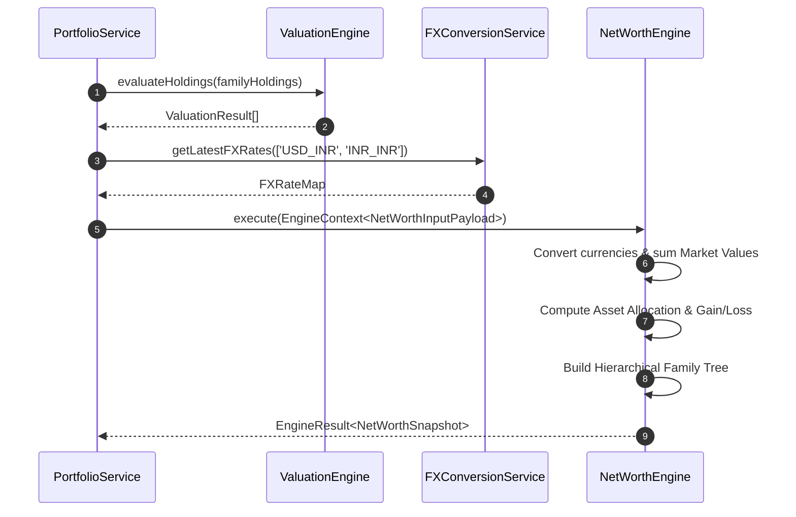
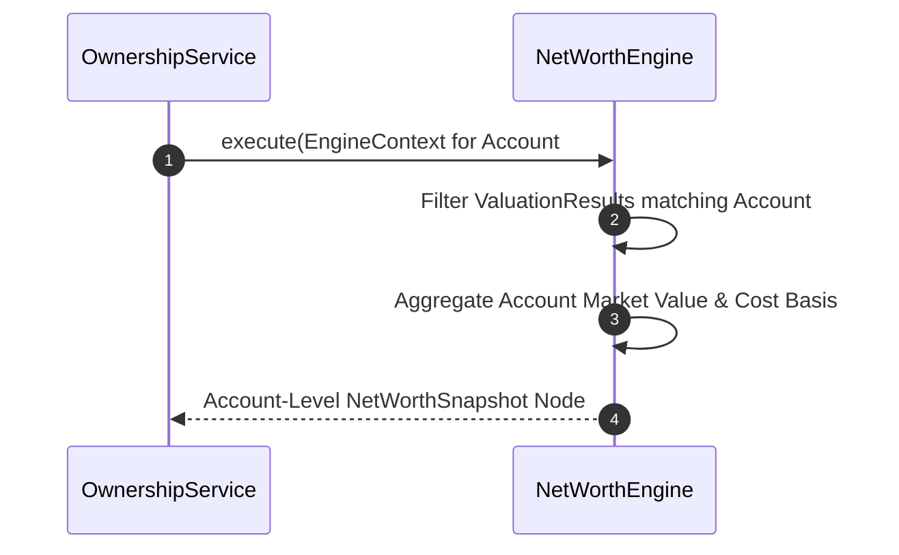

# 🔄 NET_WORTH_SEQUENCE_DIAGRAMS.md — Sequence Diagrams

**System Name**: Family Wealth OS  
**Phase**: Sprint 3 (Net Worth Engine - Architecture Phase)  
**Date**: July 26, 2026  
**Status**: APPROVED ARCHITECTURE  

---

## 1. Sequence 1: Consolidated Family Net Worth Calculation

---

## 2. Sequence 2: Multi-Currency Account Aggregation Flow

