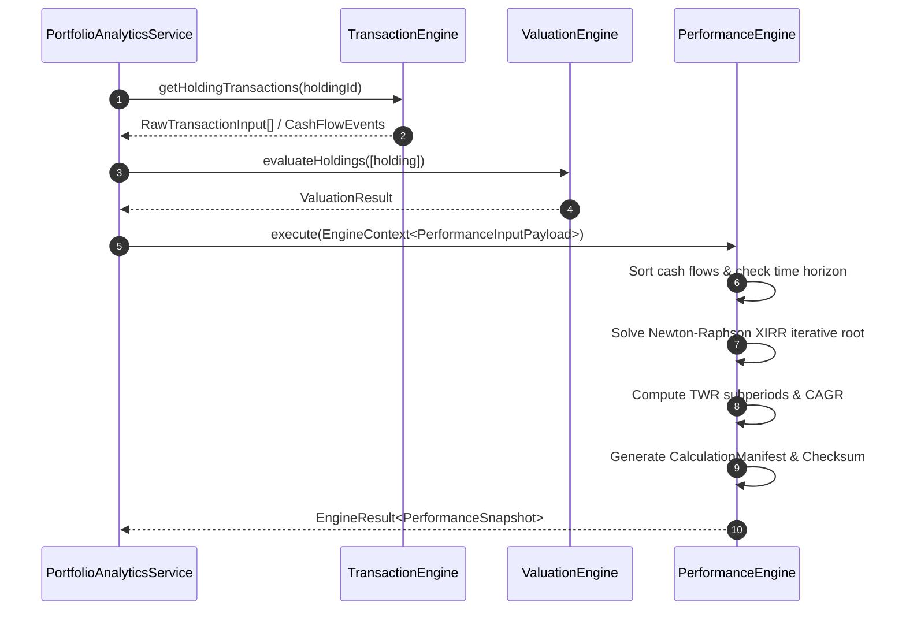
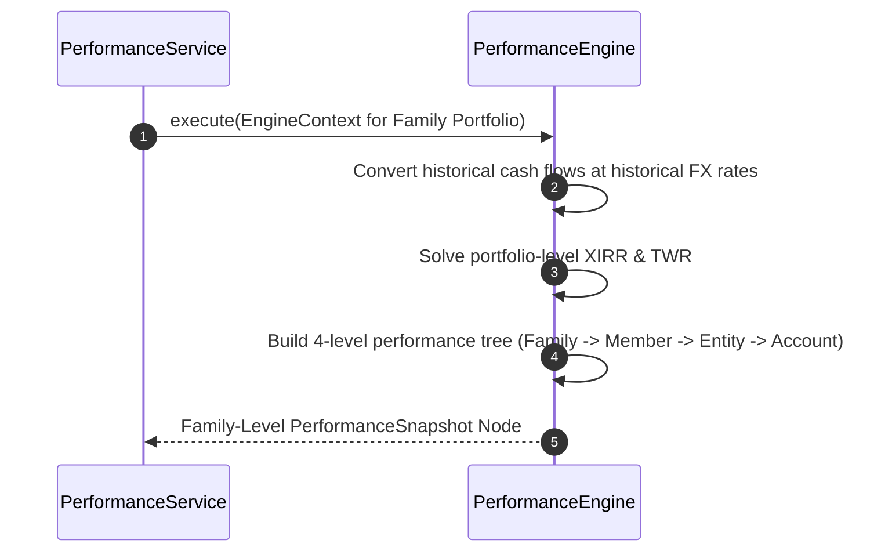

# 🔄 PERFORMANCE_SEQUENCE_DIAGRAMS.md — Sequence Diagrams

**System Name**: Family Wealth OS  
**Phase**: Sprint 4 (Performance Engine - Architecture & Design Phase)  
**Date**: July 26, 2026  
**Status**: APPROVED ARCHITECTURE  

---

## 1. Sequence 1: XIRR & Performance Calculation Flow

---

## 2. Sequence 2: Multi-Currency Family Performance Rollup

