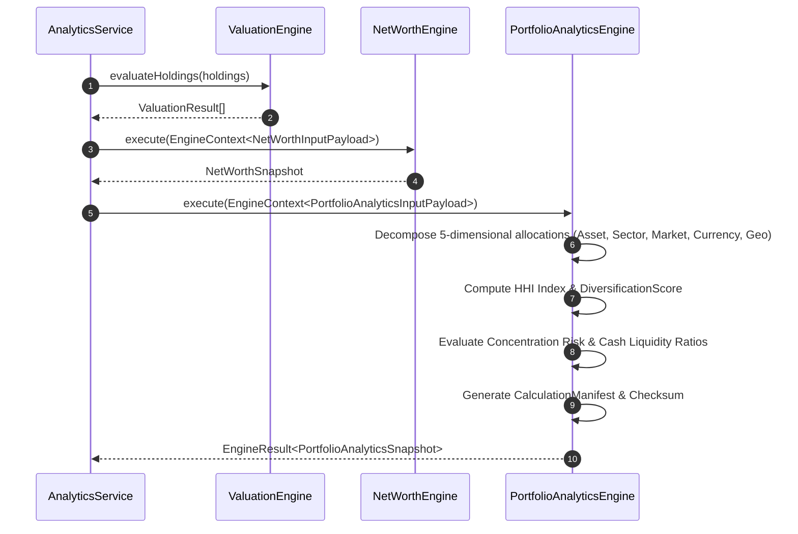

# 🔄 PORTFOLIO_ANALYTICS_SEQUENCE_DIAGRAMS.md — Sequence Diagrams

**System Name**: Family Wealth OS  
**Phase**: Sprint 5A (Portfolio Analytics Engine - Architecture & Design Phase)  
**Date**: July 26, 2026  
**Status**: APPROVED ARCHITECTURE  

---

## 1. Sequence 1: Portfolio Analytics Execution Flow

