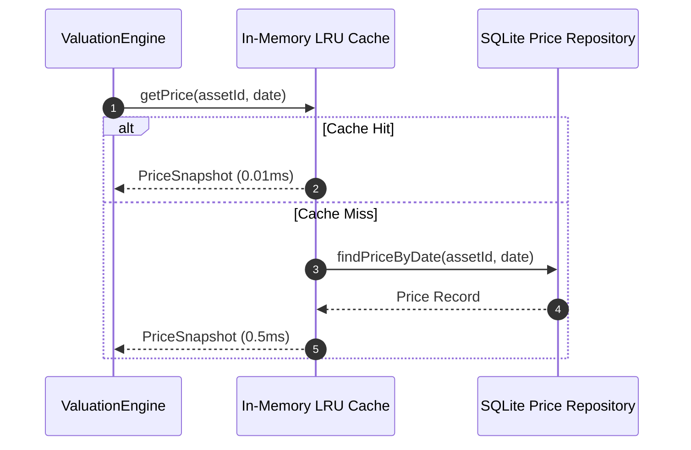
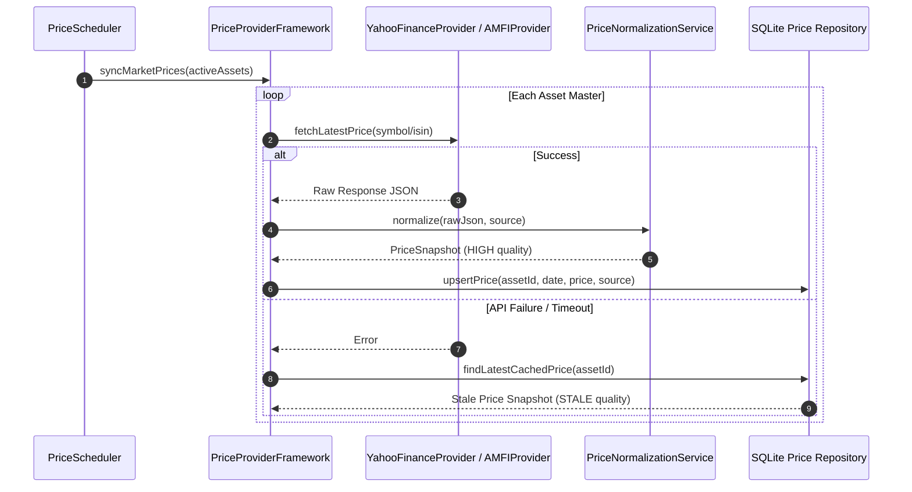
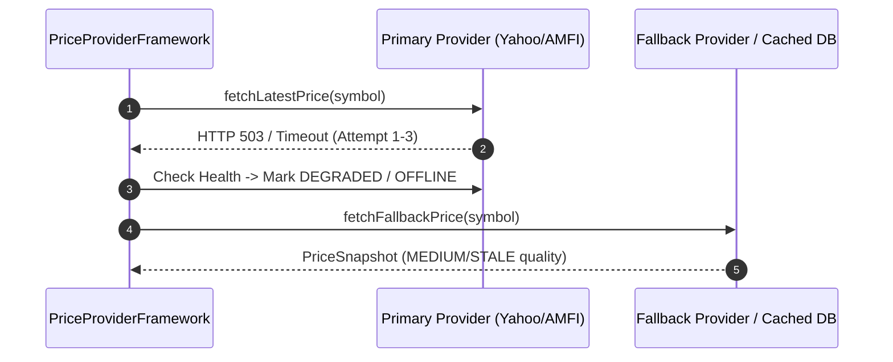

# 🔄 PRICE_PROVIDER_SEQUENCE_DIAGRAMS.md — Sequence Diagrams

**System Name**: Family Wealth OS  
**Phase**: Sprint 2 (Architecture & Provider Framework)  
**Date**: July 26, 2026  
**Status**: APPROVED ARCHITECTURE  

---

## 1. Sequence 1: Valuation Request with Cache Hit

---

## 2. Sequence 2: Scheduled Market Price Sync Flow

---

## 3. Sequence 3: Provider Failover Sequence

