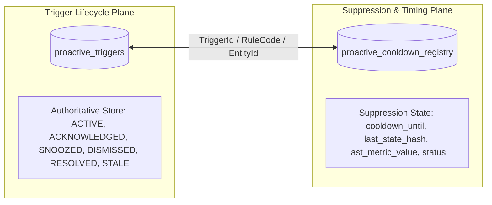
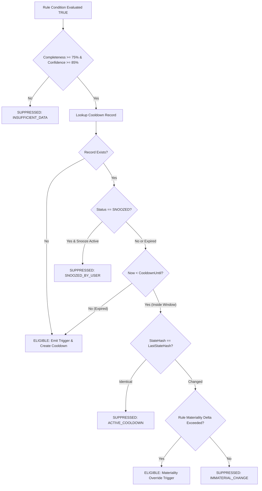
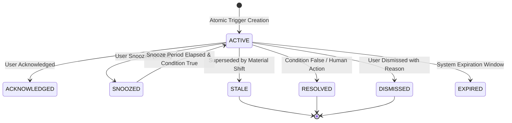

# Proactive Fiduciary AI Cooldown & Suppression Model (Sprint 8B.3)

---

## 1. Cooldown Registry Architecture & Store Ownership

To prevent notification fatigue, spam, and redundant alert cycles while ensuring critical financial changes immediately break through suppression, the system maintains two cleanly separated data stores:

### Store Separation & Invariant Guarantees:
1. **`proactive_triggers` (Authoritative Record)**: Owns the recommendation lifecycle (`ACTIVE`, `ACKNOWLEDGED`, `SNOOZED`, `DISMISSED`, `RESOLVED`, `STALE`).
2. **`proactive_cooldown_registry` (Suppression Timing)**: Owns rule-level cooldown timers (`cooldown_until`, `last_state_hash`, `last_metric_value`, `snoozed_until`).
3. **No Resurrection of Dismissed Triggers**: A user-dismissed trigger remains `DISMISSED` and cannot resurrect during the same unchanged state hash. A new trigger is only created if the financial state materially shifts according to deterministic materiality rules.
4. **Atomic Mutation**: Trigger creation and cooldown registration execute in a single atomic SQLite transaction.

---

## 2. Trigger Eligibility & Materiality Override Pipeline

When a fiduciary rule evaluates to `TRUE`, the eligibility engine executes the following evaluation pipeline:

---

## 3. Rule-Specific Materiality Thresholds ($\Delta_{\text{mat}}$)

| Rule Code | Baseline Metric | Materiality Formula | Materiality Threshold | Zero-Baseline Emergence |
| :--- | :--- | :--- | :--- | :--- |
| `DRIFT_EQUITY_OVERWEIGHT` | Equity Drift % | $|\text{Drift}_{\text{now}} - \text{Drift}_{\text{last}}|$ | $\ge 2.5\%$ | N/A |
| `CONCENTRATION_SINGLE_STOCK` | Concentration % | $|\text{Conc}_{\text{now}} - \text{Conc}_{\text{last}}|$ | $\ge 3.0\%$ | N/A |
| `INSURANCE_RENEWAL_DUE` | Days Remaining | Days remaining transition | $> 7\text{d} \longrightarrow \le 7\text{d}$ | Critical window entry |
| `PROTECTION_HLV_GAP` | Protection Gap | $\frac{|\text{Gap}_{\text{now}} - \text{Gap}_{\text{last}}|}{\text{Gap}_{\text{last}}}$ | $\ge 15.0\%$ | Emergence from $0 \longrightarrow >0$ overrides cooldown |
| `EMERGENCY_FUND_DEFICIT` | Runway Months | $\frac{|\text{Runway}_{\text{now}} - \text{Runway}_{\text{last}}|}{\text{Runway}_{\text{last}}}$ | $\ge 15.0\%$ | Emergence from $0 \longrightarrow >0$ overrides cooldown |
| `EXCESS_IDLE_CASH` | Idle Cash Balance | $\frac{|\text{Cash}_{\text{now}} - \text{Cash}_{\text{last}}|}{\text{Cash}_{\text{last}}}$ | $\ge 20.0\%$ | Emergence from $0 \longrightarrow >0$ overrides cooldown |
| `GOAL_OFF_TRACK_DRIFT` | Goal Progress % | $\text{Progress}_{\text{last}} - \text{Progress}_{\text{now}}$ | $\ge 10.0\%$ drop | N/A |
| `TAX_80C_OPPORTUNITY` | 80C Headroom | $|\text{Headroom}_{\text{now}} - \text{Headroom}_{\text{last}}|$ | $\ge ₹25,000$ | N/A |
| `ESTATE_NOMINEE_GAP` | Un-nominated Assets | $\text{Count}_{\text{now}} - \text{Count}_{\text{last}}$ | $\ge 1$ additional asset | N/A |

---

## 4. Trigger Lifecycle State Transitions

### Precise Lifecycle Semantics:
1. **Condition Evaluates FALSE**: Previous active trigger transitions to `RESOLVED` with reason `'STATE_CONDITION_NO_LONGER_MET'`.
2. **Condition Evaluates TRUE + Material State Shift**: Previous active trigger transitions to `STALE` with reason `'MATERIAL_STATE_SHIFT_SUPERSEDED'` and a new `ACTIVE` trigger is created with updated state hash and deterministic ID.
3. **Condition Evaluates TRUE + Immaterial Change**: Existing trigger remains `ACTIVE` with no duplicate trigger created.
4. **Snooze Bounds**: Snooze duration is strictly validated between **1 and 30 days** (`1 <= snoozeDays <= 30`), rejecting out-of-bound values.
