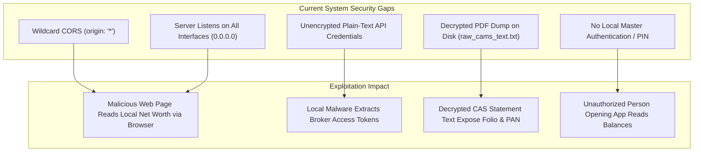

# 🔒 SECURITY_REVIEW.md — Security Audit & Hardening Architecture

**System Name**: Family Wealth OS  
**Author**: Lead Software Engineer & Software Architect  
**Date**: July 25, 2026  
**Status**: Target Specification (Sprint 0.5)

---

## 1. Executive Summary

As a local-first financial platform, Family Wealth OS stores highly sensitive personal data: net worth totals, bank statements, mutual fund folios, stock tradebooks, and broker API tokens. This document audits existing security vulnerabilities and specifies a **production-grade security architecture** ensuring zero cross-site exposure, zero plain-text leaks, and local encryption at rest.

---

## 2. Security Threat Matrix & Vulnerability Audit

---

## 3. Production-Grade Security Target Architecture

### 3.1 Authentication & Local Lock Screen
- **Master PIN / Password**: On initial setup, the user configures a 6-digit Master PIN or Master Password.
- **Key Derivation**: The PIN/Password is derived using **Argon2id** (or `PBKDF2` with 600,000 iterations) and a local salt to generate a 256-bit Key Encryption Key (KEK).
- **Session Token**: Successful unlock issues a short-lived local JWT (15-minute expiration) signed with an in-memory secret generated at backend boot. Every API call must provide `Authorization: Bearer <token>`.

### 3.2 CORS & Local Network Binding
- **Network Interface Hardening**: Express server configuration binds explicitly to the loopback interface (`127.0.0.1`) instead of `0.0.0.0`. Remote network devices on the local Wi-Fi cannot connect.
- **Strict Origin Validation**: Express `cors` middleware enforces strict origin verification matching only `http://localhost:5173`. Any browser-initiated request from `http://malicious-site.com` to `http://localhost:5000` is rejected immediately.

### 3.3 Encryption at Rest & Secrets Management
- **AES-256-GCM Column Encryption**: Sensitive database columns (`credentials.value`, `entities.pan_number`, `accounts.account_number`) are encrypted using **AES-256-GCM** before writing to SQLite.
- **Elimination of Plain-Text Files**: The diagnostic file dump (`fs.writeFileSync(raw_cams_text.txt)`) in `backend/src/routes/import.ts` is permanently removed. Statement parsing stays strictly inside in-memory V8 RAM buffers.
- **Encrypted Document Vault**: Uploaded PDFs and statement reports are stored in an encrypted local directory (`data/vault/`) encrypted with the derived master key.

### 3.4 Database Security & Input Sanitization
- **SQL Injection Prevention**: 100% of database queries use `better-sqlite3` prepared statements with parameterized inputs (`db.prepare('SELECT ... WHERE id = ?').get(id)`). Dynamic SQL string concatenation is strictly prohibited.
- **Payload Validation**: Zod schemas validate every API request body, query parameter, and path variable before reaching route controller logic.

### 3.5 API Security Checklist

| Security Control | Current State | Target Implementation State | Implementation Sprint |
| :--- | :--- | :--- | :--- |
| **CORS Policy** | Wildcard (`*`) | Strict `http://localhost:5173` | **Sprint 1** |
| **Host Binding** | All Interfaces (`0.0.0.0`) | Loopback Only (`127.0.0.1`) | **Sprint 1** |
| **Data Dump** | Plain-text file on disk | Removed (RAM-only parsing) | **Sprint 1** |
| **Secret Storage** | Plain-text in DB | AES-256-GCM Encrypted | **Sprint 1** |
| **Master Auth** | None (Open Access) | Argon2id + Local JWT PIN Guard | **Sprint 2** |
| **Document Vault**| Unencrypted directory | AES-256 Encrypted Directory | **Sprint 3** |
