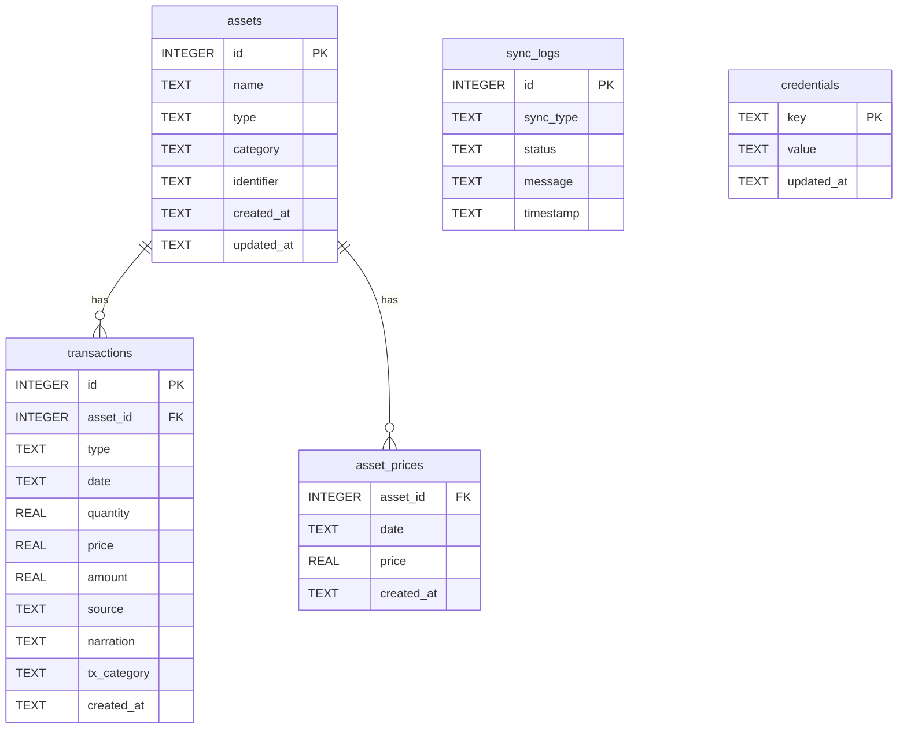

# 📋 Sprint 0 – Existing Project Assessment Report
**Project Name**: Family Wealth OS (formerly MyWorth)  
**Role**: Lead Software Engineer  
**Date**: July 25, 2026  
**Status**: Completed (Investigation & Assessment Only — Code Untouched)

---

## 1. Technology Stack

### Languages
- **TypeScript**: Backend (v5.4.5, ES2022/CommonJS), Frontend (v6.0.2 / React 19 TSX).
- **JavaScript**: Node.js ES modules & configuration scripts.
- **SQL**: SQLite dialect for local relational data storage.
- **HTML5 / CSS3**: Single Page Application structure with CSS utility classes.

### Frameworks & Libraries
- **Backend Framework**: Express.js (`v4.19.2`) on Node.js (v18+).
- **Frontend Framework**: React 19 (`react` `^19.2.6`, `react-dom` `^19.2.6`).
- **Validation**: Zod (`v3.23.8`) for runtime API payload and object schema validation.
- **Database Driver**: `better-sqlite3` (`v11.0.0`) synchronous C-bindings SQLite client.
- **File Upload Handler**: Multer (`v1.4.5-lts.1`) in-memory multipart form parsing.
- **Parsers & Connectors**:
  - `pdfjs-dist` (`v4.2.67`) for layout text extraction from CAMS/KFintech CAS PDFs & EPFO passbooks.
  - `xlsx` (`v0.18.5`) for Excel spreadsheet parsing (AngelOne, INDmoney, Bank statements).
  - `axios` (`v1.6.8`) for external HTTP API requests (AMFI NAV fetch, Yahoo Finance prices, Zerodha Kite API).

### UI Framework & Styling
- **CSS Engine**: Vanilla CSS + Tailwind CSS (`v3.4.3`) with PostCSS & Autoprefixer.
- **Design System**: Dark glassmorphic theme with HSL color tokens defined in `index.css` & `App.css`.
- **Chart Component Library**: Recharts (`v2.12.7`) for interactive SVG Area, Line, Bar, and Donut/Pie charts.
- **Iconography**: Lucide React (`v0.379.0`).
- **UI Animations**: Canvas Confetti (`v1.9.3`).
- *Note*: No pre-built component UI framework (such as Radix UI, Shadcn, MUI, or Ant Design) is used.

### Database
- **SQLite 3**: Local single-file relational database stored at `data/myworth.db`.
- *Note*: Managed via raw SQL statements in `better-sqlite3`. No ORM or query builder (No Prisma, Drizzle, or TypeORM).

### Authentication
- **None**: Complete absence of authentication, authorization, user accounts, PIN protection, or session tokens.
- **CORS Configuration**: Wildcard (`origin: '*'`), allowing any client script running locally to access or mutate database endpoints.

### State Management
- **Local Component State**: Pure React `useState` and `useEffect` hooks inside individual components.
- *Note*: No global state management library (No Redux, Zustand, or Jotai) and no server-state caching library (No React Query / TanStack Query or SWR).

### Build System & Tooling
- **Frontend Bundler**: Vite (`v8.0.12`) with `@vitejs/plugin-react` and TypeScript compiler (`tsc -b`).
- **Backend Dev Server**: `ts-node-dev` (`v2.0.0`) for TypeScript hot-reloading.
- **Monorepo Orchestrator**: `concurrently` (`v10.0.3`) in root `package.json` executing backend and frontend concurrently.

---

## 2. Folder Structure

```
Family-Wealth-OS/ (MyWorth)
├── package.json               # Monorepo root configuration & concurrent script orchestrator
├── README.md                  # High-level project documentation
├── docs/                      # Vision, Charter, and Assessment documentation
│   ├── Project_Vision.MD      # Product vision & AI Personal CFO specifications
│   ├── Project_Charter.md     # Development charter & sprint guidelines
│   └── Sprint_0_Assessment.md # This assessment report
├── data/                      # Local data storage directory
│   ├── myworth.db             # Main SQLite database file
│   └── raw_cams_text.txt      # Diagnostic plain-text dump of parsed CAS PDFs (Security risk)
├── backend/                   # Node.js + Express + TypeScript API Server
│   ├── package.json           # Backend dependencies & script definitions
│   ├── tsconfig.json          # TypeScript compiler configuration (Target ES2022, CommonJS)
│   ├── dist/                  # Compiled JavaScript output directory
│   └── src/                   # Backend application source code
│       ├── index.ts           # Server initialization, CORS setup, health check, route mounting
│       ├── db.ts              # SQLite connection, table schema creation & auto-migration engine
│       ├── schema.ts          # Zod validation schemas for assets and transactions
│       ├── routes/            # Express REST controllers & request handlers
│       │   ├── assets.ts      # Asset CRUD, portfolio valuation, price history routes
│       │   ├── dashboard.ts   # Net worth stats, category breakdown, 30-day timeline calculation
│       │   ├── import.ts      # Multi-format statement parser & broker API ingestion routes
│       │   ├── transactions.ts# Transaction ledger queries, filtering, manual logging routes
│       │   └── cashflow.ts    # Income vs. expense endpoints & BankInsights categorization
│       └── services/          # Business logic, statement parsers & external integrations
│           ├── pdfParser.ts           # CAS PDF layout text extraction service
│           ├── csvParser.ts           # NPS CSV parsing service
│           ├── excelParser.ts         # Broker Excel sheet parsing service
│           ├── xmlParser.ts           # Zerodha P&L XML parser service
│           ├── bankinsightsService.ts # Bank statement parsing & regex transaction categorizer
│           ├── marketSync.ts          # Live market NAV fetcher (AMFI & Yahoo Finance)
│           ├── kiteService.ts         # Zerodha Kite Connect OAuth & API holdings sync
│           ├── angeloneService.ts     # AngelOne SmartAPI integration & tradebook import
│           └── indmoneyService.ts     # INDmoney API token storage & holdings sync
└── frontend/                  # React 19 + Vite + TypeScript Client App
    ├── package.json           # Frontend dependencies & build scripts
    ├── tsconfig.json          # TypeScript root config
    ├── vite.config.ts         # Vite bundler configuration
    ├── tailwind.config.js     # Tailwind CSS configuration
    ├── postcss.config.js      # PostCSS configuration
    ├── index.html             # Single Page Application HTML container
    └── src/                   # Frontend client source code
        ├── main.tsx           # React DOM root render
        ├── App.tsx            # Application container, client tab router, OAuth callback handler
        ├── App.css            # Custom glassmorphism CSS rules & scrollbar styling
        ├── index.css          # Tailwind CSS directives & color tokens
        └── components/        # View components
            ├── Layout.tsx             # Sidebar navigation, server health monitor, sync trigger
            ├── Dashboard.tsx          # Net worth visual analytics & KPI cards
            ├── Portfolio.tsx          # Asset holdings breakdown & manual asset creation modal
            ├── Transactions.tsx       # Transaction ledger grid & filter controls
            ├── CashFlowDashboard.tsx  # Inflow/outflow analytics & category breakdown
            └── ImportCenter.tsx       # Statement drag-and-drop uploader & preview confirmation grid
```

---

## 3. Architecture

### Architecture Pattern: Two-Tier Monolithic Client-Server (Layered Monolith)

#### Backend Layering:
The backend follows a basic 3-layer division: `Routes (Controllers)` -> `Services / Data Access` -> `Database (SQLite)`.
- **Architectural Violation**: The separation between Controller and Service/Domain layer is blurred. Express route files (`backend/src/routes/*.ts`) directly contain core financial logic (cost basis calculation, unit accumulation, EPF fallback logic, historical 30-day net worth trend calculation) alongside raw SQL queries (`db.prepare(...)`).

#### Frontend Layering:
The frontend operates as a client-side Single Page Application (SPA) driven by tab-based router state in `App.tsx`.
- **Architectural Violation**: High component coupling. Page views (`ImportCenter.tsx`, `Portfolio.tsx`, `Dashboard.tsx`) act as massive "Smart Monolithic Components" ranging from 500 to 1,500 lines of code. They handle raw HTTP data fetching, state management, modal logic, dry-run validations, and UI rendering inside single files without custom hooks or view-models.

---

## 4. Database Analysis

### Database Engine
SQLite 3 (`better-sqlite3`) executing in synchronous mode against `data/myworth.db`.

### Entity Relationship Diagram & Tables



### Table Definitions & Constraints
1. **`assets`**:
   - `id`: `INTEGER PRIMARY KEY AUTOINCREMENT`
   - `name`: `TEXT NOT NULL`
   - `type`: `TEXT NOT NULL CHECK(type IN ('MUTUAL_FUND', 'STOCK', 'NPS', 'GOLD', 'BOND', 'PROPERTY', 'BANK_ACCOUNT', 'EPF', 'OTHER'))`
   - `category`: `TEXT NOT NULL CHECK(category IN ('Equity', 'Debt', 'Cash', 'Hybrid', 'Alternative', 'Other'))`
   - `identifier`: `TEXT NULLABLE` (ISIN, AMFI Code, Ticker)
2. **`transactions`**:
   - `id`: `INTEGER PRIMARY KEY AUTOINCREMENT`
   - `asset_id`: `INTEGER NOT NULL FK -> assets(id) ON DELETE CASCADE`
   - `type`: `TEXT NOT NULL CHECK(type IN ('BUY', 'SELL', 'REINVEST', 'DIVIDEND', 'INTEREST', 'BONUS', 'DEBIT', 'CREDIT'))`
   - `date`: `TEXT NOT NULL` (Format: `YYYY-MM-DD`)
   - `quantity`: `REAL NOT NULL`
   - `price`: `REAL NOT NULL`
   - `amount`: `REAL NOT NULL`
   - `source`: `TEXT NOT NULL CHECK(source IN ('PDF_IMPORT', 'MANUAL', 'BANK_INSIGHTS'))`
   - `narration`: `TEXT NULLABLE`
   - `tx_category`: `TEXT NULLABLE`
3. **`asset_prices`**:
   - `asset_id`: `INTEGER NOT NULL FK -> assets(id) ON DELETE CASCADE`
   - `date`: `TEXT NOT NULL` (Format: `YYYY-MM-DD`)
   - `price`: `REAL NOT NULL`
   - `PRIMARY KEY (asset_id, date)`
4. **`sync_logs`**:
   - `id`: `INTEGER PRIMARY KEY AUTOINCREMENT`
   - `sync_type`: `TEXT NOT NULL CHECK(sync_type IN ('AMFI', 'YAHOO', 'NPS'))`
   - `status`: `TEXT NOT NULL CHECK(status IN ('SUCCESS', 'FAILED'))`
   - `message`: `TEXT NULLABLE`
5. **`credentials`**:
   - `key`: `TEXT PRIMARY KEY`
   - `value`: `TEXT NOT NULL` (Plain-text API tokens)

### Potential Database Issues
1. **Single-User Hardcoding (Lack of Multi-Tenancy)**: No `user_id`, `family_member_id`, or `entity_id` column exists. The database cannot segregate assets or transactions by family member, HUF, or individual account holder.
2. **N+1 Query Bottleneck**: `GET /api/assets` fetches all assets and then loops through each asset executing 3 to 4 SQL queries synchronously. As asset count scales, request response times degrade linearly.
3. **Missing Indexes**: Beyond primary keys, there are no indexes on `transactions(asset_id, date)`, `transactions(type)`, or `asset_prices(date)`. Table scans will become slow as transactions exceed tens of thousands of rows.
4. **Plain-Text Credentials**: Secret tokens (Zerodha Kite request tokens, AngelOne credentials, INDmoney tokens) are stored unencrypted in the `credentials` table.
5. **Brittle Migration Logic**: `initDb()` in `backend/src/db.ts` uses string matching on `sqlite_master.sql` to detect schema differences and renames tables to `_old` on startup.

---

## 5. Existing Features

1. **Net Worth Aggregation & KPI Dashboard**:
   - Computes total Net Worth, total invested cost, absolute profit/loss, and portfolio return percentage.
   - Generates a 30-day historical net worth growth timeline chart.
   - Provides asset allocation breakdown by asset class and category.
   - Lists 5 most recent transaction activities.
2. **Portfolio Management & Holding Valuation**:
   - Granular breakdown of asset holdings filtered by type.
   - Calculates units, average purchase price, current price/NAV, total cost, market value, absolute return (₹ & %), and XIRR.
   - Supports manual asset creation and transaction entry modals.
   - Supports asset deletion with cascading transaction cleanup.
3. **Transaction Ledger & Filtering**:
   - Comprehensive audit table of all financial transactions.
   - Filterable by asset ID, transaction type (`BUY`, `SELL`, `DIVIDEND`, `CREDIT`, `DEBIT`), and date range.
   - Visual source badging (`MANUAL`, `PDF_IMPORT`, `BANK_INSIGHTS`).
4. **Cash Flow & BankInsights Analytics**:
   - Inflow vs. outflow monthly visual comparisons.
   - Monthly net savings rate calculation.
   - Automated regex transaction categorization (Salary, Shopping, Food, Utilities, Transfers, Investments).
   - Bank account balance listing.
5. **Multi-Source Statement Import Center**:
   - CAMS & KFintech CAS PDF statement parser (with password decryption support).
   - EPFO EPF Passbook PDF parser.
   - NPS CSV statement importer.
   - Zerodha Kite OAuth integration & Excel holdings importer.
   - AngelOne SmartAPI integration & P&L importer.
   - INDmoney OAuth token storage & holdings fetcher.
   - Bank statement CSV/Excel parser.
   - Dry-run preview grid with duplicate transaction detection prior to database commit.
6. **Automated Live Market Synchronization**:
   - Daily Mutual Fund NAV sync via AMFI text file (`NAVAll.txt`).
   - Stock and Gold price sync via Yahoo Finance endpoints.
   - Manual sync trigger button in sidebar with server health monitoring.

---

## 6. Missing Features (Compared against Family Wealth OS Vision & Charter)

| Category | Missing Feature | Impact / Gap |
| :--- | :--- | :--- |
| **Family & Multi-Entity** | **Family Member & Entity Separation** | No support for multiple family members, HUF (Hindu Undivided Family), minor children, or corporate entities. Everything is flattened into a single implicit user account. |
| **AI Personal CFO** | **Local AI Advisor & Decision Support** | Zero AI integration. No proactive financial advice, portfolio rebalancing recommendations, or answers to questions like *"Where should the next ₹50,000 go?"*. |
| **Configuration Engine** | **Externalized Business Rules** | Investment constitution, tax rules, asset allocation targets, and risk parameters are missing or hardcoded. No `config/*.json` or markdown rules. |
| **Tax Planning** | **Tax Strategy & Lot Tracking** | No FIFO/LIFO tax lot tracking, no STCG/LTCG calculation, no tax harvesting insights, and no HUF tax arbitrage optimization. |
| **Goal & Retirement** | **Goal & Retirement Simulation** | No goal templates (Education, Marriage, Real Estate), retirement corpus Monte Carlo simulations, or goal progression tracking. |
| **Estate & Protection** | **Insurance & Estate Planning / Vault** | No policy registry for Life/Health insurance adequacy analysis, no nomination tracking, and no secure Document Vault. |
| **Decision Journal** | **Investment Thesis & Decision Log** | No capability to log financial reasoning, investment thesis when buying/selling, or quarterly review notes (`Decision_Log.md`). |
| **Security & Auth** | **Local Authentication & Encryption** | No local PIN/password authentication, no encryption at rest for SQLite data or stored API credentials. |

---

## 7. Technical Debt

1. **Code Smells & Architectural Violations**:
   - **Database Logic inside Route Controllers**: Express controllers (`backend/src/routes/*.ts`) directly contain SQL queries, cost basis calculations, and business formatting.
   - **Unencrypted File Dumps**: In `import.ts` (lines 65-72), decrypted PDF plain text is synchronously written to disk at `data/raw_cams_text.txt`.
   - **Raw SQL String Queries**: Lack of a typed query builder or ORM leads to potential query typos, repeated SQL fragments, and difficult schema refactoring.
2. **Duplicate Logic**:
   - **Holding Calculation Duplication**: Valuation algorithms for units, cost basis, and bank/EPF balances are duplicated separately in `assets.ts` (lines 16-137) and `dashboard.ts` (lines 60-148).
   - **Inline Date Manipulation**: Date calculations (`YYYY-MM-DD`) and array scan loops are repeatedly written inline across services and routes.
3. **Monolithic Frontend Components**:
   - `ImportCenter.tsx`: **1,500+ lines** in a single file combining drag-and-drop file upload, password dialogs, OAuth setups, preview tables, dry-run state, and CSS styling.
   - `Portfolio.tsx`: **800+ lines** handling asset filtering, XIRR formatting, modal creation, transaction additions, and table markup.
   - `CashFlowDashboard.tsx`: **600+ lines** combining charts, categories, bank account lists, and CSV upload triggers.
   - `Dashboard.tsx`: **602 lines** combining multiple Recharts graphs, quick metric calculation, and navigation callbacks.
4. **Missing Abstractions**:
   - **No Centralized API Client**: Components perform raw `fetch('http://localhost:5000/api/...')` directly with duplicated try-catch error handling and no response interceptors.
   - **No Repository / DAO Layer**: No abstraction between database access (`db.prepare(...)`) and financial business logic.
   - **No Global State / Cache Layer**: Re-fetching full dashboard and asset data on every tab switch or mutation.
5. **Hardcoded Values**:
   - Base URL `'http://localhost:5000'` hardcoded in multiple frontend files (`Layout.tsx`, `Dashboard.tsx`, `Portfolio.tsx`, `ImportCenter.tsx`, `Transactions.tsx`, `CashFlowDashboard.tsx`).
   - Default Port `5000` hardcoded in `backend/src/index.ts`.
   - Hardcoded relative file paths (`data/myworth.db`, `../../../data/raw_cams_text.txt`).
   - Hardcoded lookback days (30 days for bank balances, 60 days for EPF in `dashboard.ts`).

---

## 8. Risks

1. **Security Risks**:
   - **Unprotected REST Endpoints & Wildcard CORS**: CORS configured with `origin: '*'` allows any website visited in the user's browser to make background HTTP requests to `http://localhost:5000` and read all financial data.
   - **Unencrypted Data Storage**: SQLite database (`myworth.db`) and plain-text file (`data/raw_cams_text.txt`) store decrypted financial statements, account numbers, and API tokens without encryption at rest.
   - **Plain-Text Credentials**: Secret tokens (Zerodha Kite request tokens, AngelOne credentials, INDmoney tokens) are stored in plain-text inside `credentials` table.
2. **Performance Risks**:
   - **Synchronous SQLite Loop Execution (N+1)**: `better-sqlite3` executed synchronously inside `.map()` loops blocks the Node.js event loop during API calls.
   - **Memory Inflation during PDF Ingestion**: 10MB PDF buffers loaded directly into Node.js RAM and processed synchronously with `pdfjs-dist`.
   - **Unindexed Scans**: Table scans on `transactions` and `asset_prices` will degrade response times as transaction rows increase.
3. **Maintainability Risks**:
   - **Monolithic UI Files**: Modifying a feature in `ImportCenter.tsx` or `Portfolio.tsx` risks breaking unrelated UI components due to 1000+ line component structures.
   - **Duplicated Financial Formulae**: Any change to unit/cost calculation logic must be manually synchronized across multiple backend route files.
4. **Scalability Risks**:
   - **Single-User Architecture**: Cannot scale to multi-member family wealth tracking without structural database schema changes (adding `family_members`, `entities`, `portfolios`).
   - **No Multi-Currency or Tax Lot Support**: Hardcoded to INR (`₹`) and simple average cost basis.

---

## 9. Recommendations

### What Should Stay?
- **Local-First & Privacy Core**: Retain the local-first design principle using SQLite and local execution.
- **Statement Parsing Engine**: Retain and modularize the CAMS/KFintech CAS PDF, EPF, and Bank Statement parsing algorithms.
- **Base Technology Stack**: React 19, Vite, TypeScript, Express, and SQLite (`better-sqlite3`) provide an ideal lightweight, fast foundation for local execution.
- **Tailwind CSS & Visual Aesthetics**: The dark glassmorphic styling system, HSL color tokens, and Lucide icons provide a high-quality user experience.

### What Should Be Improved?
- **Extract Domain & Repository Layer**: Move database queries out of Express route controllers into dedicated DAOs/Repositories (`backend/src/repositories/`) and financial business logic into Services (`backend/src/services/`).
- **Implement Multi-Entity & Family Schema**: Introduce `family_members` and `entities` (HUF, Personal, Minor) into the SQLite database.
- **Break Down Monolithic UI Components**: Refactor massive frontend components (`ImportCenter.tsx`, `Portfolio.tsx`, etc.) into small, focused sub-components and custom hooks.
- **Centralize API Client**: Create a unified API client module with base URL configuration (`VITE_API_URL`) to eliminate hardcoded `http://localhost:5000` strings.
- **Introduce Configuration Engine**: Move hardcoded rules into `config/*.json` (Asset allocation targets, tax rates, risk rules) as specified in the Product Charter.

### What Should Be Replaced?
- **Replace Plain-Text Token Storage**: Implement AES-256 encryption for the `credentials` table and sensitive local files. Remove plain-text diagnostic dumps (`raw_cams_text.txt`).
- **Replace Open Wildcard CORS**: Restrict CORS origins in `backend/src/index.ts` to `http://localhost:5173` (or configured frontend origin) to prevent cross-site local data leakage.
- **Replace Average Costing with Tax Lot Engine**: Implement proper FIFO/LIFO tax lot tracking for precise STCG/LTCG capital gains calculation.
- **Replace Ad-Hoc Component Fetching**: Adopt React Query / TanStack Query or a clean Zustand store for predictable state caching and automatic background refetching.
