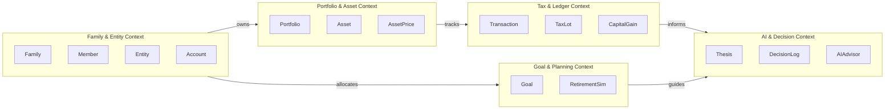

# 🏗 TARGET_ARCHITECTURE.md — Family Wealth OS Target Architecture

**System Name**: Family Wealth OS  
**Author**: Lead Software Engineer & Software Architect  
**Date**: July 25, 2026  
**Status**: Target Specification (Sprint 0.5)

---

## 1. High-Level Architecture Overview

Family Wealth OS is designed as a **local-first, privacy-focused, knowledge-driven financial decision platform**. It evolves the current monolithic architecture into a clean, multi-layered desktop solution with strict separation between UI, business domain logic, data access, configuration rules, AI decision services, and persistent knowledge storage.

```mermaid
graph TD
    subgraph ClientLayer ["Client Layer (Frontend)"]
        UI["React 19 SPA (Vite)"]
        State["Zustand Global State + React Query Cache"]
        APIClient["Typed Axios API Client (v1)"]
        UI --> State
        State --> APIClient
    end

    subgraph APILayer ["API / Middleware Gateway Layer"]
        CORS["Hardened CORS Middleware (127.0.0.1)"]
        Auth["Local PIN / Password Auth Guard"]
        ZodValidator["Zod Request Validator"]
        Controllers["Express API Controllers"]
        CORS --> Auth --> ZodValidator --> Controllers
    end

    subgraph DomainLayer ["Domain & Service Layer (Backend)"]
        ValuationSvc["Valuation & XIRR Service"]
        TaxLotSvc["FIFO Tax Lot Engine"]
        ImportSvc["Statement Ingestion Pipeline"]
        AdvisorSvc["AI Personal CFO Prompt Engine"]
        RuleEngine["Config Rules Engine"]
    end

    subgraph DataAccessLayer ["Data Access & Repository Layer"]
        Repo1["Entity / Family Repository"]
        Repo2["Portfolio / Asset Repository"]
        Repo3["Transaction & TaxLot Repository"]
        Repo4["Goal & Decision Repository"]
    end

    subgraph PersistenceLayer ["Persistence & External Storage"]
        DB[("Encrypted SQLite DB
        data/family_wealth.db")]
        Vault["Encrypted Document Vault
        data/vault/"]
        Config["Business Config Rules
        config/*.json"]
        Knowledge["Knowledge Base
        knowledge/*.md"]
    end

    APIClient -->|REST API (Port 5000)| APILayer
    Controllers --> DomainLayer
    DomainLayer --> DataAccessLayer
    DomainLayer --> Config
    DomainLayer --> Knowledge
    AdvisorSvc --> Knowledge
    DataAccessLayer --> DB
    ImportSvc --> Vault
```

---

## 2. Layer-by-Layer Architectural Specification

### 2.1 Client Layer (Frontend)
- **Framework**: React 19 + Vite + TypeScript.
- **Architecture**: Modular feature-based structure (`src/features/<feature_name>`).
- **State & Caching**:
  - `TanStack Query (React Query v5)`: Handles server-state fetching, background synchronization, and caching.
  - `Zustand`: Manages UI global state (active entity filter, active family member, active modal states).
- **API Communication**: Centralized typed Axios client utilizing `import.meta.env.VITE_API_URL` with automatic bearer token/PIN injection and error handling.

### 2.2 API / Middleware Gateway Layer
- **Framework**: Express.js REST API operating locally on port `5000`.
- **CORS Guard**: Strict origin validation restricted exclusively to `http://localhost:5173`. Express server binds strictly to `127.0.0.1` (loopback interface).
- **Auth Guard**: Local Master PIN authentication middleware verifying JWTs issued on app launch.
- **Request Validation**: Zod middleware validating incoming request params and body payloads before reaching controllers.

### 2.3 Domain & Service Layer (Backend)
The core business engine decoupled completely from Express HTTP request/response objects.
- **Valuation & Performance Service**: Calculates holding balances, current valuations, XIRR, and net worth growth trends.
- **FIFO Tax Lot Engine**: Tracks individual purchase lots, calculates Short-Term Capital Gains (STCG) and Long-Term Capital Gains (LTCG) for Indian tax rules.
- **Statement Ingestion Pipeline**: Decrypts and parses CAMS/KFintech CAS PDFs, EPF passbooks, bank CSVs, and broker exports into normalized staging models.
- **Config Rules Engine**: Reads external business rules from `config/*.json` (asset allocation targets, tax limits, risk limits).

### 2.4 Data Access & Repository Layer
Implements the **Repository Pattern** to abstract raw SQL execution.
- Interfaces (e.g. `IAssetRepository`, `ITransactionRepository`) define clean async data access signatures.
- Concrete SQLite implementations encapsulate `better-sqlite3` queries, prepared statement caching, and atomic database transactions (`db.transaction()`).

### 2.5 Knowledge & Configuration Layer
Decouples domain knowledge and business parameters from application code:
- **`config/`**: JSON configuration files defining asset allocation rules (`asset_allocation.json`), tax thresholds (`tax_rules.json`), risk parameters (`risk_rules.json`), and AI prompts (`ai_prompts.json`).
- **`knowledge/`**: Markdown documents storing persistent wealth context, investment constitution, family financial goals, and quarterly decision journals (`Investment_Constitution.md`, `Family_Wealth_Master.md`, `Decision_Log.md`).

### 2.6 AI Personal CFO Layer
A privacy-preserving AI decision support service:
- Operates locally or via user-provided API keys.
- **Data Privacy Principle**: Raw financial database rows are never sent to external AI servers. The AI Prompt Engine synthesizes anonymized structured summaries combined with `Investment_Constitution.md` context.
- Generates proactive recommendations for asset rebalancing, next investment allocations, and goal progress analysis.

---

## 3. Domain-Driven Design (DDD) Bounded Contexts



1. **Family & Entity Bounded Context**: Manages family hierarchy, members (Self, Spouse, Children), legal entities (Personal, HUF, Minor), and financial accounts (Bank, Broker, EPF).
2. **Portfolio & Asset Bounded Context**: Manages asset registries, category classifications, historical prices, and portfolio allocations.
3. **Tax & Ledger Bounded Context**: Manages raw transaction streams, FIFO tax lot assignment, cost basis, and STCG/LTCG capital gains computation.
4. **Goal & Planning Bounded Context**: Manages financial targets (Education, Retirement, Property) and goal tracking.
5. **AI & Decision Bounded Context**: Manages investment theses, quarterly decision logs, and AI Personal CFO prompt synthesis.
