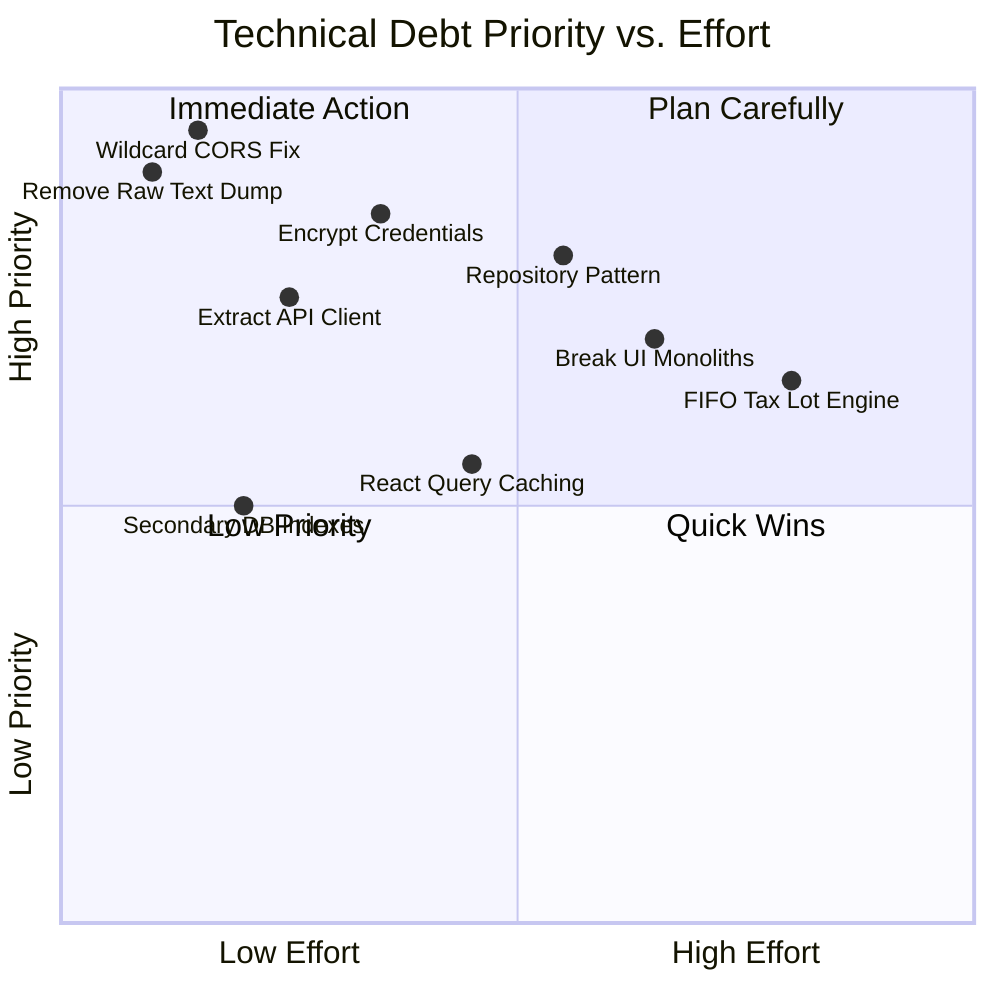

# 🛠 TECHNICAL_DEBT_ROADMAP.md — Technical Debt Prioritization & Remediation

**System Name**: Family Wealth OS  
**Author**: Lead Software Engineer & Software Architect  
**Date**: July 25, 2026  
**Status**: Target Specification (Sprint 0.5)

---

## 1. Executive Summary

This roadmap prioritizes the technical debt items identified during Sprint 0 investigation into four severity tiers: **Critical**, **High**, **Medium**, and **Low**. Remediation tasks are scheduled incrementally across Sprints 1 to 5 to eliminate security vulnerabilities, performance bottlenecks, and architectural smells without disrupting user functionality.

---

## 2. Technical Debt Matrix

---

## 3. Prioritized Remediation Backlog

### 3.1 Tier 1: CRITICAL SEVERITY (Sprint 1)
Must be resolved immediately to secure user data and establish architectural boundaries.

| Debt Item | Description | Location | Effort | Risk | Target Sprint |
| :--- | :--- | :--- | :--- | :--- | :--- |
| **CORS Wildcard Vulnerability** | Change `origin: '*'` in Express server to strict localhost `http://localhost:5173` and bind to `127.0.0.1`. | `backend/src/index.ts` | 1 hour | Low | **Sprint 1** |
| **Unencrypted Plain-Text Log Dump** | Delete `fs.writeFileSync(raw_cams_text.txt)` which exposes decrypted PDF statement text on disk. | `backend/src/routes/import.ts` | 1 hour | Low | **Sprint 1** |
| **Unencrypted Stored Credentials** | Implement AES-256-GCM encryption for stored API tokens and OAuth keys in SQLite. | `backend/src/db.ts` `credentials` table | 4 hours | Medium | **Sprint 1** |
| **Route Controller SQL Coupling** | Extract SQL queries out of route handlers into Repository interfaces (`IAssetRepository`, etc.). | `backend/src/routes/*.ts` | 12 hours | Medium | **Sprint 1** |

---

### 3.2 Tier 2: HIGH SEVERITY (Sprint 2)
Required for multi-entity family scalability and frontend maintainability.

| Debt Item | Description | Location | Effort | Risk | Target Sprint |
| :--- | :--- | :--- | :--- | :--- | :--- |
| **Hardcoded API URLs** | Replace hardcoded `'http://localhost:5000'` in 6 frontend components with centralized Axios client using `VITE_API_URL`. | `frontend/src/components/*` | 4 hours | Low | **Sprint 2** |
| **Single-Tenant Database Schema** | Execute schema migration adding `family_members`, `entities`, `accounts`, and `portfolios` tables. | `backend/src/db.ts` | 16 hours | High | **Sprint 2** |
| **ImportCenter.tsx Monolith** | Deconstruct 1,500-line single file component into 6 modular step wizard components and custom hook. | `frontend/src/components/ImportCenter.tsx` | 16 hours | Medium | **Sprint 2** |
| **Portfolio.tsx Monolith** | Deconstruct 800-line component into `AssetTable`, `AssetRow`, `AssetModal`, and `TaxLotDrawer`. | `frontend/src/components/Portfolio.tsx` | 12 hours | Medium | **Sprint 2** |

---

### 3.3 Tier 3: MEDIUM SEVERITY (Sprint 3)
Improves computation accuracy and database performance.

| Debt Item | Description | Location | Effort | Risk | Target Sprint |
| :--- | :--- | :--- | :--- | :--- | :--- |
| **Average Cost vs. Tax Lots** | Replace simple weighted average cost with a FIFO tax lot engine for STCG/LTCG capital gains. | `backend/src/services/taxLotService.ts` | 20 hours | High | **Sprint 3** |
| **Synchronous N+1 Query Loops** | Replace `.map()` loop database calls in `assets.ts` with indexed SQL join aggregations. | `backend/src/routes/assets.ts` | 8 hours | Medium | **Sprint 3** |
| **Missing Secondary DB Indexes** | Add indexes on `transactions(asset_id, date)`, `transactions(type)`, and `asset_prices(date)`. | `backend/src/db.ts` | 2 hours | Low | **Sprint 3** |
| **Lack of Client-Side Caching** | Integrate TanStack Query (React Query) to eliminate background re-fetching on tab switches. | `frontend/src/` | 12 hours | Low | **Sprint 3** |

---

### 3.4 Tier 4: LOW SEVERITY (Sprint 4-5)
Code cleanup and developer ergonomics.

| Debt Item | Description | Location | Effort | Risk | Target Sprint |
| :--- | :--- | :--- | :--- | :--- | :--- |
| **Duplicated Holding Math** | Consolidate unit/cost algorithms duplicated between `assets.ts` and `dashboard.ts` into `ValuationService`. | `backend/src/services/` | 6 hours | Low | **Sprint 4** |
| **Hardcoded Timeline Scanning** | Parameterize hardcoded 30-day and 60-day fallback lookback windows in net worth timeline generator. | `backend/src/routes/dashboard.ts` | 3 hours | Low | **Sprint 4** |
| **Utility Helper Consolidation** | Create shared `formattingUtils.ts` for currency (`₹`), percentage, and date (`YYYY-MM-DD`) formatting. | `frontend/src/utils/` | 4 hours | Low | **Sprint 4** |
