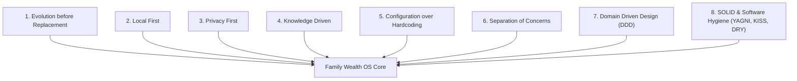

# 📖 01_ARCHITECTURE_PRINCIPLES.md — Core Architectural Principles

**Document Purpose**: Fundamental engineering principles governing all design, code, and architectural decisions for Family Wealth OS.  
**Target Audience**: Software Engineers, System Architects, AI Coding Assistants  
**Status**: Active Engineering Standard  

---

## 1. Executive Summary

Family Wealth OS is built to serve as a 20+ year personal financial operating system. To ensure long-term maintainability, privacy, security, and financial accuracy, every line of code written in this repository must adhere strictly to the core principles detailed below.

---

## 2. Core Architectural Principles

---

### 2.1 Evolution before Replacement (`Reuse > Refactor > Replace`)
- **Statement**: Existing working code, parsers, and database schemas must be evolved incrementally rather than rewritten from scratch unless strong security, maintainability, or architectural justification exists.
- **Why It Exists**: Rewriting complex domain logic (such as CAS PDF parsing or AMFI NAV scraping) introduces severe regression risks, delays feature delivery, and discards proven edge-case handling built over time.
- **Rule of Thumb**: Before replacing any module, attempt **Reuse** first. If changes are needed, **Refactor**. Only **Replace** if a critical vulnerability or architectural blocker cannot be solved through refactoring.

---

### 2.2 Local First
- **Statement**: 100% of user data, financial records, transaction histories, and credentials reside locally on the user's machine inside SQLite (`data/family_wealth.db`).
- **Why It Exists**: Financial data is deeply sensitive. Cloud-hosted wealth platforms expose users to data breaches, subscription lock-in, vendor shutdown risk, and cloud server outages.
- **Rule of Thumb**: No external database (Supabase, Firebase, AWS RDS) or cloud telemetry service may ever be added to this project. All computation runs locally.

---

### 2.3 Privacy First
- **Statement**: Data privacy is a non-negotiable security requirement. Zero unencrypted financial data leaves the local machine.
- **Why It Exists**: Users must trust Family Wealth OS with their complete financial balance sheet. Any leakage of account numbers, PANs, or portfolio valuations compromises user safety.
- **Rule of Thumb**:
  - Express server binds strictly to `127.0.0.1`.
  - CORS restricts origins exclusively to `http://localhost:5173`.
  - Stored API tokens are encrypted with AES-256-GCM.
  - Decrypted PDF text must never be dumped to plain-text disk files (`raw_cams_text.txt` is prohibited).
  - AI integrations synthesize anonymized summaries; raw database rows are never transmitted to external AI APIs.

---

### 2.4 Knowledge Driven
- **Statement**: Financial wisdom, investment constitution rules, decision logs, and quarterly review reasoning are stored as persistent Markdown documents inside `knowledge/`.
- **Why It Exists**: Code should manage software execution; human financial philosophy should manage wealth decisions. Decoupling knowledge from code ensures that financial guidance survives software updates and provides persistent memory across AI engineering sessions.
- **Rule of Thumb**: Store investment philosophy in `knowledge/Investment_Constitution.md` and decision logs in `knowledge/Decision_Log.md`. Code consumes knowledge; code does not hardcode financial philosophy.

---

### 2.5 Configuration over Hardcoding
- **Statement**: Business parameters, tax rates, asset allocation targets, risk thresholds, and AI prompts live in JSON configuration files inside `config/`.
- **Why It Exists**: Tax laws, inflation rates, and personal asset targets change over time. Hardcoding rules in TypeScript requires code recompilation and deployment for simple parameter changes.
- **Rule of Thumb**: Never hardcode tax limits (e.g. ₹1.25L LTCG exemption), target asset allocation percentages, or lookback windows inside route handlers or services. Store them in `config/tax_rules.json` or `config/asset_allocation.json` and validate them with Zod on boot.

---

### 2.6 Separation of Concerns
- **Statement**: Application code is organized into distinct, non-overlapping architectural layers: `Controller (HTTP) -> Service (Domain Logic) -> Repository (Data Access) -> SQLite`.
- **Why It Exists**: Mixing raw SQL execution and unit valuation math inside Express route controllers (as seen in baseline technical debt) makes code untestable, fragile, and difficult to maintain.
- **Rule of Thumb**:
  - Controllers only handle HTTP parsing, Zod validation, and returning JSON responses.
  - Services contain pure financial domain algorithms and business workflows.
  - Repositories encapsulate raw SQL queries and prepared statements.

---

### 2.7 Domain-Driven Design (DDD)
- **Statement**: The software architecture mirrors real-world financial domain concepts organized into explicit Bounded Contexts.
- **Why It Exists**: Financial software requires clear domain boundaries to prevent data corruption and maintain conceptual clarity.
- **Bounded Contexts**:
  1. *Family & Entity Context*: Family, Members, Legal Tax Entities (Personal, HUF), Accounts.
  2. *Portfolio & Asset Context*: Holdings, Categories, Prices, Valuations, XIRR.
  3. *Tax & Ledger Context*: Transactions, FIFO Tax Lots, STCG/LTCG.
  4. *Goal Context*: Financial Goals, Retirement Projections.
  5. *AI & Decision Context*: Investment Theses, Quarterly Decision Journal.

---

### 2.8 Software Hygiene: SOLID, YAGNI, KISS, DRY

- **S - Single Responsibility Principle**: Every class, service, and component must have one, and only one, reason to change.
- **O - Open/Closed Principle**: Software entities should be open for extension, but closed for modification (e.g., adding a new statement parser without modifying existing parser interfaces).
- **L - Liskov Substitution Principle**: Subclasses or concrete implementations must be completely substitutable for their base interfaces (e.g., `SQLiteAssetRepository` implements `IAssetRepository`).
- **I - Interface Segregation Principle**: Clients should not be forced to depend on methods they do not use. Keep interfaces small and focused.
- **D - Dependency Inversion Principle**: High-level domain services depend on abstractions (interfaces), not concrete low-level database drivers.
- **YAGNI (You Aren't Gonna Need It)**: Do not build speculative features or complex microservice infrastructure until explicitly required.
- **KISS (Keep It Simple, Stupid)**: Prefer clean, synchronous local function calls over complex asynchronous message queues unless performance profiling proves necessity.
- **DRY (Don't Repeat Yourself)**: Consolidate duplicate financial formulae (such as cost basis calculations) into single authoritative domain services.
