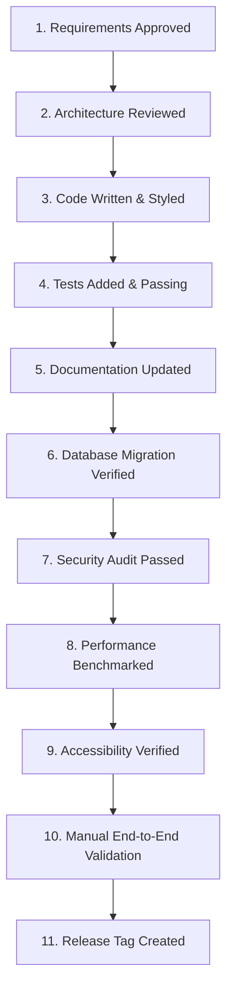

# 📖 03_DEFINITION_OF_DONE.md — Definition of Done (DoD)

**Document Purpose**: Definitive release criteria checklist for completing features, refactorings, or sprint tasks in Family Wealth OS.  
**Target Audience**: Software Engineers, QA Leads, Product Owners, AI Coding Assistants  
**Status**: Active Quality Standard  

---

## 1. Executive Summary

In Family Wealth OS, a feature or pull request is **NOT** complete simply because code compiles or a UI component renders. Because this application handles critical family wealth data, every contribution must satisfy an 11-step **Definition of Done (DoD)** before merge to `main`.

---

## 2. Mandatory Definition of Done Checklist

---

### Step 1: Requirements Approved
- Feature scope aligns explicitly with `PROJECT_CHARTER.md` and `Product_Vision.MD`.
- User stories and edge cases documented in feature specification.

### Step 2: Architecture Reviewed
- Architecture conforms to `TARGET_ARCHITECTURE.md` layered pattern (`Controller -> Service -> Repository -> SQLite`).
- New architectural patterns or library additions documented via an ADR in `docs/ARCHITECTURE_DECISIONS.md`.
- DDD bounded contexts respected; no leaks across domain models.

### Step 3: Code Written & Styled
- Code strictly follows `02_CODING_STANDARDS.md`.
- Zero TypeScript `any` types or suppressed compiler warnings.
- ESLint and Prettier pass cleanly without errors or warnings.
- Code is modular; React component files stay under 200 lines.

### Step 4: Tests Added & Passing
- Unit tests written for all new domain services and financial calculation routines.
- Integration tests written for REST API endpoints using Supertest.
- Financial calculation precision tests verify 100% mathematical correctness for XIRR, cost basis, and STCG/LTCG capital gains.
- Overall code coverage meets or exceeds 80%.

### Step 5: Documentation Updated
- API contracts updated in `API_MIGRATION_PLAN.md` or OpenAPI schemas.
- `README.md` updated if developer setup or environment variables changed.
- Persistent session memory updated in `.ai/SESSION_CONTEXT.md`.

### Step 6: Database Migration Verified
- SQLite schema DDL migration script runs non-destructively on a copy of real user data.
- Foreign key integrity verified via `PRAGMA foreign_key_check`.
- Zero data loss or corrupted balances during schema transition.

### Step 7: Security Audit Passed
- Server bound strictly to `127.0.0.1` loopback interface.
- CORS policies restricted exclusively to `http://localhost:5173`.
- No plain-text passwords, full PANs, or API secret keys logged or stored unencrypted.
- SQL queries parameterized 100% using prepared statements.

### Step 8: Performance Benchmarked
- Database queries verified to prevent N+1 query loop regressions.
- API response latency remains under 50ms for local database operations.
- Frontend React components render cleanly without redundant re-render loops.

### Step 9: Accessibility Verified
- Keyboard navigation supported across all interactive UI modals, tables, and forms.
- High-contrast visual readability maintained under dark theme.
- Form controls include descriptive `aria-label` and `htmlFor` attributes.

### Step 10: Manual End-to-End Validation
- End-to-end user workflow validated manually on desktop dev build.
- Data ingestion preview matches expected values before database commit.

### Step 11: Release Tag Created
- Branch merged to `main` via approved Pull Request.
- Semantic version release tag (e.g. `v1.2.0`) created and pushed to Git repository.
