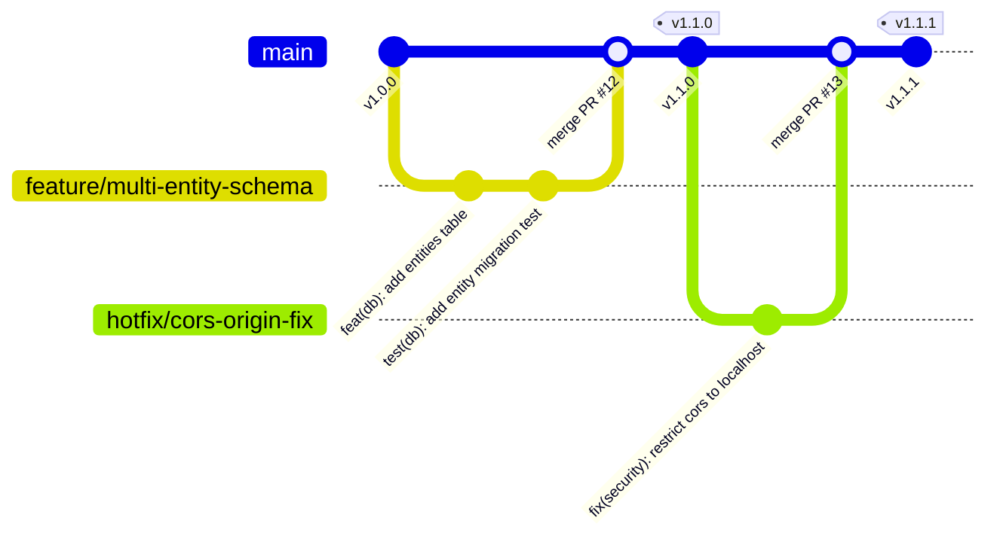

# 📖 04_GIT_WORKFLOW.md — Version Control & Branching Strategy

**Document Purpose**: Define Git branching workflows, commit standards, Pull Request checklists, and release tagging rules for Family Wealth OS.  
**Target Audience**: Software Engineers, Technical Leads, AI Coding Assistants  
**Status**: Active Engineering Standard  

---

## 1. Branching Strategy

Family Wealth OS utilizes a structured **Trunk-Based / Feature-Branch Workflow** optimized for high code quality and clear release history.



### Branch Naming Conventions
- `main`: Production-ready trunk branch. Must always be stable and deployable.
- `feature/<feature-name>`: Active feature development (e.g. `feature/fifo-tax-lots`, `feature/goal-planner`).
- `fix/<bug-name>`: Bug fixes for open issues (e.g. `fix/xirr-negative-return`).
- `refactor/<module-name>`: Code simplification and architecture refactoring (e.g. `refactor/import-center-monolith`).
- `hotfix/<critical-issue>`: Emergency security or data-corruption fixes directly targeting release candidates.

---

## 2. Commit Message Standards (Conventional Commits)

All commit messages MUST follow the **Conventional Commits** specification:

```
<type>(<scope>): <short summary in imperative mood>

[optional detailed body explaining WHY the change was made]
```

### Approved Commit Types
- `feat`: A new user-facing feature or API endpoint.
- `fix`: A bug fix or error resolution.
- `refactor`: Code change that neither fixes a bug nor adds a feature.
- `perf`: Code change that improves database query or frontend rendering performance.
- `security`: Security hardening, encryption addition, or CORS restriction.
- `docs`: Documentation updates (README, Developer Handbook, ADRs).
- `test`: Adding missing unit, integration, or financial formula tests.
- `chore`: Build script updates, package version bumps, linting fixes.

### Approved Examples
```bash
git commit -m "feat(tax): implement FIFO tax lot assignment for stock purchases"
git commit -m "security(cors): bind express server strictly to 127.0.0.1 loopback"
git commit -m "refactor(ui): break ImportCenter monolith into step wizard components"
git commit -m "fix(calculator): prevent division by zero in average cost calculation"
```

---

## 3. Pull Request (PR) & Code Review Protocol

### PR Title Format
PR titles must mirror Conventional Commit format: `type(scope): summary`.

### PR Description Template
```markdown
## Overview
Brief description of what this PR introduces and what issue it resolves.

## Type of Change
- [ ] Feature
- [ ] Bug Fix
- [ ] Refactor
- [ ] Security Hardening
- [ ] Documentation

## Checklist
- [ ] Follows `02_CODING_STANDARDS.md`.
- [ ] Satisfies `03_DEFINITION_OF_DONE.md`.
- [ ] Unit & integration tests added and passing.
- [ ] Zero database orphan records or data loss verified.
- [ ] Architecture review / ADR created if applicable.
- [ ] `.ai/SESSION_CONTEXT.md` updated.
```

---

## 4. Merge Strategy & Release Tagging

### Merge Strategy
- **Squash and Merge**: Use for feature branches to keep `main` branch history clean and atomic.
- **Rebase & Merge**: Allowed for small refactoring or documentation branches.

### Release Tagging Syntax
Semantic Versioning (`vMAJOR.MINOR.PATCH`) is enforced:
- **MAJOR**: Breaking schema changes or fundamental architecture overhauls (e.g. `v2.0.0`).
- **MINOR**: New sprint feature releases (e.g. `v1.1.0`, `v1.2.0`).
- **PATCH**: Backward-compatible bug fixes and security hotfixes (e.g. `v1.1.1`).
