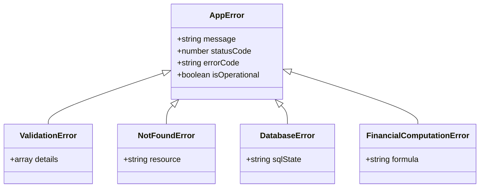

# 📖 05_ERROR_HANDLING_STANDARD.md — Error Handling & Exception Architecture

**Document Purpose**: Define standard error classes, API error response envelopes, database exception handling, and UI error boundary patterns for Family Wealth OS.  
**Target Audience**: Backend Engineers, Frontend Engineers, AI Coding Assistants  
**Status**: Active Engineering Standard  

---

## 1. Executive Summary

Financial software requires explicit, predictable error handling. Uncaught exceptions or silent failures can corrupt ledger calculations or lead to incorrect investment decisions. This standard establishes a unified error handling architecture across both backend REST services and frontend React applications.

---

## 2. Backend Custom Exception Hierarchy

All application-level errors inherit from a base `AppError` class:



### Exception Definitions
- **`AppError`**: Base class for operational errors.
- **`ValidationError`** (`HTTP 400`): Thrown when Zod schema validation fails or request params are invalid.
- **`NotFoundError`** (`HTTP 404`): Thrown when an asset, transaction, entity, or account ID does not exist in SQLite.
- **`DatabaseError`** (`HTTP 500`): Thrown when SQLite foreign key constraints or unique index constraints are violated.
- **`FinancialComputationError`** (`HTTP 422`): Thrown when mathematical computations (such as XIRR non-convergence or division by zero) fail.

---

## 3. Standardized API Error Response Envelope

All API endpoints MUST return errors using a standardized JSON structure:

```json
{
  "success": false,
  "data": null,
  "error": {
    "code": "VALIDATION_ERROR",
    "message": "Invalid transaction payload parameters.",
    "details": [
      {
        "field": "amount",
        "issue": "Amount must be a positive number greater than 0."
      }
    ]
  },
  "timestamp": "2026-07-25T12:00:00.000Z"
}
```

---

## 4. Backend Express Centralized Error Middleware

```typescript
import { Request, Response, NextFunction } from 'express';
import { AppError } from '../errors/AppError';
import { logger } from '../utils/logger';

export function errorHandlerMiddleware(
  err: Error,
  req: Request,
  res: Response,
  next: NextFunction
) {
  if (err instanceof AppError) {
    logger.warn(`Operational Error [${err.errorCode}]: ${err.message}`, { path: req.path });
    return res.status(err.statusCode).json({
      success: false,
      data: null,
      error: {
        code: err.errorCode,
        message: err.message,
        details: err.details || []
      },
      timestamp: new Date().toISOString()
    });
  }

  // Handle unexpected internal server exceptions
  logger.error(`Unhandled Exception: ${err.message}`, { stack: err.stack, path: req.path });
  
  return res.status(500).json({
    success: false,
    data: null,
    error: {
      code: 'INTERNAL_SERVER_ERROR',
      message: 'An unexpected error occurred on the local server.',
      details: []
    },
    timestamp: new Date().toISOString()
  });
}
```

---

## 5. Frontend Error Handling & UI Isolation

### 5.1 React Error Boundaries
Wrap top-level application screens and complex feature widgets inside React Error Boundaries to prevent a single rendering crash from taking down the entire dashboard UI:

```tsx
import React, { Component, ErrorInfo, ReactNode } from 'react';
import { AlertTriangle } from 'lucide-react';

interface Props {
  children: ReactNode;
  fallbackTitle?: string;
}

interface State {
  hasError: boolean;
  error: Error | null;
}

export class FeatureErrorBoundary extends Component<Props, State> {
  public state: State = { hasError: false, error: null };

  public static getDerivedStateFromError(error: Error): State {
    return { hasError: true, error };
  }

  public componentDidCatch(error: Error, errorInfo: ErrorInfo) {
    console.error('UI Feature Crash Caught:', error, errorInfo);
  }

  public render() {
    if (this.state.hasError) {
      return (
        <div className="p-6 bg-red-950/20 border border-red-900/50 rounded-2xl text-red-200 flex items-start gap-3">
          <AlertTriangle className="w-5 h-5 text-red-500 flex-shrink-0 mt-0.5" />
          <div>
            <h3 className="font-semibold text-sm">{this.props.fallbackTitle || 'Component Error'}</h3>
            <p className="text-xs text-red-400 mt-1">Failed to render widget. Click refresh to retry.</p>
          </div>
        </div>
      );
    }
    return this.props.children;
  }
}
```

### 5.2 Axios Interceptor Response Normalization
The centralized API client (`src/api/apiClient.ts`) intercepts all HTTP errors and converts raw HTTP failure status codes into clean user-facing error messages displayed via toast notifications.
