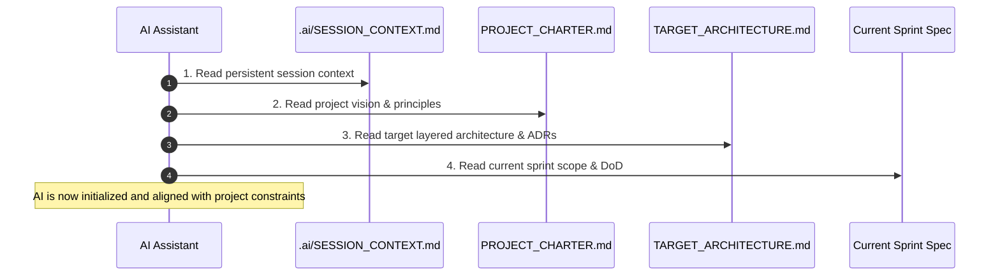

# 📖 08_AI_DEVELOPMENT_STANDARD.md — AI Engineering & Pair Programming Standard

**Document Purpose**: Define rules, boundaries, context initialization procedures, and quality controls for AI coding assistants (Antigravity, Codex, ChatGPT) working on Family Wealth OS.  
**Target Audience**: AI Agents, Software Engineers Pair-Programming with AI  
**Status**: Active Engineering Standard  

---

## 1. Executive Summary

AI coding assistants are key engineering partners on Family Wealth OS. However, AI agents MUST operate within strict architectural boundaries. An AI assistant must never bypass repository patterns, hardcode business rules, break security guards, or refactor working modules without explicit architectural authorization.

---

## 2. Mandatory Session Context Protocol

Before writing any code or executing refactorings, every AI session MUST perform the following 4-step initialization protocol:



---

## 3. Core Rules for AI Assistants

### Rule 1: Read Persistent Context First
AI must start every turn by inspecting `.ai/SESSION_CONTEXT.md` to understand current sprint goals, branch state, recent file modifications, open architectural decisions, and next recommended tasks.

### Rule 2: Respect Evolution Before Replacement
AI must NOT rewrite working parsers, components, or services from scratch. Follow `Reuse > Refactor > Replace`. Only modify code required to satisfy the immediate sprint objective.

### Rule 3: Enforce Layered Boundaries
AI must never place raw SQL queries (`db.prepare(...)`) inside Express controller routes or React components. All database access MUST use Repository interfaces (`IAssetRepository`). All business math MUST live in domain services.

### Rule 4: Business Rules Belong in Configuration
AI must NEVER hardcode tax limits, target asset allocation percentages, risk parameters, or API URLs in TypeScript files. Write parameters into `config/*.json` files and validate them with Zod.

### Rule 5: Preserve Privacy & Security
AI must NEVER add telemetry, cloud storage, or external database drivers. CORS must remain strictly locked to `http://localhost:5173`. AI must NEVER write code that dumps plain-text decrypted statements to disk (`raw_cams_text.txt` is prohibited).

### Rule 6: Mandatory Documentation Updates
Upon completing any feature or architectural modification, AI MUST update `.ai/SESSION_CONTEXT.md` with:
- List of modified files and *WHY* they changed.
- New ADR references if architectural decisions were made.
- Updated completion percentage and next recommended task.

---

## 4. AI Code Review & Prompt Formatting

When prompting AI assistants or asking AI to review code, format requests using structured context blocks:

```markdown
<TASK>
Implement FIFO tax lot assignment in backend/src/services/taxLotService.ts
</TASK>

<CONSTRAINTS>
- Adhere strictly to docs/developer_handbook/02_CODING_STANDARDS.md
- Use Repository interfaces (ITransactionRepository)
- Write Vitest unit tests covering 100% of calculation paths
- Update .ai/SESSION_CONTEXT.md upon completion
</CONSTRAINTS>
```
