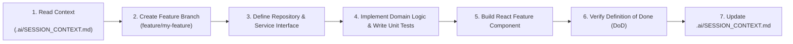

# 📖 10_DEVELOPER_ONBOARDING.md — Senior Engineer Onboarding Guide

**Document Purpose**: Complete onboarding guide enabling a new software engineer or AI assistant to understand, set up, and start contributing to Family Wealth OS within 30 minutes.  
**Target Audience**: New Software Engineers, System Architects, AI Coding Assistants  
**Status**: Active Engineering Standard  

---

## 1. Welcome & Project Vision

Welcome to **Family Wealth OS**! This is a **local-first, AI-powered Personal CFO** built for long-term family wealth preservation over a 20+ year horizon.

This platform is **NOT** a simple portfolio tracker. It is a financial decision-support system that helps families answer:
- *Where should the next ₹50,000 go?*
- *Am I overexposed to IT or Banking?*
- *Should this investment be made in my Personal account, my Spouse's account, or HUF?*
- *What is the tax impact if I sell today?*

### Core Principles
1. **Local-First**: 100% of data stays local in SQLite (`data/family_wealth.db`). Zero cloud lock-in.
2. **Privacy-First**: Sensitive data is encrypted at rest. Zero unencrypted financial data leaves the local machine.
3. **Knowledge-Driven**: Financial wisdom lives in `knowledge/*.md`; business parameters live in `config/*.json`.

---

## 2. System Architecture & Folder Map

```
Family-Wealth-OS/
├── package.json               # Monorepo root runner (runs backend & frontend concurrently)
├── README.md                  # High-level overview
├── docs/                      # Core architectural documents & Developer Handbook
│   ├── PROJECT_CHARTER.md     # Project governance charter
│   ├── TARGET_ARCHITECTURE.md # 4-layer clean architecture specification
│   ├── DOMAIN_MODEL.md        # DDD family hierarchy & entity relationships
│   └── developer_handbook/    # Developer Handbook (Coding standards, DOD, Git, Testing)
├── .ai/                       # Persistent AI session memory
│   └── SESSION_CONTEXT.md     # Active context file updated every session
├── config/                    # Business rules (tax rules, asset allocation targets, AI prompts)
├── knowledge/                 # Wealth constitution, decision logs, advisor context
├── data/                      # Local SQLite database (family_wealth.db)
├── backend/                   # Express + TypeScript REST API (Port 5000)
│   └── src/
│       ├── controllers/       # HTTP request parsing & response handling
│       ├── services/          # Pure domain business math & parsers
│       ├── repositories/      # Typed SQLite DAOs (better-sqlite3)
│       └── db.ts              # SQLite connection & schema engine
└── frontend/                  # React 19 + Vite + TypeScript Client App (Port 5173)
    └── src/
        ├── api/               # Centralized Axios client (apiClient.ts)
        ├── store/             # Zustand global UI state
        ├── features/          # Modular domain components (dashboard, portfolio, import)
        └── components/ui/     # Shared reusable UI elements
```

---

## 3. How to Run & Test the Application

### 3.1 First-Time Setup
```bash
# Install all root, backend, and frontend dependencies
npm run install-all
```

### 3.2 Start Local Development Servers
```bash
# Launch both Express Backend (:5000) and Vite Frontend (:5173) concurrently
npm run dev
```
- **Frontend App**: `http://localhost:5173`
- **Backend API**: `http://localhost:5000`

### 3.3 Run Test Suite
```bash
# Run backend unit, integration, and financial calculation tests
cd backend && npm test
```

---

## 4. Step-by-Step Guide to Creating a New Feature



1. **Check Context**: Read `.ai/SESSION_CONTEXT.md` and `docs/developer_handbook/08_AI_DEVELOPMENT_STANDARD.md`.
2. **Create Branch**: `git checkout -b feature/my-feature-name`.
3. **Define Interfaces**: Create typed contracts for repositories and services first.
4. **Implement Domain Logic**: Write business logic in `backend/src/services/` and cover with unit tests in `backend/src/services/__tests__/`.
5. **Implement Repository**: Write parameterized SQL queries in `backend/src/repositories/`.
6. **Implement Controller**: Handle REST HTTP request parsing and Zod validation in `backend/src/controllers/`.
7. **Implement UI**: Build modular React sub-components under `frontend/src/features/<feature_name>/` (< 200 lines per file).
8. **Verify DoD**: Run checklists in `docs/developer_handbook/09_REVIEW_CHECKLIST.md`.
9. **Update Session Context**: Document modified files and rationale in `.ai/SESSION_CONTEXT.md`.

---

## 5. How to Write Architectural Decision Records (ADRs)

If a new technical decision is made (e.g. adding a library, changing state management, modifying schema), add a new entry to `docs/ARCHITECTURE_DECISIONS.md` using the ADR format:

```markdown
## ADR-009: Title of Decision

### Status: Accepted

### Context
Why does this decision need to be made? What problem are we solving?

### Decision
What is the explicit technical decision?

### Consequences
- **Benefits**: Positive outcomes.
- **Risks & Trade-offs**: Negative trade-offs or constraints.
- **Long-Term Impact**: 20+ year architectural durability.
```

---

## 6. Top 10 Common Developer Mistakes to Avoid

1. ❌ **Executing Raw SQL in Controllers**: NEVER put `db.prepare(...)` in Express route handlers. Always use Repositories.
2. ❌ **Hardcoding API URLs**: NEVER write `'http://localhost:5000'` in React components. Use `apiClient.ts`.
3. ❌ **Hardcoding Business Rules**: NEVER put tax limits or asset allocation target % in TypeScript code. Use `config/*.json`.
4. ❌ **Writing Plain-Text Statement Dumps**: NEVER write decrypted PDF plain text to disk (`raw_cams_text.txt` is prohibited).
5. ❌ **Creating Monolithic React Components**: NEVER create 500+ line UI files. Keep components under 200 lines.
6. ❌ **Using `any` Types**: NEVER suppress TypeScript compiler warnings with `any`. Define Zod schemas or TS interfaces.
7. ❌ **Binding Server to `0.0.0.0`**: Server must bind strictly to `127.0.0.1` loopback for security.
8. ❌ **Allowing Wildcard CORS**: Express CORS must be locked strictly to `http://localhost:5173`.
9. ❌ **Performing Manual Data Fetching in `useEffect`**: Use TanStack Query (`useQuery`) for server state.
10. ❌ **Forgetting to Update Session Context**: ALWAYS update `.ai/SESSION_CONTEXT.md` before ending a development session.
