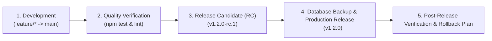
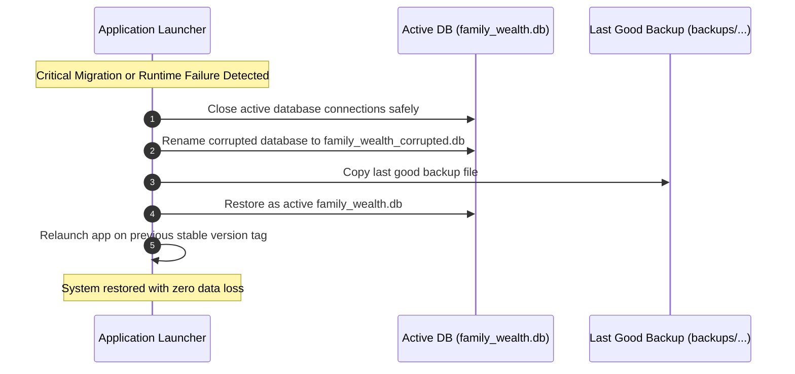

# 📖 12_RELEASE_PROCESS.md — Release Engineering & Backup Strategy

**Document Purpose**: Define release candidate preparation, quality verification gates, version tagging, database backup protocols, and zero-data-loss rollback procedures for Family Wealth OS.  
**Target Audience**: Software Engineers, Release Engineers, AI Coding Assistants  
**Status**: Active Engineering Standard  

---

## 1. Executive Summary

Because Family Wealth OS runs locally on end-user desktop machines and manages local SQLite databases (`data/family_wealth.db`), release management requires zero-downtime database safety. Every release candidate MUST pass automated schema migration tests and execute automated file backups prior to applying upgrades.

---

## 2. The 5-Stage Release Lifecycle



---

### Stage 1: Development Completion
- Feature branches merged into `main` via approved Pull Request following `04_GIT_WORKFLOW.md`.
- All items in `03_DEFINITION_OF_DONE.md` verified.

### Stage 2: Quality Verification Gate
Execute complete automated build verification:
```bash
# 1. Run type checking and linter
npm run lint

# 2. Run backend and frontend automated test suites
cd backend && npm test

# 3. Verify production build compilation
npm run build
```

### Stage 3: Release Candidate (RC) Tagging
- Create a pre-release candidate tag (e.g. `v1.2.0-rc.1`).
- Execute manual end-to-end testing of statement imports, portfolio valuation, and navigation.

### Stage 4: Automated Database Backup & Upgrade Execution
Before applying any app upgrade or schema migration, the application launcher automatically creates a compressed, timestamped physical backup of the SQLite database:
- Backup Path: `data/backups/family_wealth_backup_v1.1.0_20260725_120000.db`
- Retention: Retain last 10 release backups in `data/backups/`.

### Stage 5: Production Tagging & Release Packaging
- Tag `main` with semantic version tag: `git tag -a v1.2.0 -m "Release v1.2.0 - Multi-Entity Family Model"`.
- Push tag to repository: `git push origin v1.2.0`.
- Package desktop executable build output.

---

## 3. Rollback Procedure & Emergency Restoration

If a critical error, database lock, or regression occurs post-release:



1. **Automatic Detection**: If database schema migration fails or foreign key validation checks fail (`PRAGMA foreign_key_check`), the app aborts launch immediately.
2. **Atomic Restoration**: The corrupted DB file is moved to `data/backups/failed_migration_<timestamp>.db`.
3. **Backup Reinstatement**: The pre-upgrade database copy is restored as `data/family_wealth.db`.
4. **Safety Confirmation**: The system relaunches on the previous stable release tag without data loss.
