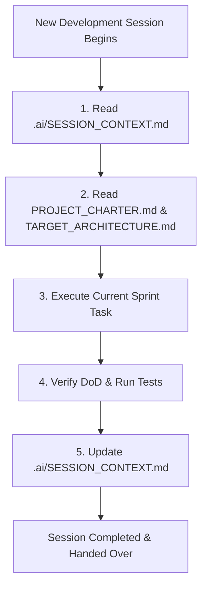

# 📖 13_SESSION_CONTEXT_STANDARD.md — Persistent Session Context Specification

**Document Purpose**: Define the mandatory structure, rules, update protocols, and schema for `.ai/SESSION_CONTEXT.md`—the persistent engineering memory between development sessions.  
**Target Audience**: Software Engineers, AI Coding Assistants (Antigravity, Codex, ChatGPT)  
**Status**: Active Engineering Standard  

---

## 1. Executive Summary

In a long-lived project, context degradation across AI development sessions is a major risk. To prevent AI agents from hallucinating outdated assumptions, reversing architectural decisions, or repeating past research, every session MUST maintain a single, standardized memory file located at:

```
.ai/SESSION_CONTEXT.md
```

This file serves as the **primary context checkpoint** read at the start of every new AI session and updated before completing every development turn.

---

## 2. Session Context Update Protocol



---

## 3. Required File Schema (`.ai/SESSION_CONTEXT.md`)

Every `.ai/SESSION_CONTEXT.md` file MUST contain all 15 required sections detailed below:

```markdown
# Current Sprint
- **Sprint Number**: [e.g. Sprint A / Sprint 1]
- **Sprint Goal**: [High-level objective]
- **Current Status**: [In Progress / Testing / Complete]
- **Completion Percentage**: [e.g. 85%]

# Current Branch
- **Git Branch**: [e.g. feature/fifo-tax-lots]
- **Last Commit**: [Commit hash and title]
- **Pending Pull Requests**: [PR link or None]

# Current Feature
- **Feature Name**: [e.g. FIFO Tax Lot Assignment Engine]
- **Specification Document**: [Link to spec in docs/]
- **Implementation Status**: [In Progress / Complete]
- **Dependencies**: [List of prerequisite tasks/modules]

# Files Modified
[List every file changed during the session and explain WHY it changed]
- `backend/src/services/taxLotService.ts`: Added FIFO lot allocation algorithm.
- `backend/src/db.ts`: Added tax_lots table schema definition.

# Architecture Decisions
- **New ADRs**: [List any new ADR numbers created in docs/ARCHITECTURE_DECISIONS.md]
- **Architecture Modifications**: [Summary of architectural boundary changes]

# Business Rules Added
- **Rule Summary**: [Document financial or tax rules introduced]
- **Configuration File**: [Path to JSON file in config/ e.g. config/tax_rules.json]

# Database Changes
- **New Tables**: [Table names or None]
- **New Columns**: [Column names or None]
- **New Indexes**: [Index names or None]
- **Migration Scripts**: [Path to migration file]
- **Rollback Notes**: [Verification that PRAGMA foreign_key_check passed]

# API Changes
- **New Endpoints**: [e.g. POST /api/v1/tax/lots]
- **Modified Endpoints**: [Endpoints updated]
- **Deprecated Endpoints**: [Endpoints deprecated]
- **Breaking Changes**: [None or description]

# UI Changes
- **New Screens**: [e.g. /goals screen added]
- **Modified Components**: [Components updated]
- **Deleted Components**: [Components removed]
- **Navigation Changes**: [Sidebar / Header updates]

# Technical Debt
- **Debt Introduced**: [Any temporary trade-offs made]
- **Debt Removed**: [Refactorings completed]
- **Future Cleanup Items**: [Tracked cleanup tasks]

# Known Issues
- **Open Bugs**: [Issue summary]
- **Limitations**: [Current software bounds]
- **Temporary Workarounds**: [Temporary fixes]

# Test Status
- **Unit Tests**: [Passed / Total count]
- **Integration Tests**: [Passed / Total count]
- **Financial Tests**: [Passed / Total count]
- **Coverage**: [Current % coverage]

# Next Recommended Task
- **Recommended Action**: [Exactly ONE recommendation]
- **Rationale**: [Why this is the single highest priority task]

# Blockers
- **Current Blockers**: [None or missing decision/requirements]

# Notes for Next AI Session
- **Project State Summary**: [Concise summary of state]
- **Key Assumptions**: [Assumptions made]
- **Prerequisite Files to Read**: [List key files next session should read]
- **Potential Risks**: [Items to watch out for]
```

---

## 4. Mandatory Rules for AI Sessions
1. **Always Read First**: Never write code before reading `.ai/SESSION_CONTEXT.md`.
2. **Single Next Task**: Under `# Next Recommended Task`, specify **EXACTLY ONE** task with clear justification. Do NOT list multiple conflicting tasks.
3. **Honest Diff Tracking**: Under `# Files Modified`, list every modified file accurately with the rationale.
