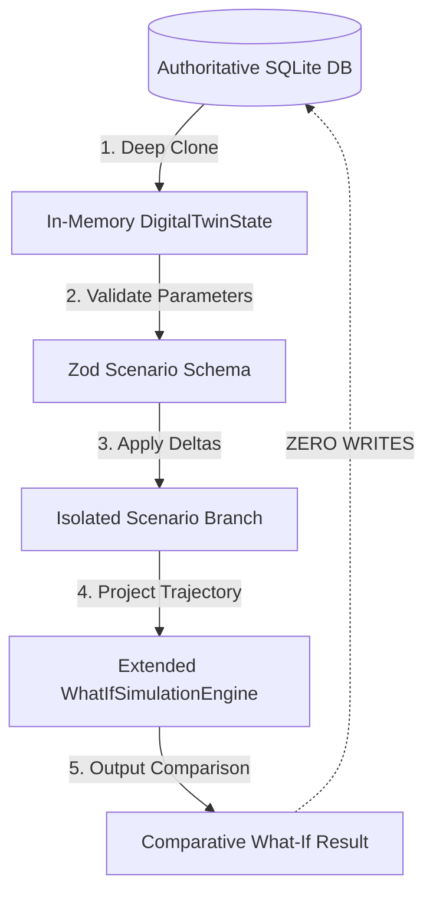
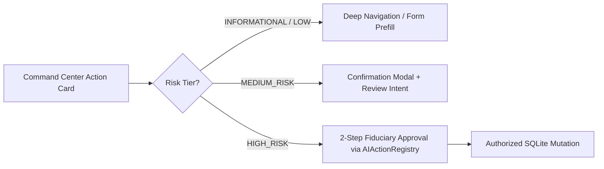

# Phase 8C Strategic Implementation Plan: Family Financial Health, Timeline, Time Machine & Command Center (Final Approved Architecture)

---

## 1. Executive Summary & Strategic Objectives

**Phase 8C** delivers the executive synthesis layer, chronological family ledger, retroactive time machine, counterfactual simulation sandbox, and decision-centric command center of the **Personal Family Office OS**. It builds directly upon the Phase 8B foundation (Contracts, 5-Pillar Digital Twin, Life Events Engine, and Proactive Observer).

---

## 2. Core Architectural & Fiduciary Guardrails

```
+----------------------------------------------------------------------------------------------------+
|                                    PHASE 8C SYSTEM BOUNDARIES                                      |
+----------------------------------------------------------------------------------------------------+
  1. DETERMINISTIC FFH         -> Explicit formulas & provenance; no ad-hoc score overrides.
  2. DERIVED TIMELINE          -> Read-only projection over authoritative SQLite domain tables.
  3. QUALIFIED TIME MACHINE    -> Historical reconstruction with explicit completeness; zero price fakes.
  4. ZERO-MUTATION WHAT-IF     -> Reuses WhatIfSimulationEngine; isolated deep-clone in-memory sandbox.
  5. SINGLE OBSERVER ENGINE    -> Proactive triggers solely governed by Sprint 8B.3 Cooldown Registry.
  6. SAFE ACTION ROUTING       -> No direct UI mutations; risk-tiered confirmation via AIActionRegistry.
  7. SERVER-RESOLVED SCOPE     -> Authoritative familyId derived strictly from CorrelationContext.
  8. MEASURED TEST METHODOLOGY -> Previous Baseline (316) + New Sprint Tests (X) = Total (316 + X).
+----------------------------------------------------------------------------------------------------+
```

---

## 3. Pillar 1: Family Financial Health (FFH) Scoring Contract

### 3.1 Formal Calculation Matrix

| Pillar | Metric / Sub-Score | Input Field | Target / Benchmark | Calculation Owner | Deterministic Formula | Missing Data / Explicit Semantics | Freshness | Version |
| :--- | :--- | :--- | :--- | :--- | :--- | :--- | :--- | :--- |
| **Protection (25%)** | Term Cover Ratio (60%) + Health Shield Ratio (40%) | Active Term Life Sum Assured, Health Sum Assured from `insurance_policies` | Required HLV from `DigitalTwinService`, Baseline Family Health Target (₹25L) | `DigitalTwinService` / `InsuranceRepository` | $\min\left(100, \left(\frac{\text{TermCover}}{\text{HLVTarget}} \times 60\right) + \left(\frac{\text{HealthCover}}{\text{HealthTarget}} \times 40\right)\right)$ | Missing HLV $\to$ `UNKNOWN`; Zero cover $\to$ Formula calculates strictly $0.0$ (no ad-hoc overrides) | $\le 30$d | `2026.1` |
| **Liquidity (20%)** | Emergency Runway Months | Liquid Bank Balances + Liquid MFs from `assets` | 6 Months of Non-Discretionary Expenses | `DigitalTwinService` / `CashflowService` | $\min\left(100, \left(\frac{\text{LiquidReserves}}{\text{MonthlyBurn} \times 6}\right) \times 100\right)$ | Missing Burn $\to$ `INSUFFICIENT_DATA`; Zero Reserves $\to$ Formula calculates $0.0$ | $\le 7$d | `2026.1` |
| **Goals (20%)** | Goal Compounding & Progress Pace | Current Allocated vs Target from `financial_goals` | Individual Goal Targets & Timelines | `GoalPlanningService` | $\frac{1}{N} \sum_{i=1}^N \min\left(100, \frac{\text{Allocated}_i}{\text{Target}_i} \times 100\right)$ | Zero registered goals $\to$ `NOT_APPLICABLE` (Weight redistributed proportionally) | $\le 30$d | `2026.1` |
| **Estate (15%)** | Will Registration & Nominee Coverage | Active Wills, Nominee Edges in Knowledge Graph | 100% Asset Nominee Linkage + Valid Will | `EstateHealthService` | Direct score from `EstateHealthService.calculateEstateHealth(familyId)` | Missing graph sync $\to$ `STALE`; No Will/Nominees $\to$ Exact score from formula | $\le 90$d | `2026.1` |
| **Tax & Data (20%)** | Section 80C Utilization (50%) + Data Completeness (50%) | Claimed 80C Deductions from `tax_deductions`, Twin Completeness | ₹1,50,000 Statutory Limit, 1.0 (100%) Twin Completeness | `TaxCalculationEngine` / `DigitalTwinService` | $\left(\frac{\min(150000, \text{Claimed80C})}{150000} \times 50\right) + (\text{TwinCompletenessScore} \times 50)$ | Missing deductions $\to$ Pro-rated on known items; Completeness from Digital Twin | $\le 30$d | `2026.1` |

### 3.2 Deterministic Family Life-Stage Selection & Weight Redistribution

#### Selection Algorithm:
1. **Identify Primary Earner**: Member with the highest declared annual income in `family_members`. If incomes are equal or undeclared, select the eldest member with employment status `ACTIVE`.
2. **Evaluate Stage**:
   - `RETIREMENT`: Primary earner age $> 65$, or employment status = `RETIRED`.
   - `WEALTH_PRESERVATION`: Primary earner age $50 \le \text{age} \le 65$.
   - `FAMILY_EXPANSION`: Minor dependents present ($< 18$ yrs), or primary earner age $32 \le \text{age} < 50$ (Default).
   - `EARLY_CAREER`: Primary earner age $< 32$ with 0 minor dependents.

#### Proportional Weight Redistribution Formula:
When a pillar evaluates to `NOT_APPLICABLE` (e.g. Goals when 0 goals exist):
$$W_i' = \frac{W_i}{\sum_{j \in \text{Available}} W_j} \times 100\%$$

### 3.3 Snapshot Cadence & Deduplication
- **Cadence**: Snapshots are persisted to `family_health_history` on distinct monthly boundaries (e.g., first evaluation of each month) or when a material state change occurs ($|\Delta \text{Score}| \ge 2.5$ pts).
- **Idempotency & Deduplication**: If a snapshot already exists for the same `familyId`, same `stateHash`, and same calendar month (`YYYY-MM`), redundant snapshot insertion is suppressed.
- **Dynamic Deltas**: Calculated dynamically between current score and previous comparable snapshot:
  $$\Delta_{\text{total}} = \text{Score}_{\text{current}} - \text{Score}_{\text{prev}}, \quad \Delta_{\text{pillar}} = \text{PillarScore}_{\text{current}} - \text{PillarScore}_{\text{prev}}$$

---

## 4. Pillar 2: Unified Family Timeline Ledger

### 4.1 Ingestion & Normalization Matrix

| Domain | Source Table | Filter Criteria | Event Date Field | Deduplication Identity |
| :--- | :--- | :--- | :--- | :--- |
| **Transactions** | `transactions` | $|\text{Amount}| \ge \text{Threshold}$ (Default ₹1,00,000) AND NOT Internal Transfer | `transaction_date` | `SHA256("TXN", id)` |
| **Insurance** | `insurance_policies` | Policy activation, renewal window ($\le 30$d) | `start_date` / `next_premium_due_date` | `SHA256("INS", id, event_type)` |
| **Goals** | `financial_goals` | Creation, milestone crossed ($\ge 50\%, 100\%$) | `created_at` / `updated_at` | `SHA256("GOAL", id, event_type)` |
| **Tax** | `tax_deductions`, `itr_filings` | Return filed, 80C limit maximized | `filing_date` / `tax_year` | `SHA256("TAX", id, tax_year)` |
| **Estate** | `wills`, `trusts` | Will registered, executor nominated | `execution_date` | `SHA256("EST", id, execution_date)` |
| **Life Events** | `life_events` | Life event declared or processed | `event_date` | `SHA256("LE", id)` |
| **Proactive Triggers** | `proactive_triggers` | Status = `ACKNOWLEDGED` or `RESOLVED` | `updated_at` | `SHA256("TRG", trigger_id, status)` |

### 4.2 Synchronization & Update/Delete Semantics
- **Derived Read Model**: `family_timeline_events` is a derived index.
- **Stable Identity**: Each event derives an immutable `event_id = SHA256(sourceType, sourceId, eventType)`.
- **Update/Delete Consistency**: When an authoritative record is modified (e.g. transaction amount or date edited), `FamilyTimelineService` updates the projected timeline record in place via `UPSERT`. When an authoritative record is deleted (`deleted_at IS NOT NULL` or hard-deleted), the corresponding timeline record is purged.
- **Transaction Filtering Rules**:
  - Threshold evaluates absolute amount: $|\text{amount}| \ge \text{configurableThreshold}$.
  - Internal transfers between two family-owned accounts are excluded.

---

## 5. Pillar 3: Financial Time Machine & Zero-Mutation Sandbox

### 5.1 Qualified Retroactive Reconstruction Matrix

| Asset Class | Historical Quantity ($T_{\text{target}}$) | Historical Price / Valuation Policy | Calculation Engine | Missing Data Semantics |
| :--- | :--- | :--- | :--- | :--- |
| **Equities & Stocks** | $\sum_{t \le T} \text{BuyUnits} - \sum_{t \le T} \text{SellUnits}$ | Exact closing price from `asset_prices` where $\text{date} \le T$ (within 90 days) | `PortfolioValuationStrategy` | If no price within 90d $\to$ `UNKNOWN` (Zero price substitution strictly forbidden) |
| **Mutual Funds** | $\sum_{t \le T} \text{Units}$ | Historical NAV from `asset_prices` where $\text{date} \le T$ | `MutualFundValuationStrategy` | Missing NAV $\to$ `UNKNOWN` |
| **Fixed Deposits** | Principal deposited $\le T$ | Accrued compounding interest up to $T$ | `fdValuation.ts` | Complete date inputs required; else `INSUFFICIENT_DATA` |
| **Bank Accounts** | Net cumulative credits/debits up to $T$ | Account balance as of $T$ | `CashflowService` | Missing statements $\to$ `UNKNOWN` |
| **PPF / EPF / NPS** | Cumulative contributions up to $T$ | Authoritative historical ledger balance | Existing EPF/NPS Parsers | Missing ledger $\to$ `HISTORICAL_SOURCE_UNAVAILABLE` |
| **Real Estate** | Active ownership verified $\le T$ | Recorded purchase cost or registered circle valuation $\le T$ | `AssetRepository` | Unvalued property $\to$ `KNOWN_ACQUISITION_COST` |
| **Insurance** | Policy active on $T$ | Sum Assured and Surrender Value status on $T$ | `InsuranceRepository` | Missing policy state $\to$ `UNKNOWN` |

#### Deterministic Cutoff Semantics:
- Cutoff boundary is end-of-day inclusive: `targetDateT 23:59:59.999Z`. All transactions, prices, and corporate actions with timestamps $\le$ cutoff are included.

### 5.2 Zero-Mutation Counterfactual What-If Sandbox



#### Invariant Protections:
- **Zero Database Writes**: Live tables (`assets`, `transactions`, `holdings`, `policies`, `goals`) are never mutated.
- **Deep Clone Isolation**: The Digital Twin state is deeply cloned in memory; nested objects and arrays are independent.
- **Input Validation**: Strict Zod schema validating:
  - `monthlySipAmount`: $\ge 0$, $\le ₹50,00,000$.
  - `sipStepUpPercent`: $0 \le \text{pct} \le 100$.
  - `loanPrepaymentAmount`: $\ge 0$.
  - `targetRetirementAge`: $35 \le \text{age} \le 80$.
  - Rejection of unknown asset IDs, goals, or cross-family identifiers.

---

## 6. Pillar 4: Family Command Center UX & Action Safety

### 6.1 Action Risk Classification & Confirmation Routing



| Risk Tier | Examples | Execution Behavior |
| :--- | :--- | :--- |
| **INFORMATIONAL** | View 80C options, review nominee gap | Opens deep workspace tab with filtered context |
| **LOW_RISK** | Snooze proactive trigger (1..30d), dismiss trigger | In-place mutation with idempotency key |
| **MEDIUM_RISK** | Update goal monthly SIP target, mark policy renewed | Explicit confirmation dialog displaying before/after impact |
| **HIGH_RISK** | Prepay loan, rebalance portfolio, delete entity | 2-Step fiduciary confirmation requiring explicit authorization |

---

## 7. Sprint-by-Sprint Execution Roadmap

| Sprint | Focus Area | Detailed Scope & Deliverables |
| :--- | :--- | :--- |
| **Sprint 8C.0** | **Contracts, Zod Schemas & Migrations (Foundation Only)** | - Zod contracts for FFH (`FamilyFinancialHealthSchema`), Timeline (`FamilyTimelineEventSchema`), Time Machine (`TimeMachineReconstructionSchema`, `WhatIfScenarioSchema`).<br>- Migration `019_family_health_and_timeline.ts` (`family_health_history`, `family_timeline_events`).<br>- Repositories: `SQLiteFamilyHealthRepository.ts`, `SQLiteFamilyTimelineRepository.ts`.<br>- Invariant test suite verifying schemas, serialization, and migration safety. |
| **Sprint 8C.1** | **Family Financial Health (FFH) Engine** | - `FamilyFinancialHealthService.ts` implementing the 5-pillar calculation matrix.<br>- Dynamic life-stage selection and proportional weight redistribution.<br>- Monthly snapshot cadence with state-hash deduplication.<br>- Calculated absolute, percentage, and pillar attribution deltas.<br>- REST endpoints (`GET /health`, `GET /health/history`, `POST /health/snapshot`).<br>- Invariant tests. |
| **Sprint 8C.2** | **Unified Family Timeline Ledger** | - `FamilyTimelineService.ts` aggregating transactions, policies, goals, tax, estate, life events, triggers.<br>- Deduplication identity (`SHA256(sourceType, sourceId)`).<br>- Configurable transaction threshold with internal transfer exclusions.<br>- Idempotent sync runner and update/delete projection consistency.<br>- REST endpoints (`GET /timeline`, `POST /timeline/sync`).<br>- Invariant tests. |
| **Sprint 8C.3** | **Financial Time Machine & Simulation Sandbox** | - `FinancialTimeMachineService.ts` implementing qualified retroactive reconstruction with asset-class matrix.<br>- Deterministic cutoff semantics and provenance tagging (`CALCULATED`, `HISTORICAL_SOURCE`, `UNKNOWN`).<br>- Extending `WhatIfSimulationEngine.ts` with deep-clone Digital Twin sandbox support.<br>- Strict parameter validation and zero-database-mutation invariant tests.<br>- REST endpoints (`GET /time-machine/reconstruct`, `POST /time-machine/simulate`).<br>- Invariant tests. |
| **Sprint 8C.4** | **Family Command Center UI** | - Executive Vitals Strip (Net Worth, FFH Circular Gauge, Emergency Runway).<br>- Prioritized Action Radar (Strict max 3 cards with 5-point explainability).<br>- Domain Matrices 2x2 Grid (Portfolio, Protection, Goals, Tax/Estate).<br>- Interactive Timeline Strip & Time Machine Scrubber.<br>- What-If Scenario Drawer.<br>- Safe action routing (no direct UI mutations). Zero frontend business logic.<br>- End-to-end integration tests. |

---

## 8. Measurable Verification & Testing Standards

- **Test Suite Reporting**: $\text{Previous Baseline (316)} + \text{New Sprint Tests (X)} = \text{Total (316 + X)}, 0 \text{ Failures}$.
- **Performance Targets (p95)**:
  - FFH calculation $\le 500\text{ms}$
  - Timeline query $\le 500\text{ms}$
  - Time Machine reconstruction $\le 1000\text{ms}$
  - What-If simulation $\le 1000\text{ms}$
- **TypeScript Strict Compilation**: `backend` and `frontend` `tsc --noEmit` = 0 errors.
- **Cross-Family Security**: Strict authorization verification across all endpoints.
