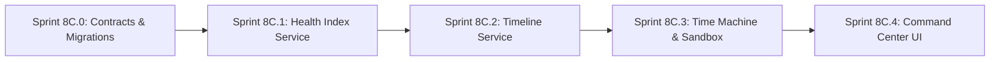

# Revised Implementation Plan: Phase 8C – Family Financial Health Index, Timeline Ledger, Financial Time Machine & Command Center

---

## 1. Executive Summary & Strategic Objectives

**Phase 8C** delivers the executive synthesis layer, chronological family ledger, retroactive time machine, counterfactual simulation sandbox, and decision-centric command center of the **Personal Family Office OS**. It builds directly upon the Phase 8B foundation (Contracts, 5-Pillar Digital Twin, Life Events Engine, and Proactive Observer).

### 🛡️ Core Fiduciary & Architectural Guardrails (Incorporating Review Comments)
1. **Deterministic Financial Health (FFH)**: Computed via strict mathematical formulas over the 5-Pillar Digital Twin; missing data produces explicit semantics (`UNKNOWN`, `INSUFFICIENT_DATA`, `NOT_APPLICABLE`, `KNOWN_ZERO`, `STALE`) rather than silent zeroes.
2. **Derived Timeline Projection**: The timeline ledger is a derived read model over authoritative domain records (`transactions`, `insurance_policies`, `wills`, `financial_goals`, `life_events`, `proactive_triggers`). It never acts as a parallel source of financial truth.
3. **Qualified Time Machine Provenance**: Point-in-time reconstruction provides exact metrics only where authoritative historical records exist, tagging every component with provenance (`CALCULATED`, `HISTORICAL_SOURCE`, `UNKNOWN`, `INSUFFICIENT_DATA`) and never fabricating historical prices.
4. **Strict Zero-Mutation Sandbox**: Counterfactual what-if simulations operate on in-memory deep clones of `DigitalTwinState`, extending the existing `WhatIfSimulationEngine` with zero SQLite database writes.
5. **Single Recommendation Engine**: Proactive fiduciary alerts remain solely governed by the Proactive Observer & Cooldown Registry (Sprint 8B.3); no duplicate or conflicting "Health Alert" engines.
6. **Command Center Human-in-the-Loop Safety**: Dashboard action cards do not execute direct financial mutations; all actions route through existing fiduciary confirmation and authorization workflows.
7. **Server-Resolved Family Scope**: Family ID is derived strictly from `CorrelationContext.getFamilyId()`. No client query or body parameter can tamper with or override family scope.

---

## 2. System Architecture & Information Flow

```mermaid
flowchart TD
    subgraph Data Tier [Authoritative Core Data]
        DB[(SQLite Master Tables: Assets, Transactions, Policies, Goals, Wills, LifeEvents, Triggers)]
    end

    subgraph Domain Tier [Authoritative Calculation Engines]
        Engines[EstateHealthService, GoalPlanningService, TaxEngine, fdValuation, InsuranceRepo]
    end

    subgraph State Tier [Semantic Digital Twin]
        DT[DigitalTwinService: Hydrates 5-Pillars & StateHash]
    end

    subgraph Synthesis Tier [Phase 8C Derived Services]
        FFH[FamilyFinancialHealthService: 0-100 Score, LifeStage, History]
        TL[FamilyTimelineService: Normalized Chronological Ledger]
        TM[FinancialTimeMachineService: Retroactive State & Sandbox]
    end

    subgraph Presentation Tier [Human Decision Plane]
        CC[FamilyCommandCenter UI: Vitals, Radar, 2x2 Grid, Scrubber]
        Auth[Fiduciary Action Confirmation Gate]
    end

    DB <--> Engines
    Engines --> DT
    DT --> FFH
    DT --> TM
    DB --> TL
    FFH -->|State Shift| Observer[Proactive Observer Engine (8B.3)]
    Observer -->|Trigger| DB
    FFH --> CC
    TL --> CC
    TM --> CC
    CC --> Auth
    Auth -->|User Confirmed Action| DB
```

---

## 3. Detailed Pillar Specifications

### 🏛️ Pillar 1: Family Financial Health (FFH) Index (0–100)

| Pillar Domain | Sub-Score Component | Default Weight | Deterministic Formula / Underlying Engine | Minimum Data Required | Missing Data / Explicit Semantics | Freshness Requirement |
| :--- | :--- | :---: | :--- | :--- | :--- | :--- |
| **1. Protection Shield** | Term Life Cover + Health Shield | **25%** | $\min(100, (\text{TermCover} / \text{HLV Target}) \times 60 + (\text{HealthCover} / \text{Target}) \times 40)$ from `DigitalTwinService` | Active earning members + policy registry | Missing HLV $\to$ `UNKNOWN`; Zero cover $\to$ `KNOWN_ZERO` (Score = 20) | $\le 30$ days |
| **2. Liquidity & Reserves** | Emergency Runway Months | **20%** | $\min(100, (\text{LiquidReserves} / (\text{MonthlyBurn} \times 6)) \times 100)$ from `DigitalTwinService` | Cash balances + 30-day expense ledger | Missing burn $\to$ `INSUFFICIENT_DATA`; Zero cash $\to$ `KNOWN_ZERO` (Score = 0) | $\le 7$ days |
| **3. Goals & Retirement** | Goal Trajectory & Compounding Pace | **20%** | Average goal progress and compounding probability from `GoalPlanningService` | $\ge 1$ registered financial goal | No goals $\to$ `NOT_APPLICABLE` (Weight reallocated to Liquidity/Tax) | $\le 30$ days |
| **4. Estate & Succession** | Will Status, Nominees, Trust Setup | **15%** | Composite score from `EstateHealthService.calculateEstateHealth(familyId)` | Family members + Asset ownership | No Will/Nominees $\to$ `KNOWN_ZERO` (Score = 0–25) | $\le 90$ days |
| **5. Tax & Data Hygiene** | 80C Utilization & Twin Completeness | **20%** | $(\text{80C Utilized} / 150000) \times 50 + (\text{DataCompletenessScore}) \times 50$ | Asset ledger + Tax deductions | Incomplete tax data $\to$ Pro-rated on known items; Completeness from Digital Twin | $\le 30$ days |

#### Explicit Life-Stage Determination Rules
- **`EARLY_CAREER`** (Primary earner age $< 32$, no minor dependents): Protection: 20%, Liquidity: 30%, Retirement: 25%, Estate: 5%, Tax/Hygiene: 20%.
- **`FAMILY_EXPANSION`** (Primary earner age 32–50, or minor dependents present): Protection: 25%, Liquidity: 20%, Retirement: 20%, Estate: 15%, Tax/Hygiene: 20% (Default).
- **`WEALTH_PRESERVATION`** (Primary earner age 50–65, dependent children transitioning): Protection: 20%, Liquidity: 15%, Retirement: 25%, Estate: 25%, Tax/Hygiene: 15%.
- **`RETIREMENT`** (Primary earner age $> 65$, or retired status declared): Protection: 10%, Liquidity: 30%, Retirement: 20%, Estate: 30%, Tax/Hygiene: 10%.

#### Derived Snapshot History & Calculated Deltas
- Stored in `family_health_history`: `(family_id, overall_score, pillar_scores_json, calculation_version, as_of_date, state_hash, life_stage, completeness_score)`.
- Calculated dynamically as $\text{Score}_{\text{current}} - \text{Score}_{\text{previous}}$, providing absolute deltas, percentage deltas, and pillar-level attribution (e.g. `+4.2 pts: Protection +3.1, Tax +1.1`).

---

### 📜 Pillar 2: Unified Family Timeline Ledger

| Source Domain | Authoritative Source Table | Normalized Event Type | Title Template | Event Date Source | Deduplication Identity |
| :--- | :--- | :--- | :--- | :--- | :--- |
| **Transactions** | `transactions` ($\ge \text{Threshold}$) | `TRANSACTION_MAJOR` | `{Type} of ₹{Amount} in {AssetName}` | `transaction_date` | `SHA256("TXN", id, transaction_date)` |
| **Insurance** | `insurance_policies` | `INSURANCE_MILESTONE` | `{Insurer} {Type} Policy Activated / Renewed` | `start_date` / `next_premium_due_date` | `SHA256("INS", id, event_type, date)` |
| **Goals** | `financial_goals` | `GOAL_MILESTONE` | `Goal "{Title}" Created / Milestone Reached` | `created_at` / `target_year` | `SHA256("GOAL", id, event_type, date)` |
| **Tax** | `tax_deductions`, `itr_filings` | `TAX_MILESTONE` | `FY{Year} Return Filed / 80C Maximized` | `filing_date` / `tax_year` | `SHA256("TAX", id, tax_year)` |
| **Estate** | `wills`, `trusts` | `ESTATE_MILESTONE` | `Will v{Version} Registered / Executor Appointed` | `execution_date` | `SHA256("EST", id, execution_date)` |
| **Life Events** | `life_events` | `LIFE_EVENT` | `Life Event: {Title}` | `event_date` | `SHA256("LE", id, event_date)` |
| **Proactive Triggers** | `proactive_triggers` (`ACKNOWLEDGED`/`RESOLVED`) | `AI_FIDUCIARY_DECISION` | `Fiduciary Action: {Headline}` | `updated_at` | `SHA256("TRG", trigger_id, status)` |

#### Configurable Transaction Threshold & Date Semantics
- Configurable transaction threshold (default $\ge ₹1,00,000$). Internal bank-to-bank transfers excluded.
- Timeline ordering strictly uses business `event_date` (not system record `created_at`).

---

### ⏳ Pillar 3: Financial Time Machine & Simulation Sandbox

#### 1. Qualified Retroactive Point-in-Time Reconstruction
- **Contract**: Point-in-time reconstruction with explicit completeness and provenance. Exact reconstruction is provided only where authoritative historical data exists.
- Reconstructs holdings from transaction history, historical prices from `asset_prices` (never fabricated), running cash balances, and accrued FD interest via `fdValuation.ts`.
- Every component tagged `CALCULATED`, `HISTORICAL_SOURCE`, `UNKNOWN`, or `INSUFFICIENT_DATA`.

#### 2. Zero-Mutation Counterfactual What-If Sandbox
- Reuses and extends existing `WhatIfSimulationEngine.ts`.
- Clones `DigitalTwinState` into ephemeral memory (`WhatIfSimulationState`). Zero database writes.
- Returns `{ scenarioId, baselineStateHash, baselineAsOf, scenarioParameters, calculationVersion, generatedAt }`.

---

### 🎛️ Pillar 4: Decision-Centric Family Command Center UX

- **Executive Vitals Strip (3-Second Rule)**: Net worth, FFH Score (0-100 gauge), Emergency runway.
- **Prioritized Action Radar (Strict Max 3 Cards)**: Top 3 proactive triggers with 5-point explainability and safe action routing.
- **Domain Matrices (2x2 Grid)**: Portfolio, Protection, Goals, Tax/Estate.
- **Interactive Timeline Strip & Scrubber**: Multi-domain chronological narrative and time machine launcher.
- **What-If Scenario Drawer**: Side-by-side comparative delta charts.
- **Zero Frontend Business Logic**: Frontend is purely a presentation layer consuming backend contracts.

---

## 4. Sprint-by-Sprint Implementation Specifications



| Sprint | Focus Area | Scope & Key Deliverables |
| :--- | :--- | :--- |
| **Sprint 8C.0** | Contracts & DB Migrations | `familyOfficeContracts.ts` (FFH, Timeline, Time Machine schemas), Migration `019_family_health_and_timeline.ts` (`family_health_history`, `family_timeline_events`), Repositories, Invariant tests |
| **Sprint 8C.1** | Financial Health Index | `FamilyFinancialHealthService.ts`, dynamic life-stage weighting, missing-data semantics, history snapshotting, calculated deltas, REST endpoints, Unit & integration tests |
| **Sprint 8C.2** | Family Timeline Ledger | `FamilyTimelineService.ts`, multi-domain normalization, deterministic deduplication, configurable transaction threshold, sync runner, REST endpoints, Unit & integration tests |
| **Sprint 8C.3** | Time Machine & What-If Sandbox | `FinancialTimeMachineService.ts`, retroactive balance sheet reconstruction with provenance, zero-mutation scenario sandbox extending `WhatIfSimulationEngine`, REST endpoints, Unit & integration tests |
| **Sprint 8C.4** | Family Command Center UI | Executive dashboard, vitals strip, action radar (max 3), 2x2 domain matrices, interactive timeline, what-if drawer, zero frontend business logic |

---

## 5. Verification & Testing Strategy

- **Baseline**: 316 tests (100% passing).
- **Test Reporting Standard**: $\text{Previous Baseline (316)} + \text{New Sprint Tests (X)} = \text{Total (316 + X)}, 0 \text{ Failures}$.
- **Zero Compilation Errors**: `tsc --noEmit` = 0 errors on backend and frontend.
- **Cross-Family Security**: Strict authorization testing on all new endpoints.


---

# ChatGPT Final Review – Phase 8C Revised Implementation Plan

## Overall Verdict

**🟢 STRATEGICALLY APPROVED — WITH REQUIRED IMPLEMENTATION CLARIFICATIONS**

The Agent has incorporated the major architectural feedback from the previous review. The revised plan now correctly establishes:

- deterministic FFH
- explicit missing-data semantics
- derived timeline projection
- qualified point-in-time reconstruction
- zero-mutation What-If
- reuse of `WhatIfSimulationEngine`
- single Proactive Observer
- server-resolved family scope
- human-in-the-loop Command Center
- zero frontend business logic
- measured test-baseline methodology

These are the right boundaries. fileciteturn22file0

I do **not** recommend another strategic redesign.

However, before Sprint 8C.0 coding begins, the following items must be clarified because several formulas and architectural statements are still ambiguous.

---

# 1. CRITICAL – FFH Pillar Formulas Need a Formal Contract

The plan now provides formulas, which is a major improvement.

However, some formulas still contain undefined targets:

```text
HealthCover / Target
Emergency runway
Goal progress
Compounding probability
```

The implementation plan must explicitly identify the authoritative source and formula for every target.

### Required source matrix

Add:

```text
FFH Pillar
→ Metric
→ Input
→ Target
→ Calculation Owner
→ Formula
→ Missing Data Behaviour
→ Freshness
→ Version
```

Do not allow `FamilyFinancialHealthService` to invent targets independently of existing domain engines.

---

# 2. CRITICAL – The "Score = 20" / "Score = 0–25" Missing-Data Rules Need Review

The Protection section says:

> Zero cover → `KNOWN_ZERO` (Score = 20)

The Estate section says:

> No Will/Nominees → `KNOWN_ZERO` (Score = 0–25)

These values look like arbitrary scoring penalties.

A known zero is **data**, not automatically a fixed health score.

For example:

```text
Known zero insurance
```

can legitimately produce a low protection score, but the exact score must come from the defined deterministic formula.

### Required rule

Do not use ad-hoc score overrides unless they are explicitly part of the versioned FFH scoring formula.

---

# 3. CRITICAL – Life-Stage Weight Reallocation Must Be Formalized

The plan says:

> No goals → `NOT_APPLICABLE` (Weight reallocated to Liquidity/Tax)

This conflicts slightly with the fixed life-stage weights.

Define exactly how weight redistribution works.

Example:

```text
Base weights
↓
Pillar unavailable
↓
Excluded pillar
↓
Remaining weights
↓
Normalized to 100%
```

Specify whether redistribution is:

- proportional
- assigned to specific pillars
- deterministic by life stage

Do not let individual implementations choose their own redistribution.

---

# 4. IMPORTANT – Family vs Member Life Stage

The plan defines life stage from:

> Primary earner age / minor dependents / retired status.

This is workable, but the implementation must explicitly define:

- how primary earner is selected
- what happens if there are multiple earners
- what happens when spouse/partner has a different stage
- what happens when retirement statuses conflict

For the first implementation, a deterministic family-level stage is acceptable, but document the selection algorithm.

---

# 5. IMPORTANT – FFH History Snapshot Timing

The plan says snapshots are stored in:

`family_health_history`

but does not yet define when a snapshot is created.

Determine whether snapshots occur:

- monthly
- on material state change
- on explicit refresh
- on demand
- combination of the above

Avoid creating a new history row on every dashboard request.

Recommended:

```text
Same family
Same stateHash
Same asOf period
        ↓
No duplicate snapshot
```

---

# 6. IMPORTANT – FFH → Proactive Observer Integration

The architecture shows:

```text
FFH → State Shift → Proactive Observer
```

This is directionally correct.

But **FFH must not become another recommendation engine**.

Define:

```text
FFH calculates health
        ↓
Existing Observer evaluates configured rule
        ↓
Existing cooldown / recommendation lifecycle
```

Do not create a separate "FFH alert" subsystem.

---

# 7. CRITICAL – Timeline Synchronization Must Be Explicit

The plan now defines the timeline as a projection, which is correct.

But `FamilyTimelineService` needs an explicit synchronization model.

Define whether synchronization is:

```text
on-demand rebuild
incremental event-driven update
scheduled sync
hybrid
```

Also define what happens if:

```text
Authoritative record deleted
Authoritative record updated
Event date changes
Source record becomes inaccessible
```

The derived timeline must remain consistent with authoritative sources.

---

# 8. IMPORTANT – Timeline Event Deduplication Must Handle Updates

The current identity:

```text
SHA256(sourceType, id, eventDate)
```

is good for initial deduplication.

But if the source record's event date changes, a new identity would be produced.

Define whether the old projection is:

- updated
- replaced
- marked stale

Do not leave orphaned timeline events.

Prefer a stable source identity plus event version where possible.

---

# 9. IMPORTANT – Transaction Threshold Semantics

The revised plan says:

> configurable transaction threshold (default ≥ ₹1,00,000)

Good.

Before implementation, explicitly define:

```text
absolute amount vs signed amount
inflow vs outflow
internal transfers
refunds/reversals
joint-account transfers
```

A transfer between two family-owned accounts should not become a major wealth event.

---

# 10. CRITICAL – Time Machine Must Define Historical Price Policy

The Time Machine is the most technically sensitive component.

The plan correctly says it will never fabricate historical prices.

Add a formal price policy:

```text
Exact historical price available
        → use it

Historical price unavailable
        → UNKNOWN / INSUFFICIENT_DATA

Current price substituted?
        → NEVER for a historical reconstruction
```

Do not silently use today's price for a historical date.

---

# 11. CRITICAL – Time Machine Cutoff Semantics

Define precisely:

```text
targetDate = 2025-12-31
```

Does a transaction on `2025-12-31 23:59:59` count?

What about:

- transactions without timestamps
- same-day transactions
- corporate actions
- dividends
- stock splits
- SIP transactions
- interest accruals

The reconstruction engine needs a deterministic cutoff convention.

---

# 12. IMPORTANT – Historical Valuation by Asset Class

Before coding 8C.3, create an asset-class reconstruction matrix:

| Asset | Historical Quantity | Historical Price/Value | Engine | Missing Data |
|---|---|---|---|---|
| Equity | Transactions | Historical market price | Existing valuation | UNKNOWN |
| Mutual Fund | Units | Historical NAV | Existing MF valuation | UNKNOWN |
| FD | Principal/interest | FD engine | `fdValuation` | Defined |
| PPF | Contribution/history | Historical balance | Existing source | Defined |
| EPF | Contribution/history | Historical balance | Existing source | Defined |
| NPS | Units/value | Historical NAV/value | Existing source | Defined |
| Property | Ownership | Historical valuation | Existing source | UNKNOWN |
| Insurance | Policy state | Historical value | Insurance engine | Defined |

Do not start Time Machine implementation until this matrix is explicit.

---

# 13. IMPORTANT – Time Machine Must Reuse Existing `WhatIfSimulationEngine`

The plan correctly states reuse.

Make the implementation boundary explicit:

```text
FinancialTimeMachineService
    = point-in-time reconstruction + orchestration

WhatIfSimulationEngine
    = scenario calculations
```

Do not duplicate scenario formulas in the Time Machine.

---

# 14. CRITICAL – What-If Scenario Isolation

The plan says the Digital Twin is deep-cloned.

Add tests proving:

```text
Before scenario:
stateHash = A

Run scenario

After scenario:
authoritative DB unchanged
DigitalTwin source unchanged
stateHash = A
```

Also test that:

- nested objects are not shared
- arrays are not shared
- mutation inside the scenario cannot mutate the original state

---

# 15. IMPORTANT – Scenario Parameters Must Be Validated

Define allowed scenario parameters.

For example:

```text
SIP increase
Loan prepayment
Asset reallocation
```

Need validation for:

- negative values
- impossible percentages
- unknown asset IDs
- unknown goals
- cross-family IDs
- extreme values
- invalid dates

Do not allow arbitrary JSON to enter the simulation engine.

---

# 16. CRITICAL – Command Center "Safe Action Routing"

The revised plan correctly says actions go through the existing fiduciary confirmation workflow.

Make this explicit:

```text
Command Center
   ↓
Recommendation / Action Intent
   ↓
Existing Authorization
   ↓
User Confirmation
   ↓
Existing Action Registry
   ↓
Mutation
```

The React UI must never call domain mutation endpoints directly based solely on a recommendation card.

---

# 17. IMPORTANT – Action Risk Classification

Define how Command Center actions are classified:

```text
INFORMATIONAL
LOW_RISK
MEDIUM_RISK
HIGH_RISK
```

At minimum, high-risk financial mutations should require explicit confirmation.

No "1-click" action should bypass the existing authorization framework.

---

# 18. IMPORTANT – API Contract & Family Scope

All 8C APIs should explicitly use:

```text
CorrelationContext.getFamilyId()
```

The implementation plan should prohibit:

```text
familyId from query
familyId from body
familyId from UI state
```

from becoming the authoritative scope.

---

# 19. IMPORTANT – Migration 019 Scope

Migration 019 currently contains:

- `family_health_history`
- `family_timeline_events`

This is reasonable.

Do not add:

- What-If scenario persistence
- temporary reconstruction state
- UI state
- recommendation tables

unless a later sprint explicitly requires persistence.

---

# 20. IMPORTANT – 8C.0 Should Be Contract + Persistence Foundation Only

Sprint 8C.0 should NOT contain:

- FFH calculations
- Timeline synchronization
- Time Machine logic
- UI work

It should establish:

```text
Contracts
Migrations
Repositories
Validation
Family scoping
Invariant tests
```

This keeps the sprint safely bounded.

---

# 21. Test Baseline

The revised plan correctly changed the methodology to:

```text
316 + X
```

Keep this.

Do not use:

```text
~360+
```

as a success criterion.

Every sprint should report:

```text
Previous baseline
New tests/assertions
Current total
Failures
Backend TS
Frontend TS
```

---

# 22. Performance

Add initial targets without turning them into premature optimization requirements.

Suggested starting points:

```text
FFH calculation p95 < 500ms
Timeline query p95 < 500ms
Point-in-time reconstruction p95 < 1s
What-If scenario p95 < 1s
```

Measure against the real local dataset.

If targets are missed, profile before redesigning.

---

# 23. Documentation

Before implementation, maintain/update:

```text
SESSION_CONTEXT.md
AI_CHANGELOG.md
docs/PHASE_8_ROADMAP.md
```

After each sprint, record:

```text
Architecture changes
Migration changes
Contracts
Tests
Known limitations
```

Avoid stale references to previous versions/family IDs.

---

# 24. Final Acceptance Criteria for Phase 8C Planning

The revised plan is ready for implementation once it explicitly confirms:

- [ ] FFH formulas and target sources are deterministic.
- [ ] No arbitrary score overrides.
- [ ] Life-stage determination is deterministic.
- [ ] Weight redistribution is deterministic.
- [ ] FFH snapshot cadence/deduplication is defined.
- [ ] FFH uses the existing Proactive Observer.
- [ ] Timeline synchronization strategy is defined.
- [ ] Timeline update/delete semantics are defined.
- [ ] Transaction threshold semantics are defined.
- [ ] Historical price policy is explicit.
- [ ] Time Machine cutoff semantics are explicit.
- [ ] Asset-class reconstruction matrix exists.
- [ ] What-If is zero-mutation and deeply isolated.
- [ ] Scenario input validation is defined.
- [ ] Existing What-If engine is reused.
- [ ] Command Center actions use existing authorization.
- [ ] High-risk actions require explicit confirmation.
- [ ] All 8C APIs enforce server-derived family scope.
- [ ] Migration 019 remains limited to required persistent state.
- [ ] 8C.0 remains implementation-foundation only.
- [ ] Test baseline remains 316 + X.
- [ ] Performance targets are measurable.
- [ ] Documentation synchronization is included.

---

# Final Decision

## 🟢 APPROVED TO PROCEED TO SPRINT-BY-SPRINT IMPLEMENTATION PLANNING

The **strategic architecture is now sound**.

I do **not** recommend another full Phase 8C redesign.

However, before the Agent starts coding, it should incorporate the remaining clarifications above—especially:

### Highest priority

1. **Formal FFH scoring contract**
2. **Deterministic weight redistribution**
3. **Timeline synchronization/update semantics**
4. **Historical price + cutoff policy**
5. **Asset-class Time Machine reconstruction matrix**
6. **What-If isolation/input validation**
7. **Command Center action authorization boundary**

Then proceed to:

> **Sprint 8C.0 – Contracts & DB Migrations**

with a dedicated Sprint 8C.0 implementation plan.

### Important workflow rule

Do not ask the Agent to implement the entire Phase 8C at once.

Use the established workflow:

```text
Phase 8C strategic plan
        ↓
Approve architecture
        ↓
8C.0 implementation plan
        ↓
Review 8C.0 plan
        ↓
Implement 8C.0
        ↓
Review output
        ↓
8C.1 plan
        ↓
...
```

This keeps the financial-health, historical reconstruction and UI layers independently testable and prevents business logic from leaking across sprint boundaries.
