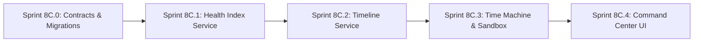

# Phase 8C Strategic Implementation Plan: Family Financial Health, Timeline, Time Machine & Command Center

---

## 1. Overview & Objectives

**Phase 8C** delivers the executive synthesis layer and interactive fiduciary decision engine of the **Personal Family Office OS**. It builds directly upon the Phase 8B foundation (Contracts, 5-Pillar Digital Twin, Life Events Engine, and Proactive Observer).

---

## 2. Core Pillars & Capabilities

1. **Family Financial Health (FFH) Index (0–100)**:
   - Composite index aggregating Protection (25%), Liquidity (20%), Goals/Retirement (20%), Estate (15%), and Tax/Data Hygiene (20%).
   - Dynamic Life-Stage Weighting (`EARLY_CAREER`, `FAMILY_EXPANSION`, `WEALTH_PRESERVATION`, `RETIREMENT`).
   - Periodic snapshotting into `family_health_history` with delta attribution (`+4.2 pts vs last month`).

2. **Unified Family Timeline Ledger**:
   - Multi-domain chronological narrative and historical family milestone ledger.
   - Normalizes transactions (> ₹1L), insurance policies, financial goals, tax filings, wills, life events, and AI triggers.
   - Backed by indexed `family_timeline_events` table and flexible multi-dimensional filtering.

3. **Financial Time Machine**:
   - **Retroactive Point-in-Time Reconstruction**: Reconstructs exact balance sheet, asset holdings, cash balances, and liabilities on any historical date $T_{\text{target}}$.
   - **Counterfactual What-If Sandbox**: In-memory branching of `DigitalTwinState`, applies hypothetical parameters (SIP increment, loan prepayment, asset rebalancing), and projects comparative trajectory without touching live SQLite tables.

4. **Family Command Center UX**:
   - Redesigned executive dashboard prioritizing actionable decisions over widget clutter.
   - Executive Vitals strip (Net Worth, FFH Score 0-100, Emergency Runway).
   - Prioritized Action Radar (max 3 actionable fiduciary cards with 1-click execution).
   - Domain Matrices 2x2 grid (Portfolio, Protection Shield, Goals, Tax).
   - Interactive Timeline strip & What-If scenario sandbox.

---

## 3. Phased Sprint Breakdown



| Sub-Sprint | Focus Area | Key Deliverables |
| :--- | :--- | :--- |
| **Sprint 8C.0** | Contracts & DB Migrations | `familyOfficeContracts.ts` (FFH, Timeline, Time Machine schemas), Migration `019_family_health_and_timeline.ts` |
| **Sprint 8C.1** | Financial Health Index | `FamilyFinancialHealthService.ts`, dynamic life-stage weighting, history snapshotting, REST endpoints, unit tests |
| **Sprint 8C.2** | Family Timeline Ledger | `FamilyTimelineService.ts`, multi-domain event normalization, timeline sync, REST endpoints, unit tests |
| **Sprint 8C.3** | Time Machine & What-If Sandbox | `FinancialTimeMachineService.ts`, retroactive balance sheet reconstruction, zero-mutation scenario sandbox, REST endpoints, unit tests |
| **Sprint 8C.4** | Family Command Center UI | Executive dashboard, vitals strip, action radar, 2x2 domain matrices, interactive timeline, what-if drawer |

---

## 4. Verification & Testing Standards

- Master test suite will expand from **316** to **~360+ tests**.
- Zero autonomous database mutations during What-If simulations.
- Strict TypeScript compilation (`tsc --noEmit` = 0 errors on backend and frontend).
- Live SQLite query binding for active Ramani family dataset.


---

# ChatGPT Review Comments – Phase 8C Strategic Plan

## Review Status

**🟡 REVISE PLAN BEFORE IMPLEMENTATION**

The strategic direction is correct, but the current document is a high-level roadmap rather than an implementation-ready architecture. The following guardrails must be incorporated before Sprint 8C.0 begins.

---

## 1. Financial Health Index Must Be Fully Deterministic

The plan proposes:

- Protection 25%
- Liquidity 20%
- Goals/Retirement 20%
- Estate 15%
- Tax/Data Hygiene 20%

Before implementation, define for each pillar:

- exact inputs
- scoring formula
- minimum/maximum
- missing-data behaviour
- freshness requirements
- calculation owner
- version
- provenance

### Critical rule

Missing information must NOT silently become zero.

Use explicit semantics such as:

```text
KNOWN_ZERO
UNKNOWN
INSUFFICIENT_DATA
STALE
NOT_APPLICABLE
```

The FFH score must measure financial-health evidence, not invent financial health from incomplete data.

---

## 2. Life-Stage Weighting Needs Explicit Rules

The plan introduces:

```text
EARLY_CAREER
FAMILY_EXPANSION
WEALTH_PRESERVATION
RETIREMENT
```

Define exactly how the active life stage is determined.

Do not allow AI to decide the life stage without deterministic evidence.

Also define what happens when multiple family members are in different life stages.

The system may need:

```text
Family Life Stage
+
Member Life Stage
```

rather than assuming one stage automatically represents the entire family.

---

## 3. FFH History Must Be a Derived Snapshot, Not a Second Financial Database

`family_health_history` is appropriate for historical scoring.

It should contain:

- familyId
- score
- pillar scores
- calculationVersion
- asOf
- generatedAt
- source stateHash
- life-stage weighting version
- completeness
- provenance

Do NOT store duplicated portfolio/transaction/policy records inside this table.

---

## 4. Do Not Hardcode Example Delta Values

The example:

```text
+4.2 pts vs last month
```

must be calculated from:

```text
current score - previous comparable snapshot
```

The implementation should support:

```text
absolute delta
percentage delta
pillar-level attribution
```

with explicit comparison dates.

---

# 5. Unified Timeline Must Be a Projection

`family_timeline_events` should be treated as a derived/read model.

Authoritative sources remain:

```text
Transactions
Policies
Goals
Tax records
Estate data
Life Events
Proactive Triggers
```

The timeline must NOT become another source of financial truth.

Document:

```text
sourceType
sourceId
eventType
eventDate
createdAt
stateHash/version
```

---

# 6. Timeline Event Identity and Deduplication

Define a deterministic timeline event identity.

For example:

```text
sourceType
+
sourceId
+
eventType
+
eventDate
```

This prevents duplicate events during synchronization.

If the same source record is updated, update the derived timeline representation rather than creating duplicate historical events.

---

# 7. ₹1 Lakh Timeline Threshold Must Be Configurable

The plan says transactions greater than ₹1L are included.

Define:

- whether threshold is configurable
- whether it uses absolute amount
- whether it applies to inflow/outflow separately
- whether transfers between owned accounts are excluded
- whether the threshold is inclusive/exclusive

Do not hardcode ₹1,00,000 throughout the service.

---

# 8. Timeline Date Semantics

Clearly distinguish:

```text
eventDate
transactionDate
policyDate
goalDate
createdAt
updatedAt
```

Timeline ordering must use the domain event date, not record creation time.

---

# 9. Financial Time Machine – "Exact" Needs Qualification

The current wording says:

> "Reconstructs exact balance sheet..."

This is too strong.

The correct contract should be:

> **Point-in-time reconstruction with explicit completeness and provenance. Exact reconstruction is provided only where authoritative historical data exists.**

For example, historical market prices may not exist for every asset.

The system must never invent a historical price.

---

# 10. Time Machine Point-in-Time Rules Must Be Explicit

Define:

### Transactions

Whether transactions occurring:

```text
<= T
```

are included.

### Holdings

Define how holdings are reconstructed from transaction history.

### Market Prices

Define:

- source
- timestamp
- closing vs intraday price
- missing price behaviour

### Liabilities

Define how outstanding principal is reconstructed at T.

### Fixed Deposits

Reuse the existing FD valuation engine.

### PPF / EPF / NPS

Define whether historical balances are authoritative, reconstructed, or unavailable.

### Insurance

Define treatment of:

- surrender value
- maturity value
- premium status
- policy state

### Property

Define valuation source and historical availability.

Every domain must have explicit:

```text
CALCULATED
HISTORICAL_SOURCE
UNKNOWN
INSUFFICIENT_DATA
```

semantics.

---

# 11. Time Machine Must Reuse Existing Calculation Engines

Do NOT rebuild:

- portfolio valuation
- FD valuation
- tax calculations
- retirement calculations
- goal calculations
- insurance calculations

inside `FinancialTimeMachineService`.

The Time Machine is an orchestration/reconstruction layer.

---

# 12. What-If Sandbox Must Remain Zero-Mutation

This is a hard invariant.

A What-If scenario must never modify:

- assets
- transactions
- holdings
- prices
- policies
- goals
- beneficiaries
- tax records
- Digital Twin source data
- proactive triggers

Scenario calculations should operate on an isolated in-memory clone/branch.

---

# 13. Existing What-If Engine Must Be Reused

The plan should explicitly inspect and reuse the existing:

`WhatIfSimulationEngine`

Do not create a competing scenario engine.

If it requires extension, document the exact extension.

---

# 14. Scenario Provenance

Every What-If result should contain:

```text
scenarioId
baselineStateHash
baselineAsOf
scenarioParameters
calculationVersion
generatedAt
```

If scenarios are not persisted, make that explicit.

If the user explicitly saves a scenario later, that should be a separate feature.

---

# 15. Command Center "1-Click Execution" Needs a Safety Boundary

The plan says:

> "1-click execution"

This must NOT mean direct financial execution.

The Command Center should route actions through the existing authorization/confirmation framework.

For example:

```text
Recommendation
   ↓
User selects action
   ↓
Existing AIActionRegistry / authorization
   ↓
Explicit confirmation
   ↓
Authorized action
```

High-risk actions must require explicit confirmation.

Do not allow:

```text
Dashboard card → direct financial mutation
```

---

# 16. Family Scope

All Phase 8C APIs must resolve:

```text
Authenticated User
        ↓
Authorized Active Family
        ↓
Service
```

A UI-provided `familyId` must never establish or override family scope.

Add cross-family authorization tests to every new service/API.

---

# 17. FFH and Proactive Observer Integration

Define how FFH changes interact with Sprint 8B.3.

Avoid creating another recommendation engine.

Preferred:

```text
FFH Service
   ↓
FFH state changes
   ↓
Existing Proactive Observer
   ↓
Existing recommendation/cooldown infrastructure
```

Do not create a separate "Health Alerts" engine.

---

# 18. Timeline and Proactive Observer Integration

Determine whether proactive triggers should appear in the Family Timeline.

If yes:

```text
Proactive Trigger
   ↓
Timeline Projection
```

Do not duplicate the trigger as a separate authoritative event.

---

# 19. Database Migration Scope

Migration 019 should contain only persistent structures genuinely required for 8C.

At minimum evaluate:

```text
family_health_history
family_timeline_events
```

Do NOT persist transient What-If scenarios unless explicitly required.

All tables must be:

- family scoped
- indexed
- migration safe
- auditable where appropriate

---

# 20. Test Baseline

Current verified baseline:

```text
316 tests
```

Do NOT use:

```text
~360+ tests
```

as a target.

Instead report:

```text
Previous baseline: 316
New Sprint tests: X
Current total: 316 + X
Failures: 0
```

Tests should be driven by business invariants and coverage.

---

# 21. Phase Sequencing

The proposed order is reasonable:

```text
8C.0 Contracts & Migrations
      ↓
8C.1 Financial Health
      ↓
8C.2 Timeline
      ↓
8C.3 Time Machine / Sandbox
      ↓
8C.4 Command Center
```

However, each sprint must remain independently testable.

8C.1 should not unnecessarily depend on Timeline.

8C.3 should reuse existing Digital Twin and What-If infrastructure rather than creating new parallel models.

8C.4 should consume stable APIs rather than introducing business logic into React components.

---

# 22. UI Must Not Contain Business Logic

The Command Center should be a presentation/orchestration layer.

Do not place:

- FFH calculations
- timeline calculations
- portfolio calculations
- recommendation rules
- scenario calculations

inside frontend components.

The frontend consumes backend contracts.

---

# 23. Phase 8C Architecture Should Preserve Existing Boundaries

The target architecture should remain:

```text
Authoritative SQLite
        ↓
Existing Domain Engines
        ↓
Digital Twin
        ↓
Phase 8C Derived Services
   ├── Financial Health
   ├── Timeline
   └── Time Machine
        ↓
Command Center
        ↓
Human Decision
```

Not:

```text
SQLite
 ↓
New Phase 8C calculation engines
 ↓
UI
```

---

# 24. Required Implementation-Plan Detail

Before coding, Agent should expand the Phase 8C plan into individual sprint implementation plans.

For each sprint specify:

- Objective
- Scope
- Non-goals
- Existing components inspected
- Components reused
- Files to create
- Files to modify
- Contracts
- Database changes
- APIs
- Family-scope model
- Calculation ownership
- Error semantics
- Idempotency
- Audit
- Performance
- Tests
- Migration
- Rollback
- Acceptance criteria
- Risks

---

# 25. Documentation

Synchronize:

```text
SESSION_CONTEXT.md
AI_CHANGELOG.md
docs/PHASE_8_ROADMAP.md
```

Create additional architecture documents only where they provide durable value, for example:

```text
docs/FINANCIAL_HEALTH_ARCHITECTURE.md
docs/FAMILY_TIMELINE_ARCHITECTURE.md
docs/FINANCIAL_TIME_MACHINE_ARCHITECTURE.md
```

Avoid unnecessary documentation duplication.

---

# Final Decision

## 🟡 PHASE 8C PLAN – REVISE BEFORE IMPLEMENTATION

The strategic direction is approved.

The implementation plan requires the above guardrails before Sprint 8C.0 coding begins.

### Most important protections

1. **FFH must be deterministic and provenance-backed.**
2. **Timeline must remain a derived projection.**
3. **Time Machine must never fabricate historical values.**
4. **What-If must remain zero-mutation.**
5. **Existing calculation engines must remain authoritative.**
6. **Command Center must not directly execute financial actions.**
7. **Family scope must always be server-authorized.**
8. **Proactive Observer remains the single recommendation engine.**
9. **Test counts are measured, not targeted.**
10. **Each 8C sprint must be independently testable.**

### Required next action

Revise the Phase 8C strategic plan incorporating these comments.

**Do not implement Sprint 8C.0 yet.**

Return the revised Phase 8C plan for final review before coding begins.
