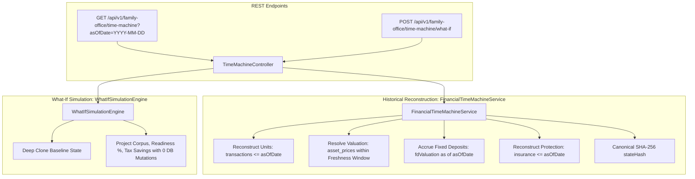

# Sprint 8C.3: Financial Time Machine, Point-in-Time Reconstruction & What-If Simulation Sandbox (Revised)

## 1. Executive Summary

The **Financial Time Machine** introduces point-in-time financial state reconstruction and what-if simulation into FamilyWealthOS, answering two core fiduciary questions:
1. **Historical Reconstruction**: *"What did FamilyWealthOS know about the family's financial position at a particular point in time (`asOfDate`)?"*
2. **What-If Simulation Sandbox**: *"What would the family's financial trajectory, retirement readiness, and tax efficiency look like under hypothetical planning adjustments?"*

This revised plan incorporates all feedback from [implementation_plan_reviewed.md](file:///c:/Users/prije/Downloads/MyWorth/prompts/Phase8C/SPRINT8C.3/implementation_plan_reviewed.md).

---

## 2. Verified Historical Data Availability & Cutoff Semantics

### 2.1 Actual Table Mappings
- **`transactions`**: Complete ledger entries with `date <= asOfDate`. Reconstructs quantity owned as of `asOfDate`.
- **`asset_prices`**: Sparse time-series table. Exact match on `date = asOfDate` or nearest prior price within `MAX_PROXY_AGE_DAYS`.
- **`insurance_policies`**: Verified by `start_date <= asOfDate`. `SUM_ASSURED` is reported under `protectionShield` as coverage and is **NEVER added to net worth**.
- **`assets` (Fixed Deposits)**: Accrued compounding interest via `calculateFixedDepositValuation`. Excluded if `asOfDate < startDate`.
- **`wills` / `trusts` / `tax_profiles`**: Scoped by `registered_at <= asOfDate` / `financial_year` matching `asOfDate`.

### 2.2 Versioned Proxy Freshness Policy (`TIME_MACHINE_RULE_REGISTRY`)
- Equities/MFs/US Stocks: `MAX_PROXY_AGE_DAYS = 30`
- Debt/Gold: `MAX_PROXY_AGE_DAYS = 60`
- Real Estate: `MAX_PROXY_AGE_DAYS = 365`
- Cash Snapshots: `MAX_PROXY_AGE_DAYS = 90`
- Expired proxies fall back to `KNOWN_ACQUISITION_COST`; unpriced assets become `HISTORICAL_SOURCE_UNAVAILABLE`.

---

## 3. Architecture & Service Design

---

## 4. Proposed Changes

### 4.1 Contracts
- [familyOfficeContracts.ts](file:///c:/Users/prije/Downloads/MyWorth/backend/src/contracts/familyOfficeContracts.ts): Add `daysOfProxyLag`, `costBasis`, `unrealizedGainLoss`, `missingDataReason`, and `DomainReconstructionStatusSchema` to `TimeMachineReconstructionSchema`.

### 4.2 Repositories
- [SQLitePriceRepository.ts](file:///c:/Users/prije/Downloads/MyWorth/backend/src/repositories/SQLitePriceRepository.ts): Add `findPriceOnDate` and `findPriceAsOf`.
- [SQLiteTransactionRepository.ts](file:///c:/Users/prije/Downloads/MyWorth/backend/src/repositories/SQLiteTransactionRepository.ts): Add `findByAssetIdAsOf`.

### 4.3 Services
- **[NEW]** `backend/src/services/familyOffice/FinancialTimeMachineService.ts`: Core historical reconstruction engine.
- **[NEW]** `backend/src/services/familyOffice/WhatIfSimulationEngine.ts`: In-memory forward simulation sandbox.

### 4.4 Controller & Routes
- **[NEW]** `backend/src/controllers/TimeMachineController.ts`: Controller for reconstruction and what-if simulation.
- **[NEW]** `backend/src/routes/timeMachineRoutes.ts`: Express routes with idempotency middleware.
- [index.ts](file:///c:/Users/prije/Downloads/MyWorth/backend/src/routes/index.ts): Mount `/family-office/time-machine`.

### 4.5 Invariant Tests
- **[NEW]** `backend/src/__tests__/sprint8c3/financialTimeMachine.test.ts`: Invariant tests covering exact pricing, proxy lag, expired proxy fallback, zero future leakage, FD lifecycle, insurance net worth exclusion, what-if 0-write invariant, cross-family isolation, and deterministic hashing.

---

## 5. Verification Plan

- **Automated Tests**: Run `npm test` verifying that all existing 348 tests continue to pass plus all new Sprint 8C.3 invariant tests (0 failures).
- **TypeScript**: Run `npx tsc --noEmit` in both backend and frontend.
