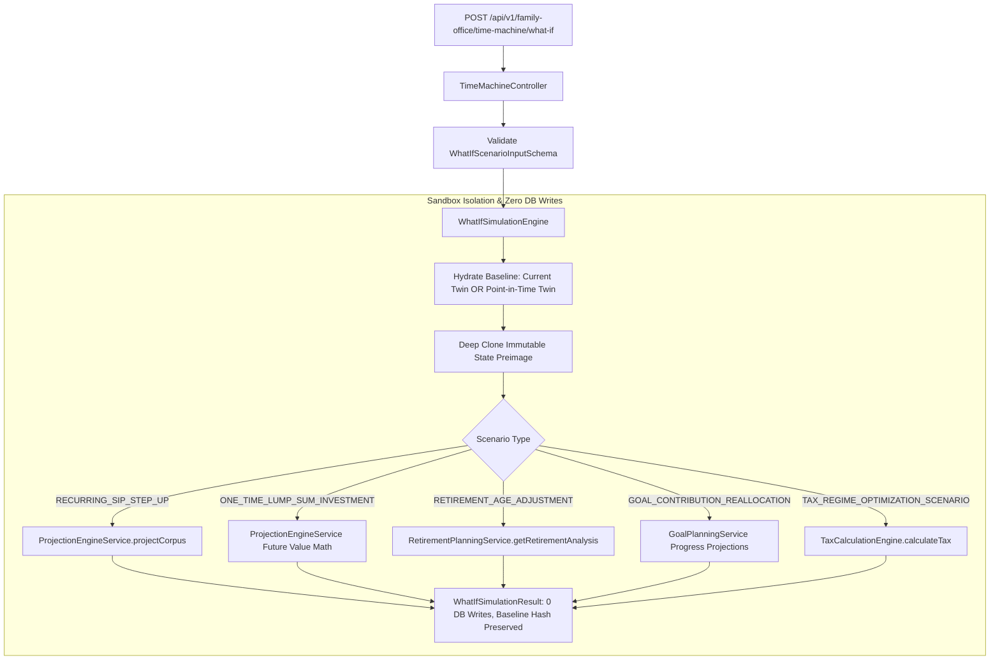

# Sprint 8C.3 Production Implementation Plan: Financial Time Machine, Point-in-Time Reconstruction & What-If Simulation Sandbox

## 1. Executive Summary & Core Time Semantics

The **Financial Time Machine** introduces point-in-time financial state reconstruction and what-if simulation into FamilyWealthOS, answering two core fiduciary questions:
1. **Historical Economic Reconstruction**: *"What was the family's verifiable financial and legal position as of a specific historical date (`asOfDate`), based on authoritative economic records effective on or before that date?"*
2. **What-If Simulation Sandbox**: *"What would the family's financial trajectory, retirement readiness, and tax efficiency look like under explicit hypothetical planning adjustments?"*

### 1.1 Core Time Semantics & Reconstruction Mode
Sprint 8C.3 implements **`HISTORICAL_ECONOMIC_STATE`** reconstruction. It reconstructs historical facts using authoritative records whose **business/economic effective dates** occurred on or before `asOfDate`.

It explicitly does **not** claim full system-time/audit reconstruction of "what the database application knew on that calendar day", as system audit history is not available across all legacy tables.
- **`reconstructionMode`**: `'HISTORICAL_ECONOMIC_STATE'`
- **`knowledgeTimeStatus`**: `'NOT_FULLY_RECONSTRUCTABLE'`

---

## 2. Actual Schema and Service Capability Inspection Evidence

Every table, column, and engine method referenced below has been verified directly against the active codebase:

### 2.1 Database Tables and Columns
- **`transactions`** (`backend/src/db.ts:142-157`):
  - Columns: `id INTEGER PRIMARY KEY`, `holding_id INTEGER`, `asset_id INTEGER NOT NULL`, `type TEXT NOT NULL CHECK(type IN ('BUY', 'SELL', 'REINVEST', 'DIVIDEND', 'INTEREST', 'BONUS', 'DEBIT', 'CREDIT'))`, `date TEXT NOT NULL`, `quantity REAL NOT NULL`, `price REAL NOT NULL`, `amount REAL NOT NULL`, `source TEXT NOT NULL`, `narration TEXT`, `tx_category TEXT`, `created_at TEXT`.
  - Effective Date: `transactions.date` (`YYYY-MM-DD`).
- **`asset_prices`** (`backend/src/db.ts:89-96`):
  - Columns: `asset_id INTEGER NOT NULL`, `date TEXT NOT NULL`, `price REAL NOT NULL`, `created_at TEXT`.
  - Effective Date: `asset_prices.date` (`YYYY-MM-DD`).
- **`assets`** (`backend/src/db.ts:60-75`):
  - Columns: `id INTEGER PRIMARY KEY`, `family_member_id INTEGER`, `name TEXT NOT NULL`, `category TEXT NOT NULL CHECK(category IN ('Equity', 'Debt', 'Cash', 'Hybrid', 'Alternative', 'Other'))`, `type TEXT NOT NULL`, `cost_basis REAL NOT NULL`, `current_value REAL NOT NULL`, `currency TEXT NOT NULL`, `metadata_json TEXT`, `created_at TEXT`.
  - Family Scope: `assets.family_member_id -> family_members.family_id`.
- **`insurance_policies`** (`backend/src/db.ts` migration005):
  - Columns: `id INTEGER PRIMARY KEY`, `family_id INTEGER NOT NULL`, `family_member_id INTEGER`, `policy_name TEXT NOT NULL`, `policy_type TEXT NOT NULL`, `sum_assured REAL NOT NULL`, `premium_amount REAL NOT NULL`, `start_date TEXT NOT NULL`, `maturity_date TEXT`, `status TEXT NOT NULL`, `metadata_json TEXT`.
  - Effective Date: `insurance_policies.start_date` (`YYYY-MM-DD`).
- **`financial_goals`** (`backend/src/db.ts` migration007):
  - Columns: `id INTEGER PRIMARY KEY`, `family_id INTEGER NOT NULL`, `name TEXT NOT NULL`, `category TEXT NOT NULL`, `target_amount REAL NOT NULL`, `target_year INTEGER NOT NULL`, `current_allocated_amount REAL NOT NULL`, `monthly_sip_amount REAL NOT NULL`, `expected_return_pct REAL NOT NULL`, `inflation_pct REAL NOT NULL`, `created_at TEXT`.
  - Effective Date: `financial_goals.created_at`.
- **`tax_profiles` & `tax_deductions`** (`backend/src/db.ts` migration009):
  - Columns: `id INTEGER PRIMARY KEY`, `family_id INTEGER NOT NULL`, `family_member_id INTEGER NOT NULL`, `financial_year TEXT NOT NULL` (e.g. `'2024-25'`), `pan TEXT`, `created_at TEXT`.
  - Effective Date: `financial_year` matching `asOfDate`.
- **`wills` & `trusts`** (`backend/src/db.ts` migration013):
  - Columns: `id INTEGER PRIMARY KEY`, `family_id INTEGER NOT NULL`, `registered_at TEXT`, `status TEXT NOT NULL`, `created_at TEXT`.

### 2.2 Verified Authoritative Engine Interfaces
1. **`ProjectionEngineService`** (`backend/src/services/ProjectionEngineService.ts:30-70`):
   - `projectCorpus(input: { initialLumpSum: number, monthlySip: number, sipStepUpPct: number, expectedReturnPct: number, inflationPct: number, years: number }): ProjectionResultDTO`
   - `calculateFutureValueCost(presentCost: number, inflationPct: number, years: number): number`
2. **`RetirementPlanningService`** (`backend/src/services/RetirementPlanningService.ts:16-65`):
   - `getRetirementAnalysis(familyId: number): RetirementAnalysisDTO`
   - Computes: `yearsToRetirement`, `corpusRequiredAtRetirement`, `corpusProjectedAtRetirement`, `readinessPct`, `monthlySipGap`.
3. **`GoalPlanningService`** (`backend/src/services/GoalPlanningService.ts:14-66`):
   - `getGoalsSummary(familyId: number): { goals: FinancialGoalRecord[], health: GoalHealthDTO }`
4. **`TaxCalculationEngine`** (`backend/src/engines/tax/TaxCalculationEngine.ts:26-115`):
   - `calculateNewRegimeTax(input: TaxCalculationInput): TaxCalculationResult`
   - `calculateOldRegimeTax(input: TaxCalculationInput): TaxCalculationResult`
   - `calculateTax(input: TaxCalculationInput, regime: 'OLD' | 'NEW'): TaxCalculationResult`
5. **`calculateFixedDepositValuation`** (`backend/src/utils/fdValuation.ts:1-156`):
   - `calculateFixedDepositValuation(params: { costBasis: number, interestRate: number, startDateStr: string, asOfDateStr: string, compoundingFrequency: string }): { currentValue: number, accruedInterest: number, ... }`

---

## 3. Mandatory Historical Data Availability Matrix

| Domain | Can Reconstruct Historically? | Evidence Source | Date Field | Fallback Policy | Status if Unavailable | Contributes to Net Worth? |
| :--- | :--- | :--- | :--- | :--- | :--- | :--- |
| **Portfolio Holdings** | **Yes (Full)** | `transactions` table | `transactions.date` | Cumulative sum $\le \text{asOfDate}$ | `INSUFFICIENT_DATA` (if negative units) | **Yes** |
| **Historical Market Prices** | **Yes (Conditional)** | `asset_prices` table | `asset_prices.date` | Exact $\to$ Proxy $\le \text{MAX\_PROXY\_AGE\_DAYS} \to$ Acquisition Cost | `HISTORICAL_SOURCE_UNAVAILABLE` | **Yes** (Market Value or Cost) |
| **Fixed Deposits** | **Yes (Full)** | `assets` (metadata) + `transactions` | `startDate`, `transactions.date` | Compounding accrual via `calculateFixedDepositValuation` | `NOT_YET_IN_EXISTENCE` (if `asOfDate < startDate`) | **Yes** (Accrued Value) |
| **Cash / Bank Balances** | **Partial** | `transactions` (`CREDIT`/`DEBIT`) | `transactions.date` | Net ledger balance accumulation $\le \text{asOfDate}$ | `UNKNOWN` (if no transactions) | **Yes** (Ledger Balance) |
| **Insurance Protection** | **Yes (Coverage Only)** | `insurance_policies` | `start_date` | Active cover if `start_date <= asOfDate` | `HISTORICAL_SOURCE_UNAVAILABLE` (Surrender) | **NEVER** (`SUM_ASSURED` $\ne$ Net Worth) |
| **Financial Goals** | **Partial (Existence Only)** | `financial_goals` | `created_at` | Active if `created_at <= asOfDate` | `HISTORICAL_SOURCE_UNAVAILABLE` (Target revisions) | **No** (Planning metric only) |
| **Estate (Wills/Trusts)** | **Partial (Existence Only)** | `wills`, `trusts` | `registered_at`, `created_at` | Document exists if registered $\le \text{asOfDate}$ | `UNKNOWN` (pre-registration) | **No** (Governance metric only) |
| **Tax Fiscal Profile** | **Yes (By FY)** | `tax_profiles`, `tax_deductions` | `financial_year` | Fiscal Year match for `asOfDate` | `HISTORICAL_SOURCE_UNAVAILABLE` | **No** (Tax readiness metric only) |
| **Liabilities** | **Partial (Snapshot)** | `liabilities` / `assets` | `created_at` | Outstanding balance if recorded $\le \text{asOfDate}$ | `KNOWN_ZERO` / `UNKNOWN` | **Yes** (Subtracted from Net Worth) |

---

## 4. Verified Transaction-Type Semantics & Complete WAC Algorithm

### 4.1 Verified Transaction Enum (`ITransactionRepository.ts:7`)
The actual codebase defines:
`type: 'BUY' | 'SELL' | 'REINVEST' | 'DIVIDEND' | 'INTEREST' | 'BONUS' | 'CREDIT' | 'DEBIT'`

| Transaction Type | Quantity Semantics | Cost Basis Semantics | Applicable Asset Classes | Missing Data / Validation Rule |
| :--- | :--- | :--- | :--- | :--- |
| **`BUY`** | $+ \text{quantity}$ | $+ \text{amount}$ (adds to WAC pool) | Equity, MF, US Stock, Debt, Gold | If `quantity <= 0` or `amount <= 0`, flags holding `INSUFFICIENT_DATA` |
| **`SELL`** | $- \text{quantity}$ | Proportional reduction: $- (Q_{\text{sold}} \times \text{AvgCost})$ | Equity, MF, US Stock, Debt, Gold | If units become $< 0$, clamped to 0 and flagged `INSUFFICIENT_DATA` |
| **`REINVEST`** | $+ \text{quantity}$ | $+ \text{amount}$ | Mutual Funds (Dividend Reinvestment) | Handled identical to `BUY` |
| **`DIVIDEND`** | 0 (units unchanged) | 0 (cost pool unchanged) | Equity, MF, US Stock | Handled as historical cash income event |
| **`INTEREST`** | 0 (or $+ \text{amount}$) | $+ \text{amount}$ for compounding instruments | Fixed Deposits, Bonds | Credited to holding accrued balance |
| **`BONUS`** | $+ \text{quantity}$ | 0 (cost pool unchanged; dilutes per-unit cost) | Equity, US Stock | Increases units without adding cash |
| **`CREDIT`** | $+ \text{amount}$ | $+ \text{amount}$ | Cash / Bank Accounts | Increases cash ledger balance |
| **`DEBIT`** | $- \text{amount}$ | $- \text{amount}$ | Cash / Bank Accounts | Decreases cash ledger balance (clamped to 0 if $< 0$) |

### 4.2 Complete Weighted Average Cost Basis (WAC) Algorithm
1. **Deterministic Ordering**: Transactions are sorted strictly by `date ASC, id ASC`.
2. **Buy / Reinvest**:
   $$\text{TotalUnits} \leftarrow \text{TotalUnits} + t.\text{quantity}, \quad \text{TotalCostPool} \leftarrow \text{TotalCostPool} + t.\text{amount}$$
   $$\text{AvgCostPerUnit} = \frac{\text{TotalCostPool}}{\text{TotalUnits}}$$
3. **Bonus Shares**:
   $$\text{TotalUnits} \leftarrow \text{TotalUnits} + t.\text{quantity}, \quad \text{TotalCostPool} \text{ (unchanged)}, \quad \text{AvgCostPerUnit} = \frac{\text{TotalCostPool}}{\text{TotalUnits}}$$
4. **Partial / Full Sell**:
   $$\text{DisposalCost} = t.\text{quantity} \times \text{AvgCostPerUnit}$$
   $$\text{TotalUnits} \leftarrow \text{TotalUnits} - t.\text{quantity}, \quad \text{TotalCostPool} \leftarrow \max(0, \text{TotalCostPool} - \text{DisposalCost})$$
   - If $\text{TotalUnits} = 0$, $\text{TotalCostPool} = 0$ and $\text{AvgCostPerUnit} = 0$.
5. **Realized vs Unrealized**:
   - Realized P&L ($t.\text{amount} - \text{DisposalCost}$) is excluded from point-in-time unrealized gains.
   - $\text{UnrealizedGainLoss} = \text{TotalMarketValue} - \text{TotalCostPool}$ (calculated **only** when a valid market valuation exists; `null` when valued at acquisition cost).
6. **Accounting Nature**: This WAC is documented as a **portfolio accounting reconstruction**, not a statutory tax-lot filing calculation.

---

## 5. Structured Valuation Contract & Asset-Class Freshness Policy

### 5.1 Structured `HistoricalPriceResult` Interface
```typescript
export interface HistoricalPriceResult {
  requestedAsOfDate: string;
  resolvedValuationDate: string;
  amount: number;
  valuationType: 'MARKET_VALUE' | 'NAV' | 'ACQUISITION_COST' | 'ACCRUED_VALUE' | 'LEDGER_BALANCE' | 'UNKNOWN';
  provenance: 'EXACT_HISTORICAL' | 'PRIOR_DATE_PROXY' | 'KNOWN_ACQUISITION_COST' | 'CALCULATED' | 'HISTORICAL_SOURCE_UNAVAILABLE';
  daysOfProxyLag: number;
  status: 'COMPLETE' | 'PARTIAL' | 'INSUFFICIENT_DATA' | 'HISTORICAL_SOURCE_UNAVAILABLE';
  missingDataReason?: string;
  ruleCode: string;
  ruleVersion: string;
}
```

### 5.2 Versioned Proxy Freshness Registry (`TIME_MACHINE_RULE_REGISTRY`)
Verified against actual `assets.category` taxonomy (`'Equity'`, `'Debt'`, `'Cash'`, `'Hybrid'`, `'Alternative'`, `'Other'`):

```typescript
export const TIME_MACHINE_RULE_REGISTRY = {
  version: '2026.1',
  effectiveDate: '2026-01-01',
  jurisdiction: 'IN',
  sourceReference: 'FamilyWealthOS Fiduciary Valuation Standard',
  MAX_PROXY_AGE_DAYS: {
    Equity: { ruleCode: 'RULE_PROXY_EQUITY_30D', maxAgeDays: 30 },
    Hybrid: { ruleCode: 'RULE_PROXY_HYBRID_30D', maxAgeDays: 30 },
    Debt: { ruleCode: 'RULE_PROXY_DEBT_60D', maxAgeDays: 60 },
    Alternative: { ruleCode: 'RULE_PROXY_ALT_60D', maxAgeDays: 60 }, // Gold / Precious Metals
    RealEstate: { ruleCode: 'RULE_PROXY_PROPERTY_365D', maxAgeDays: 365 },
    Cash: { ruleCode: 'RULE_PROXY_CASH_90D', maxAgeDays: 90 },
    Other: { ruleCode: 'RULE_PROXY_DEFAULT_30D', maxAgeDays: 30 }
  }
};
```

### 5.3 Valuation Precedence & Acquisition-Cost Fallback Policy
1. **Exact Historical Price**: Price on `date = asOfDate` (`daysOfProxyLag = 0`, `provenance = 'EXACT_HISTORICAL'`).
2. **Prior-Date Proxy**: Price on `date < asOfDate` where `daysOfProxyLag <= MAX_PROXY_AGE_DAYS` (`provenance = 'PRIOR_DATE_PROXY'`).
3. **Acquisition-Cost Fallback** (Asset-Class Controlled):
   - Allowed for: `Equity`, `Hybrid`, `Debt`, `Alternative`, `RealEstate`.
   - Result: `valuationType = 'ACQUISITION_COST'`, `provenance = 'KNOWN_ACQUISITION_COST'`, `unrealizedGainLoss = null`.
4. **Historical Source Unavailable**: If no price exists within freshness window and no cost basis exists $\to$ `provenance = 'HISTORICAL_SOURCE_UNAVAILABLE'`, `status = 'INSUFFICIENT_DATA'`.
5. **Absolute Invariant**: **Future prices (`date > asOfDate`) are NEVER used.**

---

## 6. Domain-Specific Future Leakage Prevention Policy

1. **Portfolio**:
   - Only transactions with `date <= asOfDate` are included.
   - Same-day transactions ordered deterministically by `date ASC, id ASC`.
   - Transactions with `date > asOfDate` are strictly excluded.
2. **Fixed Deposits**:
   - Pre-start (`asOfDate < startDate`): Omitted from active holdings (`NOT_YET_IN_EXISTENCE`).
   - Active tenure (`startDate <= asOfDate <= maturityDate`): Accrued value calculated via `calculateFixedDepositValuation`. `valuationType = 'ACCRUED_VALUE'`, `provenance = 'CALCULATED'`.
   - Post-Maturity (`asOfDate > maturityDate`): If no explicit redemption transaction exists in `transactions`, the accrued maturity value is retained with status warning `'MATURED_PENDING_REINVESTMENT'` and `isEstimate = true`. Continued ownership is explicitly documented as unproven without redemption records.
3. **Insurance Protection**:
   - Policies with `start_date <= asOfDate` and active status are included in `protectionShield`.
   - `SUM_ASSURED` is reported as protection coverage and is **NEVER added to gross assets, portfolio value, or net worth**.
   - Surrender value is `null` with `provenance = 'HISTORICAL_SOURCE_UNAVAILABLE'`.
4. **Financial Goals**:
   - Goals created after `asOfDate` are excluded.
   - Goals created $\le \text{asOfDate}$ show historical existence; past target revisions are documented as `HISTORICAL_SOURCE_UNAVAILABLE`.
5. **Estate**:
   - Wills/trusts registered after `asOfDate` do not appear.
   - Legal documents registered $\le \text{asOfDate}$ are shown; revocation history is documented as `HISTORICAL_SOURCE_UNAVAILABLE`.
6. **Tax Profiles**:
   - Maps `asOfDate` deterministically to Indian Financial Year:
     - April 1, Year $Y$ to March 31, Year $Y+1 \to$ FY `$Y$-${(Y+1)%100}` (e.g. `2024-03-31` $\to$ FY 2023-24; `2024-04-01` $\to$ FY 2024-25).
   - Only reads tax records for that FY with `created_at <= asOfDate`. Future FY records never leak backward.
7. **Cash / Bank Balances**:
   - Computed exclusively from ledger transactions (`CREDIT` / `DEBIT`) with `date <= asOfDate`.
   - Current bank balances are **never** retroactively projected backward.

---

## 7. Net Worth Inclusion Matrix

| Value Type | Included in Net Worth? | Provenance / Condition |
| :--- | :--- | :--- |
| **Exact Historical Market Value** | **Yes** | Valid price on `asOfDate` (`EXACT_HISTORICAL`) |
| **Prior-Date Proxy Value** | **Yes** | Valid price within allowed freshness window (`PRIOR_DATE_PROXY`) |
| **FD Accrued Value** | **Yes** | Calculated compounding interest up to `asOfDate` (`CALCULATED`) |
| **Ledger Cash Balance** | **Yes** | Net cumulative cash $\le \text{asOfDate}$ (`LEDGER_BALANCE`) |
| **Acquisition Cost** | **Yes (Policy-Controlled)** | Permitted asset class; flagged with `containsNonMarketValuations = true` |
| **Liabilities (Outstanding)** | **Yes (Subtracted)** | Valid balance snapshot $\le \text{asOfDate}$ |
| **Insurance `SUM_ASSURED`** | **NEVER** | Protection coverage only (`protectionShield`) |
| **Policy Surrender Value** | **No** | `null` with `HISTORICAL_SOURCE_UNAVAILABLE` |
| **Financial Goal Targets** | **No** | Trajectory benchmark only |
| **Unknown Valuation** | **No** | Missing data (`INSUFFICIENT_DATA`), never converted to numeric 0 |

---

## 8. Top-Level Reconstruction Response Contract

```typescript
export interface TimeMachineReconstructionResponse {
  familyId: number;
  asOfDate: string;
  reconstructionMode: 'HISTORICAL_ECONOMIC_STATE';
  knowledgeTimeStatus: 'NOT_FULLY_RECONSTRUCTABLE';
  netWorth: number;
  grossAssets: number;
  totalLiabilities: number;
  containsNonMarketValuations: boolean;
  completenessScore: number; // 0.0 to 1.0
  overallStatus: 'OPTIMAL' | 'GOOD' | 'NEEDS_ATTENTION' | 'CRITICAL';
  holdings: ReconstructedAssetHolding[];
  cashBalances: Record<string, number>;
  liabilitiesBreakdown: Record<string, number>;
  protectionShield: {
    totalSumAssured: number;
    activePolicyCount: number;
    policies: Array<{ policyId: number; policyName: string; sumAssured: number; startDate: string }>;
  };
  domains: {
    portfolio: DomainReconstructionStatus;
    protection: DomainReconstructionStatus;
    liquidity: DomainReconstructionStatus;
    goals: DomainReconstructionStatus;
    estate: DomainReconstructionStatus;
    tax: DomainReconstructionStatus;
  };
  provenanceBreakdown: Record<string, number>;
  stateHash: string;
  ruleVersion: string;
  calculationVersion: string;
  reconstructedAt: string;
}
```

---

## 9. Canonical State Hash Contract

$$\text{stateHash} = \text{SHA-256}\Big(\text{canonicalJson}(\text{preimage})\Big)$$

### 9.1 Preimage Inclusions
- `familyId`: Normalized integer.
- `asOfDate`: Normalized `YYYY-MM-DD`.
- `reconstructionMode`: `'HISTORICAL_ECONOMIC_STATE'`.
- `netWorth`, `grossAssets`, `totalLiabilities`: Normalized 2-decimal numbers.
- `containsNonMarketValuations`: Boolean.
- `holdings`: Sorted deterministically by `assetId ASC`. Each item includes `{ assetId, units, unitPrice, totalMarketValue, valuationType, provenance, daysOfProxyLag }`.
- `domains`: Alphabetically sorted domain keys with `{ status, coveragePct }`.
- `provenanceBreakdown`: Alphabetically sorted provenance count map.
- `ruleVersion`: `'2026.1'`.
- `calculationVersion`: `'2026.1'`.

### 9.2 Volatile Exclusions
- `reconstructedAt` (timestamp of API call).
- `correlationId`, `requestId`.
- Random UUIDs or database sequence IDs.
- Execution latency.

---

## 10. What-If Simulation Sandbox — Closed Scenario Catalogue



### 10.1 Scenario Specifications
1. **`RECURRING_SIP_STEP_UP`**:
   - *Input Schema*: `{ scenarioType: 'RECURRING_SIP_STEP_UP', monthlySipAmount: z.number().positive(), sipStepUpPercent: z.number().min(0).max(100), years: z.number().int().min(1).max(50).optional() }`
   - *Baseline*: Current portfolio balance from `DigitalTwinService` and assumptions from `SQLiteGoalRepository`.
   - *Authoritative Engine*: `ProjectionEngineService.projectCorpus(input)`.
   - *Outputs*: `corpusAtRetirement`, `readinessPercent`, `gapDelta`, `yearlySchedule`.
   - *Assumptions*: Uses family's configured equity return (12%) and inflation (6%).
2. **`ONE_TIME_LUMP_SUM_INVESTMENT`**:
   - *Input Schema*: `{ scenarioType: 'ONE_TIME_LUMP_SUM_INVESTMENT', lumpSumAmount: z.number().positive(), investmentHorizonYears: z.number().int().min(1).max(50), assumedReturnPct: z.number().min(0).max(30).optional() }`
   - *Baseline*: Current net worth.
   - *Authoritative Engine*: `ProjectionEngineService.projectCorpus({ initialLumpSum: lumpSumAmount, monthlySip: 0, sipStepUpPct: 0, expectedReturnPct: assumedReturnPct || 12, inflationPct: 6, years: investmentHorizonYears })`.
   - *Outputs*: `projectedValue`, `estimatedWealthGain`.
3. **`RETIREMENT_AGE_ADJUSTMENT`**:
   - *Input Schema*: `{ scenarioType: 'RETIREMENT_AGE_ADJUSTMENT', targetRetirementAge: z.number().int().min(35).max(75) }`
   - *Baseline*: `RetirementProfileRecord` from `SQLiteGoalRepository`.
   - *Authoritative Engine*: `RetirementPlanningService.getRetirementAnalysis(familyId)` with overridden `retirement_age`.
   - *Outputs*: `yearsToRetirement`, `corpusRequiredAtRetirement`, `corpusProjectedAtRetirement`, `readinessPct`, `monthlySipGap`.
4. **`GOAL_CONTRIBUTION_REALLOCATION`**:
   - *Input Schema*: `{ scenarioType: 'GOAL_CONTRIBUTION_REALLOCATION', targetGoalId: z.number().int().positive(), reallocatedMonthlySip: z.number().positive() }`
   - *Baseline*: `financial_goals` record for `targetGoalId`.
   - *Authoritative Engine*: `GoalPlanningService`.
   - *Outputs*: `goalReadinessPercent`, `projectedCompletionYear`, `onTrackStatus`.
5. **`TAX_REGIME_OPTIMIZATION_SCENARIO`**:
   - *Input Schema*: `{ scenarioType: 'TAX_REGIME_OPTIMIZATION_SCENARIO', hypothetical80CAmount: z.number().min(0).max(150000).optional(), hypothetical80CCDAmount: z.number().min(0).max(50000).optional(), salaryIncome: z.number().min(0).optional() }`
   - *Baseline*: `tax_profiles` and `tax_deductions` for the family.
   - *Authoritative Engine*: `TaxCalculationEngine.calculateOldRegimeTax` vs `calculateNewRegimeTax`.
   - *Outputs*: `taxSavingsBenefit`, `optimalRegime`, `effectiveTaxRate`.
   - *Missing Data Guard*: If income sources are not configured and not provided, returns `status = 'INSUFFICIENT_DATA'`, `taxSavingsBenefit = null` (never fabricated ₹0).

### 10.2 What-If Baseline Policy
- **Default Baseline**: Current authoritative `DigitalTwinState`.
- **Historical Baseline**: Supported when `baselineAsOf` is explicitly provided, delegating to `FinancialTimeMachineService.hydratePointInTimeTwin(familyId, baselineAsOf)`.
- **Zero-Write Invariant**: In-memory execution on deep-cloned state with **0 database writes (0 INSERT, 0 UPDATE, 0 DELETE)**.

---

## 11. REST API Contract & Request Validation

### 11.1 Historical Reconstruction Endpoint
`GET /api/v1/family-office/time-machine?asOfDate=YYYY-MM-DD`
- **Headers**: `Authorization: Bearer <token>`, `x-family-id: <id>` (optional, verified via server context).
- **Validation**:
  - `asOfDate`: Required, strict regex `^\d{4}-\d{2}-\d{2}$`, must be valid calendar date.
  - Future Date Check: If `asOfDate > CURRENT_DATE`, returns `400 Bad Request` with `{ error: 'FUTURE_AS_OF_DATE_UNSUPPORTED', message: 'asOfDate cannot be in the future. For future projections, use the What-If Simulation Sandbox.' }`.
- **Response**: `200 OK` with `TimeMachineReconstructionResponse`.
- **Idempotency**: Standard read-only endpoint (no idempotency key required).

### 11.2 What-If Simulation Endpoint
`POST /api/v1/family-office/time-machine/what-if`
- **Headers**: `Authorization: Bearer <token>`.
- **Validation**: Strict discriminated Zod schema `WhatIfScenarioInputSchema`. Rejects unknown fields, negative values, and non-finite numbers.
- **Response**: `200 OK` with `WhatIfSimulationResultSchema`.
- **Idempotency**: In-memory computational sandbox (0 database writes).

---

## 12. Complete 35-Point Invariant Test Matrix

| Category | # | Test Name | Setup | Action | Expected Invariant |
| :--- | :--- | :--- | :--- | :--- | :--- |
| **Historical Boundaries** | 1 | `testExactHistoricalPricePreferred` | Prices on 2024-03-31 and 2024-03-25 exist | Reconstruct `asOfDate = 2024-03-31` | Price from 2024-03-31 used, `daysOfProxyLag = 0`, `provenance = 'EXACT_HISTORICAL'`. |
| | 2 | `testPriorDateProxyWithinWindow` | Price on 2024-03-25 exists, none on 2024-03-31 | Reconstruct `asOfDate = 2024-03-31` | Price from 2024-03-25 used, `daysOfProxyLag = 6`, `provenance = 'PRIOR_DATE_PROXY'`. |
| | 3 | `testFuturePriceNeverUsed` | Only price is on 2024-04-05 | Reconstruct `asOfDate = 2024-03-31` | 2024-04-05 price ignored; falls back to acquisition cost or unavailable. |
| | 4 | `testExpiredProxyFallsBackToCost` | Equity price is 45 days old ($> 30\text{d}$) | Reconstruct historical holding | Price ignored; `valuationType = 'ACQUISITION_COST'`, `provenance = 'KNOWN_ACQUISITION_COST'`. |
| | 5 | `testMissingPriceAndCostUnavailable` | Asset has no historical price and no cost basis | Reconstruct historical holding | `provenance = 'HISTORICAL_SOURCE_UNAVAILABLE'`, `status = 'INSUFFICIENT_DATA'`. |
| | 6 | `testFutureTransactionsExcluded` | Buy on 2024-01-15 (10 units), Buy on 2024-05-01 (20 units) | Reconstruct `asOfDate = 2024-03-31` | Exactly 10 units reconstructed; 2024-05-01 transaction ignored. |
| | 7 | `testSameDayTransactionOrdering` | Same-day BUY (10 units @ 100) then SELL (5 units @ 110) | Reconstruct holding | Processed in `id ASC` order; resulting units = 5. |
| | 8 | `testUnsupportedTransactionExplicit` | Transaction with invalid type injected | Reconstruct holding | Returns explicit `INSUFFICIENT_DATA`, never fabricated units. |
| **Holdings & Valuation** | 9 | `testPartialDisposalWAC` | Buy 100 @ 100 (cost 10k), Buy 100 @ 200 (cost 20k), Sell 50 | Reconstruct holding | Units = 150, WAC = 150/unit, Cost Basis = 22,500. |
| | 10 | `testFullDisposal` | Buy 100 @ 100, Sell 100 @ 120 | Reconstruct holding | Units = 0, Cost Basis = 0, Market Value = 0. |
| | 11 | `testNegativeQuantityClamped` | Anomalous Sell 150 when owning 100 | Reconstruct holding | Units clamped to 0, flagged with `status = 'INSUFFICIENT_DATA'`. |
| | 12 | `testAcquisitionCostNotLabelledMarket` | Expired proxy falls back to cost basis | Reconstruct holding | `valuationType` is `'ACQUISITION_COST'`, never `'MARKET_VALUE'`. |
| | 13 | `testUnrealizedGainNullOnCostFallback` | Holding valued at acquisition cost | Inspect holding metrics | `unrealizedGainLoss` is strictly `null` (not 0). |
| **FD & Insurance** | 14 | `testFDPreStartOmitted` | FD starts on 2024-05-01 | Reconstruct `asOfDate = 2024-03-31` | FD omitted from holdings (`NOT_YET_IN_EXISTENCE`). |
| | 15 | `testActiveFDCompoundingAccrual` | FD starts 2024-01-01 @ 7.5% quarterly | Reconstruct `asOfDate = 2024-03-31` | Accrued value matches `calculateFixedDepositValuation` (`CALCULATED`). |
| | 16 | `testFDMaturedPendingReinvestment` | FD matured on 2024-02-01, no redemption tx | Reconstruct `asOfDate = 2024-03-31` | Retained with status `'MATURED_PENDING_REINVESTMENT'` and `isEstimate = true`. |
| | 17 | `testInsuranceSumAssuredNotInNetWorth` | Policy with 1 Crore `sum_assured` active | Reconstruct net worth | Net worth is unchanged; 1 Crore is in `protectionShield.totalSumAssured` only. |
| | 18 | `testPolicySurrenderValueUnavailable` | Insurance policy active | Reconstruct policy metrics | Surrender value is `null` with `HISTORICAL_SOURCE_UNAVAILABLE`. |
| **Historical Limitations** | 19 | `testFutureGoalsDoNotLeakBackward` | Goal created on 2024-06-01 | Reconstruct `asOfDate = 2024-03-31` | Goal does not appear in historical reconstruction. |
| | 20 | `testFutureEstateDocsDoNotLeakBackward` | Will registered on 2024-08-01 | Reconstruct `asOfDate = 2024-03-31` | Will does not appear in historical reconstruction. |
| | 21 | `testTaxFYDeterministicMapping` | Profiles for FY 2023-24 and FY 2024-25 exist | Reconstruct `asOfDate = 2024-03-31` | Exactly matches FY 2023-24; FY 2024-25 data excluded. |
| | 22 | `testMissingCashBalanceNotFabricated` | No transactions for bank account $\le \text{asOfDate}$ | Reconstruct liquidity | Balance is `0` with `status = 'UNKNOWN'`, never today's live balance. |
| **Integrity & Security** | 23 | `testCrossFamilySQLIsolation` | Family A queries with `asOfDate` | Execute reconstruction | Family B transactions and prices are never returned in SQL queries. |
| | 24 | `testReconstructionZeroSourceWrites` | Record DB table row counts before reconstruction | Execute `GET /time-machine` | DB row counts and checksums are identical before and after. |
| | 25 | `testWhatIfZeroDatabaseWrites` | Record DB table row counts before simulation | Execute `POST /what-if` | DB row counts and checksums are identical before and after (0 writes). |
| | 26 | `testWhatIfBaselineImmutability` | Deep-freeze baseline object | Execute What-If simulation | Baseline object properties are unmodified. |
| | 27 | `testDeterministicCanonicalStateHash` | Run identical reconstruction twice | Compare `stateHash` | Both hashes are byte-for-byte identical SHA-256 strings. |
| | 28 | `testVolatileTimestampsExcludedFromHash` | Reconstruct with identical data at different times | Compare `stateHash` | Different `reconstructedAt` yields identical `stateHash`. |
| | 29 | `testFutureAsOfDateRejected` | Request with `asOfDate = 2099-01-01` | Execute `GET /time-machine` | Returns `400 Bad Request` with `FUTURE_AS_OF_DATE_UNSUPPORTED`. |
| | 30 | `testMissingDataNotConvertedToNumericZero` | Unpriced holding with no cost | Inspect holding | Valuation is `0` with `status = 'INSUFFICIENT_DATA'`, not a valid 0 valuation. |
| **What-If Simulation** | 31 | `testUnsupportedScenarioRejected` | Request with `{ scenarioType: 'INVALID' }` | Execute `POST /what-if` | Fails Zod schema validation (`400 Bad Request`). |
| | 32 | `testScenarioResultContainsAssumptions` | Execute SIP step-up simulation | Inspect result | Contains `appliedParameters`, `assumptionsUsed`, and `ruleVersion`. |
| | 33 | `testScenarioResultContainsBaselineHash` | Execute simulation on baseline | Inspect result | `baselineStateHash` matches baseline's canonical hash. |
| | 34 | `testIncompleteTaxDataReturnsInsufficientData` | Family has no income records | Execute tax optimization scenario | Returns `status = 'INSUFFICIENT_DATA'`, `taxSavingsBenefit = null`. |
| | 35 | `testTaxScenarioDelegatesToEngine` | Standard salary income provided | Execute tax scenario | Results match direct `TaxCalculationEngine` output. |

---

## 13. File-by-File Implementation Details

### 13.1 Contracts Layer
- **`backend/src/contracts/familyOfficeContracts.ts`**:
  - *Status*: Modify.
  - *Responsibilities*: Add `ReconstructionModeEnum`, update `ReconstructedAssetHoldingSchema` with `daysOfProxyLag`, `valuationType`, `provenance`, `missingDataReason`. Update `TimeMachineReconstructionSchema` with `reconstructionMode`, `knowledgeTimeStatus`, `containsNonMarketValuations`, `domains`. Update `WhatIfScenarioInputSchema` as a discriminated union for all 5 scenarios.

### 13.2 Repositories Layer
- **`backend/src/repositories/SQLitePriceRepository.ts`**:
  - *Status*: Modify.
  - *Responsibilities*: Add family-scoped methods:
    - `findPriceAsOf(familyId: number, assetId: number, asOfDate: string, assetClass: string, maxAgeDays: number): HistoricalPriceResult | null`
    - `findBatchPricesAsOf(familyId: number, asOfDate: string): Map<number, HistoricalPriceResult>` (avoids N+1 queries).
- **`backend/src/repositories/SQLiteTransactionRepository.ts`**:
  - *Status*: Modify.
  - *Responsibilities*: Add family-scoped methods:
    - `findByAssetIdAsOf(familyId: number, assetId: number, asOfDate: string): Transaction[]`
    - `findAllByFamilyAsOf(familyId: number, asOfDate: string): Transaction[]`

### 13.3 Core Services Layer
- **`backend/src/services/familyOffice/FinancialTimeMachineService.ts`**:
  - *Status*: New.
  - *Responsibilities*: Reconstructs historical economic state for a family as of `asOfDate`. Enforces WAC calculation, 5-level valuation hierarchy, proxy freshness expiry, FD lifecycle accrual, insurance coverage isolation, and canonical SHA-256 state hashing.
  - *Dependencies*: `SQLiteTransactionRepository`, `SQLitePriceRepository`, `SQLiteAssetRepository`, `SQLiteInsuranceRepository`, `SQLiteGoalRepository`, `SQLiteTaxRepository`, `calculateFixedDepositValuation`.
- **`backend/src/services/familyOffice/WhatIfSimulationEngine.ts`**:
  - *Status*: New.
  - *Responsibilities*: Executes in-memory what-if simulations on deep-cloned baseline states. Coordinates with `ProjectionEngineService`, `RetirementPlanningService`, `GoalPlanningService`, and `TaxCalculationEngine`. Guarantees 0 database writes.

### 13.4 Controller & Routes Layer
- **`backend/src/controllers/TimeMachineController.ts`**:
  - *Status*: New.
  - *Responsibilities*: Handles `GET /` and `POST /what-if`. Resolves `familyId` from server context, validates input schemas, rejects future `asOfDate`, and returns structured responses.
- **`backend/src/routes/timeMachineRoutes.ts`**:
  - *Status*: New.
  - *Responsibilities*: Defines Express router for Time Machine endpoints.
- **`backend/src/routes/index.ts`**:
  - *Status*: Modify.
  - *Responsibilities*: Mounts router at `/family-office/time-machine`.

### 13.5 Test Suite Layer
- **`backend/src/__tests__/sprint8c3/financialTimeMachine.test.ts`**:
  - *Status*: New.
  - *Responsibilities*: Implements all 35 invariant tests in Section 12 against a test SQLite database.
- **`backend/src/__tests__/runTests.ts`**:
  - *Status*: Modify.
  - *Responsibilities*: Wires `runSprint8c3Tests` into the master test runner.

---

## 14. Performance Plan

- **Representative Performance Benchmark**:
  - Seed a test family with: 10 assets (Equities, MFs, US Stocks, FDs, Real Estate, Gold, Cash), 100 historical transactions across 2 years, 30 historical price snapshots, 2 insurance policies, 2 financial goals, and 1 tax profile.
  - Benchmark: Reconstruction latency $\le 1000\text{ms}$.
- **Query Optimization & Anti-N+1 Strategy**:
  - Batch load all transactions for the family with `date <= asOfDate` in a single query: `findAllByFamilyAsOf(familyId, asOfDate)`.
  - Batch load all latest prices with `date <= asOfDate` using a window function / subquery: `findBatchPricesAsOf(familyId, asOfDate)`.

---

## 15. Complete Documentation Plan

Upon implementation completion, the following 10 documents will be created or updated:
1. **`docs/FINANCIAL_TIME_MACHINE.md`**: Complete architectural guide, WAC algorithm, proxy freshness rules, What-If catalogue, and known historical limitations.
2. **`docs/FINANCIAL_TIME_MACHINE.md` (Section 2)**: Historical Data Availability Matrix.
3. **`docs/FINANCIAL_TIME_MACHINE.md` (Section 4)**: What-If Scenario Catalogue.
4. **`docs/FINANCIAL_TIME_MACHINE.md` (Section 6)**: Assumptions and Limitations.
5. **`docs/FINANCIAL_TIME_MACHINE.md` (Section 7)**: State Hash Contract.
6. **`docs/FINANCIAL_TIME_MACHINE.md` (Section 8)**: REST API Contract.
7. **`SESSION_CONTEXT.md`**: Version bump to `v2.9.3` and test count update.
8. **`AI_CHANGELOG.md`**: Sprint 8C.3 entry.
9. **`docs/PHASE_8_ROADMAP.md`**: Mark Sprint 8C.3 as Complete.
10. **`prompts/Phase8C/SPRINT_8C_3_OUTPUT_REVIEW.md`**: Sprint completion output review.

---

## 16. Explicit List of Unsupported Historical Capabilities

1. **Intraday Tick-Level Replay**: The system reconstructs end-of-day positions only; intraday order books are not supported.
2. **System-Time Database Audit**: The system reconstructs business-effective economic states (`HISTORICAL_ECONOMIC_STATE`), not full historical database application state (`NOT_FULLY_RECONSTRUCTABLE`).
3. **Retroactive Bank Statement Generation**: If no transaction records exist for a cash account, historical balances are reported as `UNKNOWN`, not guessed from current balance.
4. **Insurance Surrender Value Reconstruction**: Historical cash surrender values are reported as `null` (`HISTORICAL_SOURCE_UNAVAILABLE`).
5. **Historical Goal Target Revisions**: Historical changes to goal target amounts before the current record are not versioned in the database.
6. **Tax Law Retrospective Simulation**: Tax What-If simulates within current FY tax provisions via `TaxCalculationEngine`; historical tax law revisions (e.g. FY 2018 rules) are not dynamically re-simulated.

---

## 17. Acceptance Criteria & Confirmation

- [ ] All 35 invariant tests pass cleanly with 0 failures.
- [ ] Baseline of 348 existing tests is 100% preserved.
- [ ] No historical prices, valuations, or cash balances are fabricated.
- [ ] Insurance `SUM_ASSURED` is never included in net worth or gross assets.
- [ ] Expired proxies fall back to acquisition cost or unavailable; acquisition cost is never labelled market value.
- [ ] What-If simulation executes on cloned state with 0 database writes.
- [ ] TypeScript compilation passes with 0 errors across backend and frontend.

> **Confirmation: No production code has been modified during the planning phase.**
