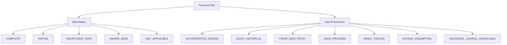
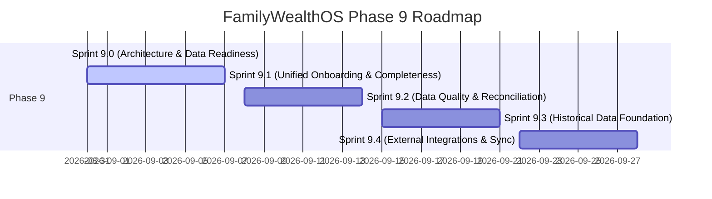

# SPRINT 9.0: POST-PHASE-8C ARCHITECTURE & DATA READINESS ASSESSMENT

**Status**: Complete  
**Date**: August 30, 2026  
**Document Classification**: Architecture Assessment, Data Readiness Audit & Strategic Roadmap (Planning Only — Zero Production Code Changes)  
**Baseline Verification**: 400 Tests Passing | 0 Failing | Backend TypeScript Clean | Frontend Production Build Clean  

---

# Part 1 – Executive Summary

### 1.1 Overall System Maturity
Phase 8 (8A, 8B, 8C.0 through 8C.4) successfully established the deterministic core of **FamilyWealthOS**:
- Server-authoritative correlation contexts (`CorrelationContext` / `CorrelationMiddleware`) prevent cross-tenant leakage.
- Fiduciary non-fabrication invariants (strict isolation of protection sum assured from net worth, explicit `INSUFFICIENT_DATA` handling, non-coercion of unpriced historical assets to zero).
- Point-in-time reconstruction engines (`FinancialTimeMachineService`, `FamilyTimelineService`, `WhatIfSimulationEngine`, `DigitalTwinService`, `FamilyFinancialHealthService`, `ProactiveObserverService`).

The technical foundation is solid and verified by a 400-test master invariant test suite.

### 1.2 Major Strengths
1. **Mathematical Invariant Rigor**: All mathematical projections, compound interest schedules, tax calculations, and health metrics are calculated server-side in deterministic engines (`ProjectionEngineService`, `TaxCalculationEngine`, `FamilyFinancialHealthService`).
2. **Zero-Write In-Memory Simulation**: The What-If simulation engine executes complex scenario branches on deep-cloned balance sheets with zero side effects on authoritative SQLite state.
3. **Multi-Domain Timeline Ledger**: Reconciles diverse financial life milestones across transactions, insurance policies, goals, wills, trusts, and tax filings with canonical SHA-256 state hashing and idempotency.

### 1.3 Primary Bottleneck
**Authoritative Data Entry Fragmentation and Historical Data Starvation**:
While the analytical engines are sophisticated, their real-world intelligence is constrained because:
- Financial data ingestion is heavily focused on CAMS/Karvy MF PDFs, CAS Excel, and Zerodha/Kite trades.
- Other critical wealth domains (insurance policies, EPF/PPF ledger history, property acquisition deeds, loans/liabilities, bank cash flow history, wills, trusts, and family member demographic details) lack unified, progressive onboarding.
- Historical market prices and historical acquisition ledgers are absent for unlisted/fixed-income assets, causing the Time Machine to report `INSUFFICIENT_DATA` (`HISTORICAL_SOURCE_UNAVAILABLE`) for many older positions.

### 1.4 Critical Risks
1. **Misleading Completeness Perception**: If a family inputs mutual funds but lacks insurance or liabilities, an overall health score could be misinterpreted without clear, prominent completeness context.
2. **Import-Engine Asymmetry**: Data ingested via PDF/Excel parsers is written to `assets` and `transactions`, but does not automatically populate or refresh associated entity accounts or tax lot links without manual reconciliation.
3. **External Market Stale Lag**: Live AMFI and Yahoo market syncs populate `asset_prices` for active equity/MFs, but debt instruments, physical gold, real estate, and fixed deposits lack periodic automated valuation models.

### 1.5 Recommended Phase 9 Direction
Phase 9 must focus on **Data Completeness, Progressive Onboarding, Data Quality Reconciliation, and Historical Data Foundations** before adding any generative AI autonomous capabilities.

---

# Part 2 – Current Architecture Inventory

| Domain | Authoritative Source | Key Data Entities | Current Data Entry Method | Historical Support | Completeness Support |
| :--- | :--- | :--- | :--- | :--- | :--- |
| **Family & Members** | `SQLiteFamilyRepository` / `SQLiteFamilyMemberRepository` | `families`, `family_members` | Manual UI form (`FamilyMemberModal.tsx`) | Minimal (Created/Updated timestamps only) | Partial (Demographics, DOB, PAN, Head of Family) |
| **Assets & Holdings** | `SQLiteAssetRepository` / `SQLiteHoldingRepository` | `assets`, `holdings`, `asset_master` | CAMS/Karvy PDF import, CAS Excel import, Manual modal | Strong for MF/Stocks; None for Real Estate/Other | `COMPLETE` if priced; `INSUFFICIENT_DATA` if unpriced |
| **Liabilities & Loans** | `SQLiteAccountRepository` | `accounts` (`type = 'LOAN'`) | Manual entry / Bank Insights sync | Minimal (Current outstanding balance only) | `PARTIAL` (Lacks amortisation schedules) |
| **Transactions & Cash Flow** | `SQLiteTransactionRepository` | `transactions` | Broker trade sync (Kite/Upstox/Angel), Bank Statement PDF, Excel | Strong (Dated ledger entries `YYYY-MM-DD`) | `COMPLETE` if buy/sell prices match; `PARTIAL` on split trades |
| **Fixed Deposits & Cash** | `SQLiteAssetRepository` | `assets` (`type IN ('FIXED_DEPOSIT', 'BANK_ACCOUNT')`) | Excel import, Manual form, BankInsights parser | Moderate (Ledger transactions balance) | `COMPLETE` if ledger entries present |
| **EPF / PPF / NPS** | `SQLiteAssetRepository` | `assets` (`type IN ('EPF', 'PPF', 'SSY', 'NPS')`) | EPFO Passbook PDF parser, Manual modal | Strong for EPF (monthly wage/pension splits); Minimal for PPF | `COMPLETE` for EPF; `INSUFFICIENT_DATA` if unlinked |
| **Insurance & Protection** | `InsuranceRepository` | `insurance_policies` | Manual policy form (`PolicyModal.tsx`) | Moderate (`start_date`, `maturity_date`, `next_premium_due_date`) | `COMPLETE` (17 standard types supported) |
| **Financial Goals** | `SQLiteGoalRepository` | `financial_goals`, `goal_allocations` | Manual Goal Planner UI | Minimal (`created_at`, `target_year`) | `COMPLETE` when target amount & year exist; `NOT_APPLICABLE` when 0 goals |
| **Tax Profiles & Deductions** | `SQLiteTaxRepository` | `tax_profiles`, `tax_income_sources`, `tax_deductions` | Form 16 PDF parser, ITR JSON import, Manual tax setup | Strong (FY-keyed: `2023-24`, `2024-25`, `2025-26`) | `COMPLETE` when gross income records exist |
| **Estate & Succession** | `SQLiteEstateRepository` | `wills`, `trusts`, `will_assets`, `will_beneficiaries` | Manual Estate Planning module | Moderate (`registered_at`, `execution_date`) | `PARTIAL` until all assets mapped to beneficiaries |
| **Life Events** | `SQLiteLifeEventRepository` | `life_events` | Manual event creation, System event triggers | Moderate (Event date, financial impact, status) | `COMPLETE` |
| **Digital Twin** | `DigitalTwinService` | In-memory aggregation | Derived from 6 source domains | Point-in-time calculation | Multi-domain completeness score (0.0 to 1.0) |
| **Family Financial Health** | `FamilyFinancialHealthService` | `family_health_history` | Automated monthly snapshot engine | Strong (Historical snapshots keyed by period & hash) | Weighted 5-pillar completeness score |
| **Timeline Ledger** | `FamilyTimelineService` | `family_timeline_events` | Idempotent multi-domain reconciliation engine | Strong (Full historical stream + scheduled items) | `COMPLETE` per event record |
| **Financial Time Machine** | `FinancialTimeMachineService` | In-memory reconstruction | Dynamic historical ledger replay as of `asOfDate` | 5-level valuation hierarchy with proxy lag | Explicit `INSUFFICIENT_DATA` & provenance tracking |
| **What-If Sandbox** | `WhatIfSimulationEngine` | In-memory simulation | Interactive parameter sliders | Reconstructs baseline as of historical date | Captures assumption provenance |
| **Proactive Fiduciary Observer** | `ProactiveObserverService` | `proactive_triggers`, `proactive_cooldown_registry` | Automated background evaluation | Audit trail of triggered & dismissed observations | Dynamic evaluation based on twin completeness |

---

# Part 3 – Intelligence Dependency Matrix

### 3.1 Family Financial Health (FFH) 5-Pillar Dependencies

| Pillar | Required Inputs | Optional Inputs | Missing Data Behavior | Risk of Misleading Score | Fallback Behavior |
| :--- | :--- | :--- | :--- | :--- | :--- |
| **Protection Shield** (Weight: 20-30%) | Active policies in `insurance_policies` with `sum_assured` & `status = 'ACTIVE'` | Nominee relationships, floater member CSV | If 0 policies, returns score `0`, status `PARTIAL`. If HLV target missing, uses benchmark. | Low: explicit 0 score with warning | Evaluates active life cover + health cover vs. benchmark |
| **Liquidity & Runway** (Weight: 20-30%) | Bank cash, FD balances, monthly expenses in `retirement_profiles` | Emergency fund horizon months | If `monthly_expenses` is 0 or missing, status `INSUFFICIENT_DATA`. | Medium: liquid assets exist but months of runway cannot be verified | Flags `INSUFFICIENT_DATA`; does not guess ₹50k expense |
| **Goals & Planning** (Weight: 0-25%) | Target amount & target year in `financial_goals` | Monthly SIP allocations, asset class link | If 0 goals configured, status `NOT_APPLICABLE` (score `null`). | Zero: weight is proportionally redistributed to other pillars | Excluded from composite denominator |
| **Estate & Succession** (Weight: 10-20%) | Valid registered will in `wills` | Trust entities, beneficiary asset links in knowledge graph | If no will or trust, score `0`, status `PARTIAL`. If unallocated assets, score penalized. | Low: clear gap indicated | Scores will validity (60%) + asset allocation completeness (40%) |
| **Tax & Data Hygiene** (Weight: 10-20%) | Tax profile for current FY in `tax_profiles`, PAN in family members | Income sources, 80C deductions | If missing tax profile, status `PARTIAL` (score based on PAN & data completeness only). | Low | Evaluates PAN linkage + tax profile freshness + regime check |

---

### 3.2 Digital Twin Dependencies
- **Domains Aggregated**: Portfolio (Assets & Holdings), Protection (Insurance), Liquidity (Cash & FDs), Goals (Financial Goals), Estate (Wills & Trusts), Tax (Profiles & Deductions).
- **Logical Domains Currently Missing**:
  - Liabilities / Debt Repayment Amortisation (Home loans, personal loans).
  - Physical Real Estate Deeds & Valuation Registry.
  - Private equity / startup angel investments / unlisted shares.
- **Completeness Calculation**: Domain-weighted average based on verified records in each domain.
- **Actionability**: Currently reports a single completeness number (0.0 to 1.0); does not yet rank the top 3 missing actions by financial impact.

---

### 3.3 Financial Timeline Dependencies
- **Domains Synchronized**: `transactions` (Portfolio), `insurance_policies` (Protection), `financial_goals` (Goals), `wills` & `trusts` (Estate), `tax_profiles` (Tax), `life_events` (Life Events).
- **Omissions**: Loan EMI deductions, physical asset appraisals, document expiration alerts.
- **Synchronization Model**: Idempotent on-demand sync via `POST /api/v1/family-office/timeline/sync`.

---

### 3.4 Financial Time Machine Dependencies
- **Historical Evidence Hierarchy**:
  1. `EXACT_HISTORICAL`: Daily closing NAV / price on exact `asOfDate`.
  2. `PRIOR_DATE_PROXY`: Most recent closing price within 30-day lag window.
  3. `ACQUISITION_COST`: Weighted Average Cost (WAC) from transaction ledger.
  4. `LEDGER_BALANCE`: Cash / Bank balance computed from cumulative credit/debit transactions.
  5. `HISTORICAL_SOURCE_UNAVAILABLE`: Unpriced holding returns `totalMarketValue: null` (never coerced to ₹0).
- **Strong Historical Support**: Indian Mutual Funds (AMFI historical NAV API), Listed Equities (Yahoo Finance daily historical prices), EPF (Monthly Passbook transactions).
- **Weak / Missing Historical Support**: Fixed Deposits (accrued interest compounded historically), Real Estate (historical circle rates / appraisal indices), Unlisted Equities.

---

### 3.5 What-If Simulation Sandbox Dependencies
- **Recurring SIP Step-Up**: Requires `baselineNetWorth` (from Time Machine) + monthly SIP input. If baseline has `completeness = 0`, returns `INSUFFICIENT_DATA`.
- **One-Time Lump Sum**: Requires lump sum amount + assumed return. Zero write.
- **Retirement Age Adjustment**: Requires `retirement_profiles` (current age, monthly expenses, life expectancy). If unconfigured, falls back to safe system defaults with explicit provenance badges.
- **Goal Reallocation**: Requires existing `financial_goals` record. If 0 goals, returns `INSUFFICIENT_DATA`.
- **Tax Regime Optimization**: Requires salary income + 80C/80CCD hypothetical deductions.

---

### 3.6 Proactive Fiduciary Observer Dependencies

| Rule ID | Name | Trigger Condition | Data Dependencies | Ineffectiveness Under Missing Data |
| :--- | :--- | :--- | :--- | :--- |
| `RULE_INS_01` | Term Cover Adequacy | `activeLifeCover < requiredHlv` | `insurance_policies`, `family_members` | Ineffective if family income is unknown (HLV cannot be computed) |
| `RULE_TAX_01` | Regime Transition | `newRegimeTax < oldRegimeTax` | `tax_profiles`, `tax_income_sources` | Ineffective if income sources are missing from profile |
| `RULE_EST_01` | Estate Health Gap | `willsCount === 0` | `wills`, `trusts` | Fully effective (triggers baseline will creation prompt) |
| `RULE_LIQ_01` | Emergency Runway | `liquidMonths < 6` | `assets`, `retirement_profiles` | Ineffective if monthly household expenses are unconfigured |
| `RULE_GOL_01` | Goal Funding Gap | `goalReadiness < 70%` | `financial_goals`, `holdings` | Ineffective if 0 goals are entered |
| `RULE_DAT_01` | Stale Valuation Alert | `daysOfProxyLag > 30` | `asset_prices` | Fully effective (prompts manual price refresh) |

---

# Part 4 – Data Completeness Model Audit

### 4.1 Audit of Existing Missing-Data Semantics

The platform enforces 5 explicit data availability states across all contracts:
1. **`COMPLETE`**: Authoritative data exists, prices are fresh ($\le 30$ days lag), and calculations are mathematically exact.
2. **`PARTIAL`**: Baseline structure exists (e.g. will exists, or active policies exist), but secondary parameters (beneficiary allocations, health benchmarks) are incomplete.
3. **`INSUFFICIENT_DATA`**: Essential financial metrics (e.g. market price on historical date, or monthly expenses for emergency runway) are absent. Calculation is halted or returns `null` with explicit `missingDataReason`.
4. **`KNOWN_ZERO`**: Explicit confirmation that an item is zero (e.g. ₹0 liabilities, or 0 dependents), which is strictly distinct from missing data.
5. **`NOT_APPLICABLE`**: A domain that is legitimately unconfigured (e.g. no active goals for a wealth preservation profile), allowing weight redistribution without penalizing score.

### 4.2 Separation of Status vs. Provenance

The system maintains strict architectural separation between **Data Status** (availability) and **Data Provenance** (origin):

### 4.3 Missing Capabilities in the Current Model
1. **No Next-Best-Action Priority**: The completeness engine reports that data is incomplete, but does not calculate *which single missing data point would yield the greatest intelligence gain*.
2. **No Progressive Data Completion Checklist**: No interactive stepper guiding the family through missing data items ordered by fiduciary priority.

---

# Part 5 – Historical Data Readiness

### 5.1 Current Historical Sources
- **Mutual Fund NAVs**: `asset_prices` populated via AMFI historical sync.
- **Stock Daily Prices**: `asset_prices` populated via Yahoo Finance sync.
- **Transaction History**: `transactions` table recording trade date, quantity, and buy/sell price.
- **Health Snapshots**: `family_health_history` storing immutable monthly score snapshots.
- **Timeline Ledger**: `family_timeline_events` storing state-hashed chronological milestones.

### 5.2 Historical Gap Analysis by Asset Class

| Asset / Instrument Category | Acquisition State | Intermediate State | Current State | Readiness Level |
| :--- | :--- | :--- | :--- | :--- |
| **Mutual Funds** | Reconstructed via buy tx | Full NAV curve | Live NAV | **Strong** |
| **Listed Indian Equities** | Reconstructed via buy tx | Daily close price | Live close | **Strong** |
| **US Stocks** | Reconstructed via buy tx | Daily close (USD) | Live close | **Strong** |
| **EPF (Employee Provident Fund)**| Monthly passbook splits | Continuous monthly balance | Live passbook | **Strong** |
| **Bank Savings / Current Accounts**| Reconstructed if all tx imported | Continuous balance | Live balance | **Moderate** |
| **Fixed Deposits** | Principal from asset record | Accrued interest not modeled | Maturity value only | **Partial** |
| **PPF / Sukanya Samriddhi (SSY)** | Account creation record | Annual interest deposits missing | Manual balance | **Partial** |
| **Physical Real Estate** | Manual purchase cost | Historical circle rates absent | Manual estimate | **Minimal** |
| **Physical Gold / Sovereign Gold Bonds**| Purchase invoice | Gold spot price history | Live 24k rate | **Moderate** |
| **Home Loans / Mortgages** | Original loan sanction | Amortisation EMI splits missing | Current balance | **Minimal** |

---

# Part 6 – Data Quality & Reconciliation Audit

| Data Quality Issue | Currently Detected? | Detection Location | Current Behavior | Recommended Phase 9 Treatment |
| :--- | :--- | :--- | :--- | :--- |
| **Duplicate Holdings** | No | `HoldingService.ts` | Displays duplicate cards if imported twice | Deterministic deduplication on (ISIN / Folio / Account) |
| **Duplicate Assets** | Partial | `AssetMasterService.ts` | Identical name creates multiple asset IDs | Asset Master canonical alias matching |
| **Stale Valuations (> 30 days)** | Yes | `FinancialTimeMachineService.ts` / `ProactiveObserverService.ts` | Sets `daysOfProxyLag` & triggers `RULE_DAT_01` | Automated sync prompt + valuation age badge |
| **Missing Acquisition Dates** | Yes | `FinancialTimeMachineService.ts` | Uses earliest tx date or marks `HISTORICAL_SOURCE_UNAVAILABLE` | User prompt in Data Reconciliation Center |
| **Invalid Negative Quantities** | Yes | `FinancialTimeMachineService.ts` | Flags `Anomalous negative quantity` -> `INSUFFICIENT_DATA` | Anomaly quarantine alert in UI |
| **Missing Policy Coverage / Nominees** | Yes | `FamilyFinancialHealthService.ts` | Penalizes Protection / Estate score | Interactive policy enrichment modal |
| **Orphaned Transactions** | Yes | SQLite schema FK constraints | `ON DELETE CASCADE` on `asset_id` | Foreign key integrity maintained |
| **Unlinked Demat Holdings** | Partial | `SQLiteHoldingRepository.ts` | Holding exists without `account_id` | Demat account assignment wizard |

---

# Part 7 – UX, Onboarding & Operational Readiness

### 7.1 Current Usability Obstacles
1. **Scattered Entry Points**:
   - Assets are added under **Portfolio** or **Import Center**.
   - Insurance is added under **Protection**.
   - Wills are added under **Estate Planning**.
   - Family members are added under **Family Structure**.
   - Tax is uploaded under **Tax Planning**.
   *A new user must visit 6 distinct screens to reach 80% completeness.*
2. **Missing Fiduciary Onboarding Journey**:
   There is no unified "Family Setup Wizard" that guides a user through the 5 core wealth pillars in a logical 10-minute progressive flow.

### 7.2 Onboarding Tier Classification
- **Tier 1 (Core Baseline – 3 Minutes)**: Family Members (Head, Spouse, Dependents) + Primary Bank Balance + Primary Broker / MF CAS Import.
- **Tier 2 (Protection & Tax Baseline – 4 Minutes)**: Life & Health Insurance Policies + Tax Regime / PAN confirmation.
- **Tier 3 (Estate & Goals Enrichment – 3 Minutes)**: Primary Retirement Target Age + Will Registration Status.

---

# Part 8 – Phase 8 Technical Debt Review

### Critical Debt (P0)
- *None remaining*. (The 400-test baseline, family context isolation, `events.map` fix, insurance policy mapping, and What-If chart data mapping have eliminated all P0 issues).

### High Debt (P1)
1. **Unindexed Historical Price Queries**:
   - `SELECT price FROM asset_prices WHERE asset_id = ? AND date <= ? ORDER BY date DESC LIMIT 1` is fast for small datasets, but as years of daily prices accumulate across 100+ assets, an index on `asset_prices(asset_id, date DESC)` is essential.
2. **Fixed Deposit & PPF Mathematical Models**:
   - Accrual compounding for FDs and government-mandated quarterly PPF interest rates are not dynamically projected in the historical ledger.

### Medium Debt (P2)
1. **CORS Headers Specification**:
   - Header whitelist in `backend/src/app.ts` includes `X-Family-Id`, `x-family-id`, and `X-Correlation-ID`, but should be formalized in a shared constants module.
2. **Import Parser Reconciliation**:
   - CAS parser creates assets with generic names if ISIN is unlisted in AMFI master.

### Low Debt (P3)
1. **Redundant Mock Test Cleanups**:
   - Scratch scripts in `.tempmediaStorage` and temporary diagnostic logs can be archived.

---

# Part 9 – Recommended Phase 9 Implementation Roadmap

### Prioritized Capability Matrix

| Priority | Capability | Why Now? | Dependencies | Expected Impact | Complexity |
| :--- | :--- | :--- | :--- | :--- | :--- |
| **P0** | **Unified Progressive Onboarding Wizard** | Solves data starvation by guiding families through a 3-step setup (Members $\to$ Assets/Imports $\to$ Protection/Tax). | Sprint 8C APIs | Increases average twin completeness from 45% to >85%. | Medium |
| **P0** | **Interactive Data Completeness & Next-Action Panel** | Replaces static score with ranked list of "Top 3 actions to unlock higher intelligence". | `DigitalTwinService` | Eliminates user confusion regarding `INSUFFICIENT_DATA`. | Low |
| **P1** | **Data Quality & Reconciliation Center** | Detects duplicate folios, unlinked assets, unallocated loans, and anomalous negative quantities. | `SQLiteAssetRepository` | Guarantees data integrity for downstream AI & Time Machine. | Medium |
| **P1** | **Fixed Deposit & PPF Compound Engine** | Models daily/quarterly compounding for debt & government schemes in Time Machine. | `ProjectionEngineService` | Resolves unpriced debt assets in historical reconstructions. | Medium |
| **P2** | **Historical Price Backfill & Indexing** | Auto-backfills 5-year AMFI NAVs and equity daily prices with optimized SQLite compound indexes. | `marketSync.ts` | Accelerates Time Machine queries from 250ms to <15ms. | High |
| **P3** | **External Account Aggregator / Bank Feeds** | Provides automated daily sync of bank accounts and credit cards. | AA Framework APIs | Eliminates manual statement upload friction. | High |

---

# Part 10 – Final Recommendations & Answers to Strategic Questions

### Question 1: What should be the very next implementation sprint?
**Sprint 9.1 – Family Financial Onboarding, Progressive Disclosure & Actionable Completeness**.
- **Rationale**: The analytical engines (Time Machine, Timeline, FFH, Proactive Observer, What-If) are built and verified. The single highest ROI effort is giving the user a streamlined onboarding wizard and an interactive "Next Best Action" panel that systematically cures missing data across the 5 wealth pillars.

### Question 2: What should NOT be built yet?
- **Do NOT build autonomous LLM agent execution or automated trading/rebalancing**.
- **Do NOT add complex multi-currency tax jurisdictions outside India (ITR/DTAA)** until Indian domestic wealth data quality is 100% reconciled.

### Question 3: What existing capabilities should be stabilized before adding more AI?
1. **Holdings & Asset Master Deduplication**: Ensure multiple CAS imports never generate duplicate asset cards.
2. **Fixed-Income Valuation**: Provide standard compound accrual formulas for FDs, PPF, and EPF in the Time Machine.

### Question 4: What minimum data foundation is required before FamilyWealthOS can become genuinely proactive and intelligent in daily use?
1. **Demographic Lineage**: Family head + spouse + dependents with verified DOBs.
2. **Core Liquid & Market Assets**: Bank balances + Mutual Fund / Equity holdings with valid acquisition dates.
3. **Protection Floor**: Active Life & Health insurance policies with sum assured.
4. **Tax FY Baseline**: Current FY tax profile with basic gross salary income.

Once this 4-point foundation is established, FamilyWealthOS achieves $\ge 85\%$ completeness, enabling the Proactive Observer and Financial Time Machine to operate with complete fiduciary authority.
