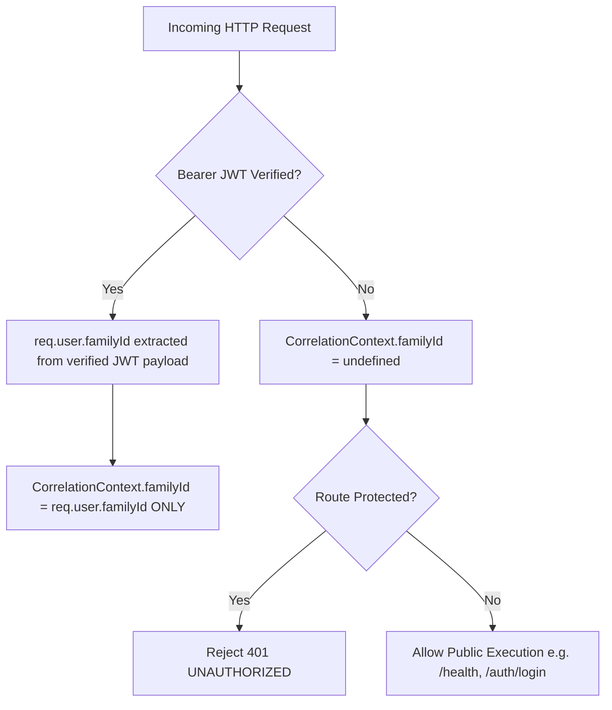
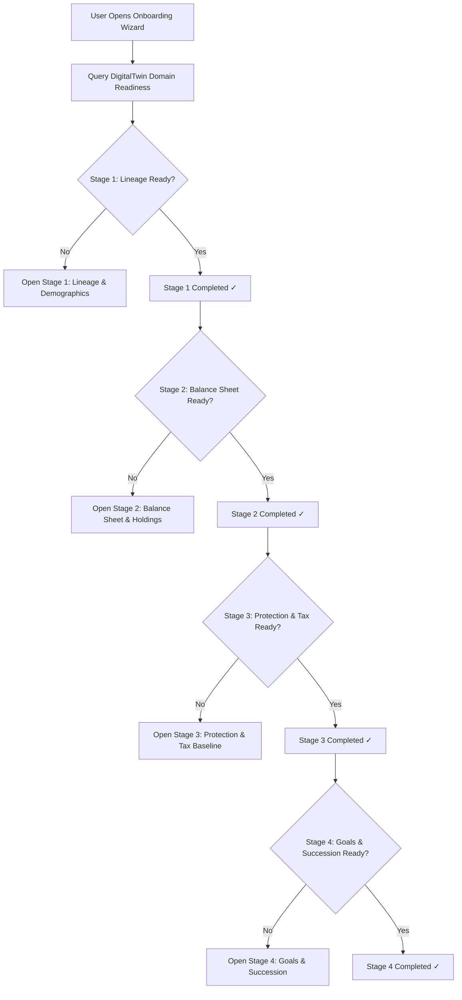

# SPRINT 9.1 DETAILED IMPLEMENTATION PLAN: FAMILY FINANCIAL ONBOARDING & ACTIONABLE COMPLETENESS

**Document Status**: Final Approved Implementation Plan (Planning Only — Zero Production Code Changes)  
**Authoritative Review Reference**: `FINAL TARGETED CORRECTIONS – SPRINT 9.1.md`  
**Target Completion**: Sprint 9.1  
**Verification Baseline**: 400 Tests Passing | 0 Failing | Backend TypeScript Clean | Frontend Production Build Clean  

---

# 1. Server-Authoritative Security Invariant & Compatibility Audit

### 1.1 Pure JWT Identity Resolution (Zero Client Fallbacks)
All client-controlled family scoping headers (`X-Family-Id`, `x-family-id`), query parameters (`?familyId=X`), and request body parameters (`body.familyId`) are **permanently removed** from ordinary HTTP request resolution logic.



### 1.2 Comprehensive Correlation Context Compatibility Audit

| Execution Context Type | How Context is Established | `familyId` Source | Client Header Influence? | Compatibility Guarantee |
| :--- | :--- | :--- | :--- | :--- |
| **Ordinary Authenticated Family APIs** (`/api/v1/family-office/*`, `/portfolio/*`, etc.) | `authenticateMiddleware` $\to$ `correlationMiddleware` | `req.user.familyId` (from verified JWT) | **None** (`X-Family-Id` ignored) | 100% tenant-isolated |
| **Public / Unauthenticated Routes** (`/health`, `/api-docs`, `/api/v1/auth/login`) | `correlationMiddleware` | `undefined` | **None** | Allows public access; protected routes reject 401 |
| **Trusted Background / Internal Jobs** (e.g. Audit Dispatch, Snapshot Jobs) | Server invokes `CorrelationContext.runWithContext(store, fn)` | Server-side trusted payload | **None** (Server-originated) | Fully preserved; zero dependence on HTTP headers |
| **Import Processing & Parsing** (CAMS/Karvy/Zerodha) | Controller invokes service within active JWT request context | `req.user.familyId` | **None** | Fully preserved via authenticated user context |
| **Automated Backend Test Suites** (`jest` / `supertest`) | Test fixtures attach mock JWT / `req.user` OR call `CorrelationContext.runWithContext()` directly | Test fixture parameter | **None** | Tests pass without client header spoofing |

### 1.3 Hardened Implementation Logic (`CorrelationMiddleware.ts`)

```typescript
// File: backend/src/infrastructure/correlation/CorrelationMiddleware.ts
// (and backend/src/middleware/correlationMiddleware.ts)

export function correlationMiddleware(req: Request, res: Response, next: NextFunction): void {
  const headerCorrId = (req.headers['x-correlation-id'] as string) || (req.headers['correlation-id'] as string);
  const correlationId = headerCorrId && headerCorrId.trim() !== '' ? headerCorrId.trim() : `req_${crypto.randomUUID()}`;
  const headerCausationId = (req.headers['x-causation-id'] as string) || (req.headers['causation-id'] as string);
  
  // 1. Authoritative JWT context is the SOLE source of tenant identity for HTTP requests
  const authenticatedUser = (req as any).user;
  const familyId: number | undefined = (authenticatedUser?.familyId || authenticatedUser?.family_id)
    ? Number(authenticatedUser.familyId || authenticatedUser.family_id)
    : undefined;

  const userId = authenticatedUser?.id ? Number(authenticatedUser.id) : undefined;

  // Set response correlation headers
  res.setHeader('X-Correlation-ID', correlationId);
  if (headerCausationId) {
    res.setHeader('X-Causation-ID', headerCausationId);
  }

  const store: CorrelationStore = {
    correlationId,
    causationId: headerCausationId,
    familyId,
    userId,
    timestamp: new Date().toISOString()
  };

  CorrelationContext.runWithContext(store, () => {
    next();
  });
}
```

---

# 2. Readiness-Driven Progressive Onboarding Journey

### 2.1 Dynamic State & Resume Semantics
The onboarding wizard is **readiness-driven**:
- On launch, the wizard inspects `domainReadiness` from `DigitalTwinService.getDigitalTwin(familyId)`.
- **New Families** (0% completeness): Start automatically at Stage 1.
- **Existing Families** ($>0\%$ completeness): Previously satisfied stages are rendered with green checkmarks and collapsed; users land directly on the **first incomplete stage**.
- **Skip / Defer**: Any incomplete stage can be deferred without mutating authoritative data or hiding gaps.



### 2.2 Stage-by-Stage Specification Table

| Stage | Purpose | Authoritative Domains | Existing APIs/Forms Reused | Required Information | Conditional Information | Optional Information | Skip/Defer Support |
| :--- | :--- | :--- | :--- | :--- | :--- | :--- | :--- |
| **Stage 1: Lineage & Demographics** | Establish household composition, head/testator earner status, and demographic life-stage calibration. | `families`, `family_members` | `FamilyMemberModal.tsx`<br>`POST /api/v1/family-members` | Head of Family: Name, DOB, `relationship = 'SELF'`. | Spouse & Dependent DOBs (required if added). | PAN (optional for children/dependents), Email, Phone. | **No** for brand-new families (Minimum 1 head required to anchor family context). |
| **Stage 2: Balance Sheet & Holdings** | Establish gross wealth, investment holdings, liquid bank reserves, and historical time machine baseline. | `assets`, `transactions`, `holdings` | `ImportCenter.tsx` (`ImportDropzone`)<br>`POST /api/v1/import/upload`<br>`POST /api/v1/assets` | At least 1 Bank savings balance OR 1 CAS/CAMS Statement upload (if completing stage). | ISIN/Folio number (if manually entering holdings). | Account nicknames, broker tags. | **Yes** ("Skip for now – enter balance later"). Does not hide data gap. |
| **Stage 3: Protection Floor & Tax Baseline** | Calibrate Protection Shield HLV adequacy and configure current FY tax regime without guesswork. | `insurance_policies`, `tax_profiles` | `PolicyModal.tsx`<br>`POST /api/v1/insurance/policies`<br>`POST /api/v1/tax/profiles` | Current FY Tax Regime is **required only when completing the Tax Baseline stage**. | Sum assured & premium (if policy entered). | Policy document PDF, policy numbers. | **Yes** ("Skip for now"). Entire stage can be deferred without fabricating assumptions; protection/tax gaps remain active in NBA stream. |
| **Stage 4: Goals & Succession Milestones** | Calibrate long-term retirement trajectory and succession readiness. | `financial_goals`, `wills` | `GoalModal.tsx`<br>`POST /api/v1/goals`<br>`POST /api/v1/estate/wills` | None (entire stage is optional enrichment). | Target retirement age & target year (if setting retirement goal). | Will registration date, executor name. | **Yes** ("Complete setup and go to Dashboard"). |

---

# 3. Initial 7-Action Registry & Data Integrity Clarification

### 3.1 Data Integrity Signal Audit
An audit of `DigitalTwinService.ts:305,320,337` confirms that `sourceFreshness.latestPriceDate` currently tracks the *maximum* price date among holdings, but does not evaluate asset-by-asset price coverage or individual holding staleness.
- **Decision**: In strict accordance with the final review directive, **`ACT_DAT_01` will NOT be introduced as an active producer in Sprint 9.1**, avoiding incomplete or premature reconciliation logic.
- **Ranking Architecture**: `DATA_INTEGRITY` (Category A) remains fully supported in `ActionRankingEngine.ts` as the highest priority tier (Rank 1).
- **Active Producers in Sprint 9.1**: 7 solid, fully verified foundational and enrichment actions.
- **Sprint 9.2 Scope**: Formal multi-source reconciliation scanning (stale valuations, duplicate folios, unlinked demat accounts) will be introduced in Sprint 9.2 as active Category A producers.

### 3.2 Initial 7-Action Registry Table

| Action ID | Category | Detection Condition (Authoritative Backend State) | Resolution Condition (Satisfied When) | Why It Matters | Affected Capabilities | Impact Level | Suggested UI Route |
| :--- | :--- | :--- | :--- | :--- | :--- | :--- | :--- |
| **`ACT_LIN_01`** | **Category B** (Missing Foundation) | `lineage.members.length === 0` in `SQLiteFamilyMemberRepository` | At least 1 member with `isPrimaryTestator = true` exists in `family_members`. | Life-stage calibration (`EARLY_CAREER`, `FAMILY_EXPANSION`, `RETIREMENT`) and dependency profile cannot be established. | `FAMILY_FINANCIAL_HEALTH`, `DIGITAL_TWIN`, `ESTATE_SUCCESSION` | **HIGH** | `/family/members` |
| **`ACT_AST_01`** | **Category B** (Missing Foundation) | `activeAssetCount === 0` (zero asset records in `assets` for family) | At least 1 active asset holding exists in `assets` (`deleted_at IS NULL`). | Net worth, asset allocation distribution, and wealth trajectories cannot be evaluated without asset records. | `FINANCIAL_TIME_MACHINE`, `PORTFOLIO_ANALYTICS`, `DIGITAL_TWIN` | **HIGH** | `/import` |
| **`ACT_INS_01`** | **Category B** (Missing Foundation) | `activePolicyCount === 0` (zero policies in `insurance_policies` for family) | At least 1 active insurance policy with `status = 'ACTIVE'` exists in `insurance_policies`. | Protection shield is unconfigured; family earner death leaves dependents financially exposed. | `PROTECTION_SHIELD`, `FAMILY_FINANCIAL_HEALTH`, `DIGITAL_TWIN` | **HIGH** | `/protection` |
| **`ACT_LIQ_01`** | **Category B** (Missing Foundation) | `liquidAssetCount === 0` (zero assets with `type IN ('BANK_ACCOUNT', 'FIXED_DEPOSIT', 'CASH')`) | At least 1 asset with `type IN ('BANK_ACCOUNT', 'FIXED_DEPOSIT', 'CASH')` exists. | Emergency liquidity runway in months cannot be calculated without liquid cash reserves. | `LIQUIDITY_RUNWAY`, `FAMILY_FINANCIAL_HEALTH`, `PROACTIVE_OBSERVER` | **HIGH** | `/assets/new` |
| **`ACT_TAX_01`** | **Category B** (Missing Foundation) | `taxProfilesCount === 0` in `SQLiteTaxRepository` | At least 1 tax profile exists for the current FY in `tax_profiles`. | Tax What-If regime optimization relies on unverified system assumptions. | `TAX_OPTIMIZATION`, `WHAT_IF_SIMULATION` | **MEDIUM** | `/tax/planner` |
| **`ACT_EST_01`** | **Category C** (Intelligence Enrichment) | `governance.willRegistered === false` in `SQLiteEstateRepository` | At least 1 registered will or trust exists in `wills` or `trusts`. | Succession readiness remains unallocated, reducing the Estate & Governance pillar health score. | `ESTATE_SUCCESSION`, `FAMILY_FINANCIAL_HEALTH` | **MEDIUM** | `/estate/wills` |
| **`ACT_GOL_01`** | **Category C** (Intelligence Enrichment) | `activeGoalsCount === 0` in `SQLiteGoalRepository` | At least 1 active goal exists in `financial_goals` (`status != 'ARCHIVED'`). | Goal funding progress, SIP adequacy, and retirement milestone tracking cannot be evaluated. | `GOAL_TRAJECTORY`, `WHAT_IF_SIMULATION` | **MEDIUM** | `/planning/goals` |

---

# 4. Final Deterministic Lexicographical Ranking Algorithm

```typescript
// File: backend/src/services/familyOffice/ActionRankingEngine.ts

export class ActionRankingEngine {
  private static readonly CATEGORY_ORDER: Record<ActionPriorityCategory, number> = {
    DATA_INTEGRITY: 1,
    MISSING_FOUNDATION: 2,
    INTELLIGENCE_ENRICHMENT: 3,
    OPTIONAL_ENRICHMENT: 4
  };

  private static readonly IMPACT_ORDER: Record<ActionImpactLevel, number> = {
    HIGH: 1,
    MEDIUM: 2,
    LOW: 3
  };

  public static rankActions(actions: NextBestAction[]): NextBestAction[] {
    return [...actions].sort((a, b) => {
      // Tier 1: Priority Category Precedence (A > B > C > D)
      const catDiff = this.CATEGORY_ORDER[a.category] - this.CATEGORY_ORDER[b.category];
      if (catDiff !== 0) return catDiff;

      // Tier 2: Qualitative Impact Level (HIGH > MEDIUM > LOW)
      const impactDiff = this.IMPACT_ORDER[a.impactLevel] - this.IMPACT_ORDER[b.impactLevel];
      if (impactDiff !== 0) return impactDiff;

      // Tier 3: Multi-Pillar Scope (Blocks composite health score first)
      const aMulti = a.affectedCapabilities.includes('FAMILY_FINANCIAL_HEALTH') ? 1 : 0;
      const bMulti = b.affectedCapabilities.includes('FAMILY_FINANCIAL_HEALTH') ? 1 : 0;
      if (bMulti !== aMulti) return bMulti - aMulti;

      // Tier 4: Total Affected Capabilities Count (Descending)
      const capDiff = b.affectedCapabilities.length - a.affectedCapabilities.length;
      if (capDiff !== 0) return capDiff;

      // Tier 5: Stable Deterministic Tie-Breaker (Alphabetical ASC on actionId)
      return a.actionId.localeCompare(b.actionId);
    });
  }
}
```

---

# 5. Service Responsibilities & Separation of Concerns

- **`DigitalTwinService`**: Evaluates authoritative domain records across 6 dimensions, calculates the 100-point dynamic completeness score, and returns `CompletenessBreakdown` with `missingElements`.
- **`ActionGapAnalyzer`**: Logical translator mapping authoritative domain gap signals to unranked `NextBestAction` DTOs.
- **`ActionRankingEngine`**: Pure stateless ranking engine executing the 5-tier deterministic lexicographical comparator.
- **`FamilyCompletenessController`**: Scopes request via JWT `CorrelationContext.getFamilyId()`, invokes `DigitalTwinService` and `ActionRankingEngine`, and delivers `ActionableCompletenessResponse`.

---

# 6. Endpoint Contract & UI Presentation

### 6.1 Route: `GET /api/v1/family-office/completeness/actions`
- **Output**: Returns all active ranked actions (bounded to max 10).
- **Frontend Presentation**: `NextBestActionPanel.tsx` renders the **Top 3 actions by default**, with an expandable drawer for all remaining gaps.
- **Zero Gaps**: When 100% completeness is reached, returns `status: 'COMPLETE', completenessScore: 100, rankedActions: []`.

### 6.2 Zod Contracts (`backend/src/contracts/familyOfficeContracts.ts`)

```typescript
export const ActionPriorityCategoryEnum = z.enum([
  'DATA_INTEGRITY',
  'MISSING_FOUNDATION',
  'INTELLIGENCE_ENRICHMENT',
  'OPTIONAL_ENRICHMENT'
]);
export type ActionPriorityCategory = z.infer<typeof ActionPriorityCategoryEnum>;

export const ActionImpactLevelEnum = z.enum(['HIGH', 'MEDIUM', 'LOW']);
export type ActionImpactLevel = z.infer<typeof ActionImpactLevelEnum>;

export const NextBestActionSchema = z.object({
  actionId: z.string(),
  title: z.string(),
  description: z.string(),
  category: ActionPriorityCategoryEnum,
  impactLevel: ActionImpactLevelEnum,
  whyItMatters: z.string(),
  affectedCapabilities: z.array(z.string()),
  targetRoute: z.string(),
  targetDomain: z.enum(['LINEAGE', 'PORTFOLIO', 'PROTECTION', 'TAX', 'ESTATE', 'GOALS', 'LIQUIDITY', 'DATA_HYGIENE'])
});
export type NextBestAction = z.infer<typeof NextBestActionSchema>;

export const ActionableCompletenessResponseSchema = z.object({
  familyId: z.number().int().positive(),
  overallCompleteness: z.number().min(0).max(1),
  completenessScore: z.number().min(0).max(100),
  status: z.enum(['COMPLETE', 'PARTIAL', 'INSUFFICIENT_DATA']),
  rankedActions: z.array(NextBestActionSchema),
  domainReadiness: z.record(z.object({
    isReady: z.boolean(),
    status: z.string(),
    missingSummary: z.string().optional()
  })),
  calculatedAt: z.string()
});
export type ActionableCompletenessResponse = z.infer<typeof ActionableCompletenessResponseSchema>;
```

---

# 7. Comprehensive Invariant Test Plan

1. **`10.1 No False Completion`**: Opening a modal or clicking a button without saving data produces zero changes in `rankedActions`.
2. **`10.2 Skip Does Not Hide Gap`**: Skipping a wizard stage leaves the corresponding action active in the dashboard stream.
3. **`10.3 Dynamic Recalculation`**: Adding an authoritative record (e.g. `POST /api/v1/family-members`) immediately removes `ACT_LIN_01` on the next query.
4. **`10.4 No Static Score Promise`**: All actions pass Zod schema validation without numeric score gain claims.
5. **`10.5 Family Scope Security`**: Authenticated user with `familyId = 1` passing `X-Family-Id: 2` or `?familyId=2` is strictly scoped to family `1`.
6. **`10.6 Data Integrity Precedence`**: When Category A signals are introduced, Category A actions strictly outrank Category B actions regardless of incoming evaluation order.

---

# 8. Execution Sequence

- **Phase 1**: Modify `CorrelationMiddleware.ts` (Pure JWT resolution).
- **Phase 2**: Add Zod contracts in `familyOfficeContracts.ts` and implement `ActionRankingEngine.ts`.
- **Phase 3**: Expose `getActionableCompleteness(familyId)` in `DigitalTwinService.ts` and mount `GET /api/v1/family-office/completeness/actions`.
- **Phase 4**: Write and run backend test suites (`onboardingCompleteness.test.ts`, `nextBestActionRanking.test.ts`, `serverAuthoritativeScopeSecurity.test.ts`).
- **Phase 5**: Create `NextBestActionPanel.tsx` in `frontend/` and wire into `Dashboard.tsx`.
- **Phase 6**: Create `OnboardingWizardModal.tsx` with readiness-driven stage resumption.
- **Phase 7**: Verify full regression baseline (`npm test` 400+ passing, `npm run build` 0 errors).
